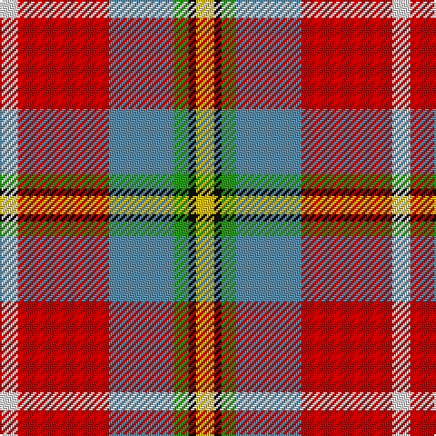

In pattern [WRBGKY](/patterns/wrbgky/).

This was sourced from tartans-authority.  It is a [6 stripes tartan](/stripes/stripes6/).

Original link http://www.tartansauthority.com/tartan-ferret/display/10293/

## Thread count
LN/10 R50 B36 G8 K4 Y/10

## Palette
Each colour and its ΔE from the base-6 reference it is a variant of.

| Colour | Shade | Base | ΔE (OKLab) |
|---|---|---|---|
| B | <code style="background-color:#5C8CA8;">#5C8CA8</code> `#5C8CA8` | B <code style="background-color:#2A418A;">#2A418A</code> | 0.23 |
| G | <code style="background-color:#289C18;">#289C18</code> `#289C18` | G <code style="background-color:#006100;">#006100</code> | 0.19 |
| K | <code style="background-color:#101010;">#101010</code> `#101010` | K <code style="background-color:#000000;">#000000</code> | 0.17 |
| LN | <code style="background-color:#E0E0E0;">#E0E0E0</code> `#E0E0E0` | W <code style="background-color:#F7F7F7;">#F7F7F7</code> | 0.07 |
| R | <code style="background-color:#C80000;">#C80000</code> `#C80000` | R <code style="background-color:#CC0000;">#CC0000</code> | 0.01 |
| Y | <code style="background-color:#E8C000;">#E8C000</code> `#E8C000` | Y <code style="background-color:#F2BF00;">#F2BF00</code> | 0.02 |

# Sample pattern

## Nearest tartans

The nearest existing variants by ΔTartan distance.

1. [Ball](/setts/s6/y13b8r5k3w2g1x4~b1474b4-g006818-k101010-rc80000-wfcfcfc-ydc943c/) — ΔT 0.83
1. [Scottish American Soc. of Michigan](/setts/s6/r48b16y5g17w8ga3x2~b1474b4-g006818-ga604000-rc80000-we0e0e0-ybc8c00/) — ΔT 0.91
1. [Round Table Sweden](/setts/s8/r3y15g4b6w2r30b6ya3x2~b3c82af-g007800-r800028-wffffff-ye0a126-yaffff00/) — ΔT 1.15
1. [Scottish American Society of Michigan (Official)](/setts/s6/r48b16y5g17w8k3x2~b5f749c-g23321b-k000000-rb62531-wf9f5ef-ye0a126/) — ΔT 1.19
1. [Christie (London)](/setts/s6/w5r25wa18g4k2y5x2~g008b00-k101010-rff0000-wffffff-wa82cffd-yffe600/) — ΔT 1.22
1. [Wilson's, No 227](/setts/s9/r26b7ba8y3r3w3g20ba10w2x2~b5480b0-ba800080-g008000-rc00000-we0e0e0-yf0c000/) — ΔT 1.26
1. [Oor Wullie (Corporate)](/setts/s7/y3r3ya2r20k16w24wa2x2~k101010-rc80000-wc0c0c0-wae0e0e0-yfccc00-yae8c000/) — ΔT 1.27
1. [Barbour Dress](/setts/s7/r4b2r21ba11w2ra20rb3x2~b4c3428-ba141e46-rb07430-ra888888-rbc8002c-wf8f8f8/) — ΔT 1.27
1. [Hewitt](/setts/s7/r30b12k6g12y2g3w2x2~b2c4084-g005020-k101010-rdc0000-we0e0e0-ye8c000/) — ΔT 1.28
1. [Porcupine City of](/setts/s7/r10b3ba1w8ba1y2g5x4~b5c5c5c-ba1c0070-g006818-rb03000-wc0c0c0-yd09800/) — ΔT 1.28

## Neighbour map

Every grey dot is one of 15726 variants placed by the first two principal components of the ΔTartan feature space (44% of its variance). Red is this tartan; blue dots are its nearest — click one to open its page.

<svg viewBox="0 0 640 380" role="img" style="max-width:100%;height:auto;border:1px solid #e0e0e0;border-radius:4px;display:block" xmlns="http://www.w3.org/2000/svg"><image href="/nn/cloud.v1.png" width="640" height="380"/><a href="/setts/s6/y13b8r5k3w2g1x4~b1474b4-g006818-k101010-rc80000-wfcfcfc-ydc943c/"><circle cx="149.5" cy="152.3" r="4" fill="#3465a4"><title>Ball</title></circle></a><a href="/setts/s6/r48b16y5g17w8ga3x2~b1474b4-g006818-ga604000-rc80000-we0e0e0-ybc8c00/"><circle cx="243.1" cy="140.7" r="4" fill="#3465a4"><title>Scottish American Soc. of Michigan</title></circle></a><a href="/setts/s8/r3y15g4b6w2r30b6ya3x2~b3c82af-g007800-r800028-wffffff-ye0a126-yaffff00/"><circle cx="215.9" cy="116.9" r="4" fill="#3465a4"><title>Round Table Sweden</title></circle></a><a href="/setts/s6/r48b16y5g17w8k3x2~b5f749c-g23321b-k000000-rb62531-wf9f5ef-ye0a126/"><circle cx="231.4" cy="136.6" r="4" fill="#3465a4"><title>Scottish American Society of Michigan (Official)</title></circle></a><a href="/setts/s6/w5r25wa18g4k2y5x2~g008b00-k101010-rff0000-wffffff-wa82cffd-yffe600/"><circle cx="165.9" cy="133.1" r="4" fill="#3465a4"><title>Christie (London)</title></circle></a><a href="/setts/s9/r26b7ba8y3r3w3g20ba10w2x2~b5480b0-ba800080-g008000-rc00000-we0e0e0-yf0c000/"><circle cx="144.5" cy="130.4" r="4" fill="#3465a4"><title>Wilson's, No 227</title></circle></a><a href="/setts/s7/y3r3ya2r20k16w24wa2x2~k101010-rc80000-wc0c0c0-wae0e0e0-yfccc00-yae8c000/"><circle cx="128.0" cy="130.6" r="4" fill="#3465a4"><title>Oor Wullie (Corporate)</title></circle></a><a href="/setts/s7/r4b2r21ba11w2ra20rb3x2~b4c3428-ba141e46-rb07430-ra888888-rbc8002c-wf8f8f8/"><circle cx="188.4" cy="163.7" r="4" fill="#3465a4"><title>Barbour Dress</title></circle></a><a href="/setts/s7/r30b12k6g12y2g3w2x2~b2c4084-g005020-k101010-rdc0000-we0e0e0-ye8c000/"><circle cx="206.7" cy="132.0" r="4" fill="#3465a4"><title>Hewitt</title></circle></a><a href="/setts/s7/r10b3ba1w8ba1y2g5x4~b5c5c5c-ba1c0070-g006818-rb03000-wc0c0c0-yd09800/"><circle cx="114.8" cy="161.3" r="4" fill="#3465a4"><title>Porcupine City of</title></circle></a><circle cx="188.8" cy="148.8" r="5" fill="#c00000"/></svg>

ID: /setts/s6/w5r25b18g4k2y5x2~b5c8ca8-g289c18-k101010-rc80000-we0e0e0-ye8c000/
