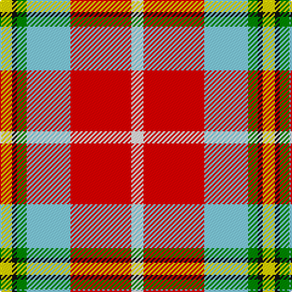

In pattern [WRWGKY](/stripes/wrwgky/).

This was sourced from register-of-tartans.  It is a [6 stripe tartan](/stripes/stripes6/).

Original link https://www.tartanregister.gov.uk/tartanDetails.aspx?ref=10293

## Register references

External register numbers recorded for this tartan.

- Scottish Register of Tartans: [10293](https://www.tartanregister.gov.uk/tartanDetails.aspx?ref=10293)

## Thread count
Y/10 K4 G8 LB36 R50 W/10

## Palette
Each colour and the base-6 reference it is a variant of.

| Colour | Shade | Base |
|---|---|---|
| G | <code style="background-color:#008B00;">#008B00</code> `oklch(55.2% 0.188 142.5)` <small>#008B00</small> | G <code style="background-color:#006100;">#006100</code> |
| K | <code style="background-color:#101010;">#101010</code> `oklch(17.3% 0.000 89.9)` <small>#101010</small> | K <code style="background-color:#000000;">#000000</code> |
| LB | <code style="background-color:#82CFFD;">#82CFFD</code> `oklch(82.2% 0.100 236.0)` <small>#82CFFD</small> | W <code style="background-color:#F7F7F7;">#F7F7F7</code> |
| R | <code style="background-color:#FF0000;">#FF0000</code> `oklch(62.8% 0.258 29.2)` <small>#FF0000</small> | R <code style="background-color:#CC0000;">#CC0000</code> |
| W | <code style="background-color:#FFFFFF;">#FFFFFF</code> `oklch(100.0% 0.000 89.9)` <small>#FFFFFF</small> | W <code style="background-color:#F7F7F7;">#F7F7F7</code> |
| Y | <code style="background-color:#FFE600;">#FFE600</code> `oklch(91.7% 0.192 101.4)` <small>#FFE600</small> | Y <code style="background-color:#F2BF00;">#F2BF00</code> |

# Sample pattern

## Nearest tartans

The nearest existing variants by ΔTartan distance, with this tartan at the top so the swatches line up against it.

ΔTartan

Tartan

Sett

—

<a href="/ttd/edit/#slug=w5r25lt18g4k2ly5~x2">Christie (London)</a> <a class="nn-out" href="/setts/s6/w5r25lt18g4k2ly5~x2/" title="open its dictionary page">↗</a>

1.16

<a href="/ttd/edit/#slug=ly3r3lo2r20k16w24w2~x2">Oor Wullie (DC Thomson)</a> <a class="nn-out" href="/setts/s7/ly3r3lo2r20k16w24w2~x2/" title="open its dictionary page">↗</a>

1.22

<a href="/ttd/edit/#slug=w5r25t18g4k2ly5~x2">Christie (London) (Personal)</a> <a class="nn-out" href="/setts/s6/w5r25t18g4k2ly5~x2/" title="open its dictionary page">↗</a>

1.26

<a href="/ttd/edit/#slug=k4ly2k4r29w29db4w2g4~x2">Clan MacLeod Societies of Canada</a> <a class="nn-out" href="/setts/s8/k4ly2k4r29w29db4w2g4~x2/" title="open its dictionary page">↗</a>

1.29

<a href="/ttd/edit/#slug=r1w12g6r8lb3lo1~x4">MacLean Dress (Lumsden)</a> <a class="nn-out" href="/setts/s6/r1w12g6r8lb3lo1~x4/" title="open its dictionary page">↗</a>

1.36

<a href="/ttd/edit/#slug=lo13b8r5k3w2g1~x4">Ball</a> <a class="nn-out" href="/setts/s6/lo13b8r5k3w2g1~x4/" title="open its dictionary page">↗</a>

1.38

<a href="/ttd/edit/#slug=r1w12g6r8t3ly1~x4">MacLean, dress</a> <a class="nn-out" href="/setts/s6/r1w12g6r8t3ly1~x4/" title="open its dictionary page">↗</a>

1.39

<a href="/ttd/edit/#slug=w8r5dp10r24w30r2db2~x2">Shiel, Claret (Dance)</a> <a class="nn-out" href="/setts/s7/w8r5dp10r24w30r2db2~x2/" title="open its dictionary page">↗</a>

1.43

<a href="/ttd/edit/#slug=r6w30r2k3r30g3r2w25r6~x2">Virginia Military Institute (Milit.)</a> <a class="nn-out" href="/setts/s9/r6w30r2k3r30g3r2w25r6~x2/" title="open its dictionary page">↗</a>

1.48

<a href="/ttd/edit/#slug=r8dp2r24db5w26dy2w8~x2">Lennox Dress</a> <a class="nn-out" href="/setts/s7/r8dp2r24db5w26dy2w8~x2/" title="open its dictionary page">↗</a>

1.48

<a href="/ttd/edit/#slug=r8p2r24db5w26o2w8~x2">Lennox, dress</a> <a class="nn-out" href="/setts/s7/r8p2r24db5w26o2w8~x2/" title="open its dictionary page">↗</a>

## Neighbour map

Every grey dot is one of 14299 variants placed by the first two principal components of the ΔTartan feature space (44% of its variance). Red is this tartan; blue dots are its nearest — click one to open its page.

<svg viewBox="0 0 640 380" role="img" style="max-width:100%;height:auto;border:1px solid #e0e0e0;border-radius:4px;display:block" xmlns="http://www.w3.org/2000/svg"><image href="/nn/cloud.v1.png" width="640" height="380"/><a href="/setts/s7/ly3r3lo2r20k16w24w2~x2/"><circle cx="120.4" cy="117.3" r="4" fill="#3465a4"><title>Oor Wullie (DC Thomson)</title></circle></a><a href="/setts/s6/w5r25t18g4k2ly5~x2/"><circle cx="189.6" cy="148.3" r="4" fill="#3465a4"><title>Christie (London) (Personal)</title></circle></a><a href="/setts/s8/k4ly2k4r29w29db4w2g4~x2/"><circle cx="166.7" cy="86.6" r="4" fill="#3465a4"><title>Clan MacLeod Societies of Canada</title></circle></a><a href="/setts/s6/r1w12g6r8lb3lo1~x4/"><circle cx="149.5" cy="158.8" r="4" fill="#3465a4"><title>MacLean Dress (Lumsden)</title></circle></a><a href="/setts/s6/lo13b8r5k3w2g1~x4/"><circle cx="151.1" cy="151.4" r="4" fill="#3465a4"><title>Ball</title></circle></a><a href="/setts/s6/r1w12g6r8t3ly1~x4/"><circle cx="158.9" cy="164.8" r="4" fill="#3465a4"><title>MacLean, dress</title></circle></a><a href="/setts/s7/w8r5dp10r24w30r2db2~x2/"><circle cx="211.6" cy="130.9" r="4" fill="#3465a4"><title>Shiel, Claret (Dance)</title></circle></a><a href="/setts/s9/r6w30r2k3r30g3r2w25r6~x2/"><circle cx="236.5" cy="100.3" r="4" fill="#3465a4"><title>Virginia Military Institute (Milit.)</title></circle></a><a href="/setts/s7/r8dp2r24db5w26dy2w8~x2/"><circle cx="234.2" cy="139.9" r="4" fill="#3465a4"><title>Lennox Dress</title></circle></a><a href="/setts/s7/r8p2r24db5w26o2w8~x2/"><circle cx="232.9" cy="141.3" r="4" fill="#3465a4"><title>Lennox, dress</title></circle></a><circle cx="166.6" cy="129.5" r="5" fill="#c00000"/></svg>

ID: /setts/s6/w5r25lt18g4k2ly5~x2/
