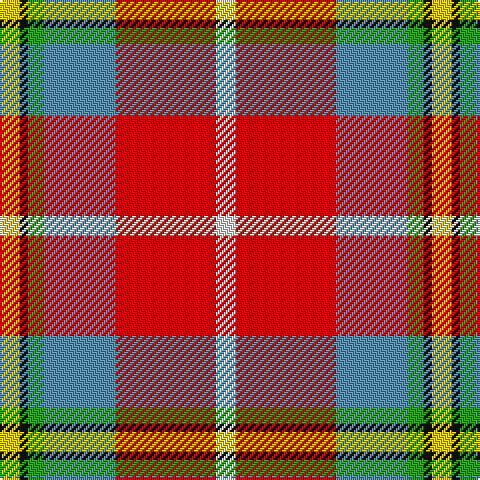

This page is one **sett** — a single exact thread-count. It belongs to the [tartan](/tartans/y5k2g4b18r25ln5/)
(the same proportion at any scale), whose colour order is pattern [WRBGKY](/stripes/wrbgky/).

Sourced from tartans-authority.  It is a [6 stripe tartan](/stripes/stripes6/).

Original link http://www.tartansauthority.com/tartan-ferret/display/10293/

## Thread count
Y/10 K4 G8 B36 R50 LN/10

## Palette
Each colour and the base-6 reference it is a variant of.

| Colour | Shade | Base |
|---|---|---|
| B | <code style="background-color:#5C8CA8;">#5C8CA8</code> `oklch(61.7% 0.067 235.0)` <small>#5C8CA8</small> | B <code style="background-color:#2A418A;">#2A418A</code> |
| G | <code style="background-color:#289C18;">#289C18</code> `oklch(60.6% 0.191 141.6)` <small>#289C18</small> | G <code style="background-color:#006100;">#006100</code> |
| K | <code style="background-color:#101010;">#101010</code> `oklch(17.3% 0.000 89.9)` <small>#101010</small> | K <code style="background-color:#000000;">#000000</code> |
| LN | <code style="background-color:#E0E0E0;">#E0E0E0</code> `oklch(90.7% 0.000 89.9)` <small>#E0E0E0</small> | W <code style="background-color:#F7F7F7;">#F7F7F7</code> |
| R | <code style="background-color:#C80000;">#C80000</code> `oklch(52.3% 0.215 29.2)` <small>#C80000</small> | R <code style="background-color:#CC0000;">#CC0000</code> |
| Y | <code style="background-color:#E8C000;">#E8C000</code> `oklch(81.9% 0.168 93.7)` <small>#E8C000</small> | Y <code style="background-color:#F2BF00;">#F2BF00</code> |

# Sample pattern

## Nearest tartans

The nearest existing variants by ΔTartan distance, with this tartan at the top so the swatches line up against it.

ΔTartan

Tartan

Sett

—

<a href="/ttd/edit/#slug=w5r25t18g4k2ly5~x2">Christie (London) (Personal)</a> <a class="nn-out" href="/setts/s6/w5r25t18g4k2ly5~x2/" title="open its dictionary page">↗</a>

0.84

<a href="/ttd/edit/#slug=lo13b8r5k3w2g1~x4">Ball</a> <a class="nn-out" href="/setts/s6/lo13b8r5k3w2g1~x4/" title="open its dictionary page">↗</a>

0.91

<a href="/ttd/edit/#slug=r48b16lo5g17w8dy3~x2">Scottish American Soc. of Michigan</a> <a class="nn-out" href="/setts/s6/r48b16lo5g17w8dy3~x2/" title="open its dictionary page">↗</a>

1.15

<a href="/ttd/edit/#slug=r3lo15g4t6w2r30t6ly3~x2">Round Table Sweden</a> <a class="nn-out" href="/setts/s8/r3lo15g4t6w2r30t6ly3~x2/" title="open its dictionary page">↗</a>

1.20

<a href="/ttd/edit/#slug=r48t16lo5dg17w8k3~x2">Scottish American Society of Michigan (Official)</a> <a class="nn-out" href="/setts/s6/r48t16lo5dg17w8k3~x2/" title="open its dictionary page">↗</a>

1.22

<a href="/ttd/edit/#slug=w5r25lt18g4k2ly5~x2">Christie (London)</a> <a class="nn-out" href="/setts/s6/w5r25lt18g4k2ly5~x2/" title="open its dictionary page">↗</a>

1.26

<a href="/ttd/edit/#slug=r26t7p8ly3r3w3g20p10w2~x2">Wilson's, No 227</a> <a class="nn-out" href="/setts/s9/r26t7p8ly3r3w3g20p10w2~x2/" title="open its dictionary page">↗</a>

1.26

<a href="/ttd/edit/#slug=ly3r3ly2r20k16lb24w2~x2">Oor Wullie (Corporate)</a> <a class="nn-out" href="/setts/s7/ly3r3ly2r20k16lb24w2~x2/" title="open its dictionary page">↗</a>

1.27

<a href="/ttd/edit/#slug=o4do2o21db11w2o20r3~x2">Barbour Dress</a> <a class="nn-out" href="/setts/s7/o4do2o21db11w2o20r3~x2/" title="open its dictionary page">↗</a>

1.28

<a href="/ttd/edit/#slug=r30db12k6dg12ly2dg3w2~x2">Hewitt</a> <a class="nn-out" href="/setts/s7/r30db12k6dg12ly2dg3w2~x2/" title="open its dictionary page">↗</a>

1.28

<a href="/ttd/edit/#slug=r10n3db1lb8db1lo2g5~x4">Porcupine City of</a> <a class="nn-out" href="/setts/s7/r10n3db1lb8db1lo2g5~x4/" title="open its dictionary page">↗</a>

## Neighbour map

Every grey dot is one of 14299 variants placed by the first two principal components of the ΔTartan feature space (44% of its variance). Red is this tartan; blue dots are its nearest — click one to open its page.

<svg viewBox="0 0 640 380" role="img" style="max-width:100%;height:auto;border:1px solid #e0e0e0;border-radius:4px;display:block" xmlns="http://www.w3.org/2000/svg"><image href="/nn/cloud.v1.png" width="640" height="380"/><a href="/setts/s6/lo13b8r5k3w2g1~x4/"><circle cx="151.1" cy="151.4" r="4" fill="#3465a4"><title>Ball</title></circle></a><a href="/setts/s6/r48b16lo5g17w8dy3~x2/"><circle cx="243.6" cy="140.3" r="4" fill="#3465a4"><title>Scottish American Soc. of Michigan</title></circle></a><a href="/setts/s8/r3lo15g4t6w2r30t6ly3~x2/"><circle cx="216.9" cy="115.1" r="4" fill="#3465a4"><title>Round Table Sweden</title></circle></a><a href="/setts/s6/r48t16lo5dg17w8k3~x2/"><circle cx="232.2" cy="134.7" r="4" fill="#3465a4"><title>Scottish American Society of Michigan (Official)</title></circle></a><a href="/setts/s6/w5r25lt18g4k2ly5~x2/"><circle cx="166.6" cy="129.5" r="4" fill="#3465a4"><title>Christie (London)</title></circle></a><a href="/setts/s9/r26t7p8ly3r3w3g20p10w2~x2/"><circle cx="145.8" cy="131.6" r="4" fill="#3465a4"><title>Wilson's, No 227</title></circle></a><a href="/setts/s7/ly3r3ly2r20k16lb24w2~x2/"><circle cx="129.5" cy="127.7" r="4" fill="#3465a4"><title>Oor Wullie (Corporate)</title></circle></a><a href="/setts/s7/o4do2o21db11w2o20r3~x2/"><circle cx="189.8" cy="167.4" r="4" fill="#3465a4"><title>Barbour Dress</title></circle></a><a href="/setts/s7/r30db12k6dg12ly2dg3w2~x2/"><circle cx="207.8" cy="131.2" r="4" fill="#3465a4"><title>Hewitt</title></circle></a><a href="/setts/s7/r10n3db1lb8db1lo2g5~x4/"><circle cx="116.5" cy="163.3" r="4" fill="#3465a4"><title>Porcupine City of</title></circle></a><circle cx="189.6" cy="148.3" r="5" fill="#c00000"/></svg>

ID: /setts/s6/w5r25t18g4k2ly5~x2/
