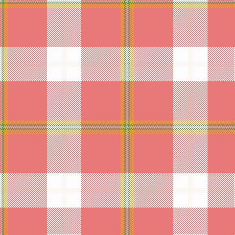

In pattern [WWRYGY](/stripes/wwrygy/).

This was sourced from register-of-tartans.  It is a [6 stripe tartan](/stripes/stripes6/).

Original link https://www.tartanregister.gov.uk/tartanDetails.aspx?ref=11001

## Register references

External register numbers recorded for this tartan.

- Scottish Register of Tartans: [11001](https://www.tartanregister.gov.uk/tartanDetails.aspx?ref=11001)

## Thread count
Wa/10 W30 LR80 Y8 LG4 N/4

## Palette
Each colour and the base-6 reference it is a variant of.

| Colour | Shade | Base |
|---|---|---|
| LG | <code style="background-color:#649848;">#649848</code> `oklch(62.4% 0.125 135.7)` <small>#649848</small> | G <code style="background-color:#006100;">#006100</code> |
| LR | <code style="background-color:#E87878;">#E87878</code> `oklch(70.0% 0.139 21.2)` <small>#E87878</small> | R <code style="background-color:#CC0000;">#CC0000</code> |
| N | <code style="background-color:#B8B8B8;">#B8B8B8</code> `oklch(78.3% 0.000 89.9)` <small>#B8B8B8</small> | Y <code style="background-color:#F2BF00;">#F2BF00</code> |
| W | <code style="background-color:#FCFCFC;">#FCFCFC</code> `oklch(99.1% 0.000 89.9)` <small>#FCFCFC</small> | W <code style="background-color:#F7F7F7;">#F7F7F7</code> |
| Wa | <code style="background-color:#F9F5EF;">#F9F5EF</code> `oklch(97.2% 0.009 78.3)` <small>#F9F5EF</small> | W <code style="background-color:#F7F7F7;">#F7F7F7</code> |
| Y | <code style="background-color:#E0A126;">#E0A126</code> `oklch(75.1% 0.146 78.3)` <small>#E0A126</small> | Y <code style="background-color:#F2BF00;">#F2BF00</code> |

# Sample pattern

## Nearest tartans

The nearest existing variants by ΔTartan distance, with this tartan at the top so the swatches line up against it.

ΔTartan

Tartan

Sett

—

<a href="/ttd/edit/#slug=w5w15r40lo4g2lr2~x2">Tomomi</a> <a class="nn-out" href="/setts/s6/w5w15r40lo4g2lr2~x2/" title="open its dictionary page">↗</a>

1.96

<a href="/ttd/edit/#slug=o47w6r24w3dt5lo3~x2">Duminiak (Personal)</a> <a class="nn-out" href="/setts/s6/o47w6r24w3dt5lo3~x2/" title="open its dictionary page">↗</a>

1.98

<a href="/ttd/edit/#slug=w2r12lg5lb35b4r4ly2~x2">Nicolson of the Isles (Personal)</a> <a class="nn-out" href="/setts/s7/w2r12lg5lb35b4r4ly2~x2/" title="open its dictionary page">↗</a>

2.10

<a href="/ttd/edit/#slug=lb40dp5lb6ly26o13lb9dy3~x2">de Meuron Dress (Family)</a> <a class="nn-out" href="/setts/s7/lb40dp5lb6ly26o13lb9dy3~x2/" title="open its dictionary page">↗</a>

2.15

<a href="/ttd/edit/#slug=r26r5m12ly1g1r3~x2">Roseate Sunrise</a> <a class="nn-out" href="/setts/s6/r26r5m12ly1g1r3~x2/" title="open its dictionary page">↗</a>

2.28

<a href="/ttd/edit/#slug=do2r3r3r21ly3r2r6g6r4lb2~x2">Hello Kitty (Corporate)</a> <a class="nn-out" href="/setts/s10/do2r3r3r21ly3r2r6g6r4lb2~x2/" title="open its dictionary page">↗</a>

2.33

<a href="/ttd/edit/#slug=o59t28ly5dg3w4ly5~x2">Dundhuin Gold</a> <a class="nn-out" href="/setts/s6/o59t28ly5dg3w4ly5~x2/" title="open its dictionary page">↗</a>

2.34

<a href="/ttd/edit/#slug=w6r25o2g3o30k3o2r30ly6~x2">Virginia Military Institute, New Market</a> <a class="nn-out" href="/setts/s9/w6r25o2g3o30k3o2r30ly6~x2/" title="open its dictionary page">↗</a>

2.36

<a href="/ttd/edit/#slug=t12ly4r4ly4ly2ly56r18w1db4w3~x2">Confederate Memorial (Military)</a> <a class="nn-out" href="/setts/s10/t12ly4r4ly4ly2ly56r18w1db4w3~x2/" title="open its dictionary page">↗</a>

2.39

<a href="/ttd/edit/#slug=lg8lr2r3lr2ly2lr28r10lb1db3lb2~x2">Confederate Memorial Commemmorative Tartan Tartan Number: 2501. Earliest known date: 1995 Designed by Dr. Philip Smith in 1995. Grey is the colour of the Confederate States of America. The fields represent the Confederate Army in line of battle-- light blue for infantry, flanked by red for artilllery and yellow for outriding cavalry. The red field represents the Confederate flag in true proportions. See products available Copyright © Blair Urquhart, Comrie, 2015</a> <a class="nn-out" href="/setts/s10/lg8lr2r3lr2ly2lr28r10lb1db3lb2~x2/" title="open its dictionary page">↗</a>

2.40

<a href="/ttd/edit/#slug=lo18r3w3r3lo2r1w1g1lo2ly1r1k1~x4">Studio Wolf Polysun</a> <a class="nn-out" href="/setts/s12/lo18r3w3r3lo2r1w1g1lo2ly1r1k1~x4/" title="open its dictionary page">↗</a>

## Neighbour map

Every grey dot is one of 14299 variants placed by the first two principal components of the ΔTartan feature space (44% of its variance). Red is this tartan; blue dots are its nearest — click one to open its page.

<svg viewBox="0 0 640 380" role="img" style="max-width:100%;height:auto;border:1px solid #e0e0e0;border-radius:4px;display:block" xmlns="http://www.w3.org/2000/svg"><image href="/nn/cloud.v1.png" width="640" height="380"/><a href="/setts/s6/o47w6r24w3dt5lo3~x2/"><circle cx="325.6" cy="158.5" r="4" fill="#3465a4"><title>Duminiak (Personal)</title></circle></a><a href="/setts/s7/w2r12lg5lb35b4r4ly2~x2/"><circle cx="290.5" cy="114.6" r="4" fill="#3465a4"><title>Nicolson of the Isles (Personal)</title></circle></a><a href="/setts/s7/lb40dp5lb6ly26o13lb9dy3~x2/"><circle cx="286.5" cy="166.4" r="4" fill="#3465a4"><title>de Meuron Dress (Family)</title></circle></a><a href="/setts/s6/r26r5m12ly1g1r3~x2/"><circle cx="350.9" cy="122.5" r="4" fill="#3465a4"><title>Roseate Sunrise</title></circle></a><a href="/setts/s10/do2r3r3r21ly3r2r6g6r4lb2~x2/"><circle cx="272.8" cy="132.2" r="4" fill="#3465a4"><title>Hello Kitty (Corporate)</title></circle></a><a href="/setts/s6/o59t28ly5dg3w4ly5~x2/"><circle cx="374.7" cy="160.3" r="4" fill="#3465a4"><title>Dundhuin Gold</title></circle></a><a href="/setts/s9/w6r25o2g3o30k3o2r30ly6~x2/"><circle cx="282.2" cy="125.3" r="4" fill="#3465a4"><title>Virginia Military Institute, New Market</title></circle></a><a href="/setts/s10/t12ly4r4ly4ly2ly56r18w1db4w3~x2/"><circle cx="375.7" cy="54.8" r="4" fill="#3465a4"><title>Confederate Memorial (Military)</title></circle></a><a href="/setts/s10/lg8lr2r3lr2ly2lr28r10lb1db3lb2~x2/"><circle cx="287.3" cy="79.5" r="4" fill="#3465a4"><title>Confederate Memorial Commemmorative Tartan Tartan Number: 2501. Earliest known date: 1995 Designed by Dr. Philip Smith in 1995. Grey is the colour of the Confederate States of America. The fields represent the Confederate Army in line of battle-- light blue for infantry, flanked by red for artilllery and yellow for outriding cavalry. The red field represents the Confederate flag in true proportions. See products available Copyright © Blair Urquhart, Comrie, 2015</title></circle></a><a href="/setts/s12/lo18r3w3r3lo2r1w1g1lo2ly1r1k1~x4/"><circle cx="324.1" cy="62.3" r="4" fill="#3465a4"><title>Studio Wolf Polysun</title></circle></a><circle cx="357.9" cy="120.4" r="5" fill="#c00000"/></svg>

ID: /setts/s6/w5w15r40lo4g2lr2~x2/
