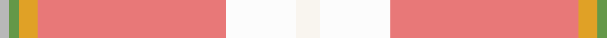

In pattern [WWRYGY](/patterns/wwrygy/).

This was sourced from register-of-tartans.  It is a [6 stripes tartan](/stripes/stripes6/).

Original link https://www.tartanregister.gov.uk/tartanDetails.aspx?ref=11001

## Thread count
N/4 LG4 Y8 LR80 W30 Wa/10

## Palette
Each colour and its ΔE from the base-6 reference it is a variant of.

| Colour | Shade | Base | ΔE (OKLab) |
|---|---|---|---|
| LG | <code style="background-color:#649848;">#649848</code> `#649848` | G <code style="background-color:#006100;">#006100</code> | 0.20 |
| LR | <code style="background-color:#E87878;">#E87878</code> `#E87878` | R <code style="background-color:#CC0000;">#CC0000</code> | 0.19 |
| N | <code style="background-color:#B8B8B8;">#B8B8B8</code> `#B8B8B8` | Y <code style="background-color:#F2BF00;">#F2BF00</code> | 0.17 |
| W | <code style="background-color:#FCFCFC;">#FCFCFC</code> `#FCFCFC` | W <code style="background-color:#F7F7F7;">#F7F7F7</code> | 0.01 |
| Wa | <code style="background-color:#F9F5EF;">#F9F5EF</code> `#F9F5EF` | W <code style="background-color:#F7F7F7;">#F7F7F7</code> | 0.01 |
| Y | <code style="background-color:#E0A126;">#E0A126</code> `#E0A126` | Y <code style="background-color:#F2BF00;">#F2BF00</code> | 0.08 |

# Sample pattern

## Nearest tartans

The nearest existing variants by ΔTartan distance.

1. [Duminiak (Personal)](/setts/s6/r47w6ra24w3b5y3~b003c64-r888888-rac80000-we0e0e0-ybc8c00~x2/) — ΔT 1.95
1. [Nicolson of the Isles (Personal)](/setts/s7/w2r12y5wa35b4r4ya2~b6080d0-rc80000-we0e0e0-wa98c8e8-y80c86c-yae8c000~x2/) — ΔT 1.97
1. [Australian Dress District Tartan Tartan Number: 612. Earliest known date: 1987 Information from the Scottish Australian Heritage Council See products available Copyright © Blair Urquhart, Comrie, 2015](/setts/s9/w50r4y2k2y2r4y10r15b2~b5c8ca8-k101010-rac6444-we0e0e0-ybc9450~x2/) — ΔT 2.02
1. [de Meuron Dress (Family)](/setts/s7/w40b5w6y26r13w9g3~b440044-g604000-r888888-we8ccb8-ye8c000~x2/) — ΔT 2.09
1. [Roseate Sunrise](/setts/s6/r26ra5rb12y1g1rc3~g649848-re87878-ra960000-rb781c38-rcc82828-yc4bc68~x2/) — ΔT 2.14
1. [Hello Kitty (Corporate)](/setts/s10/b2r3ra3r21y3r2ra6g6ra4w2~b441800-g008078-rf87488-raf83838-wd4d4d4-ye8c000~x2/) — ΔT 2.28
1. [Dundhuin Gold](/setts/s6/r59b28y5g3w4y5~b5f749c-g23321b-r905966-we5e0d2-yf8e38c~x2/) — ΔT 2.32
1. [Virginia Military Institute, New Market](/setts/s9/w6r25ra2g3ra30k3ra2r30y6~g006818-k101010-rc80000-ra888888-we0e0e0-ye8c000~x2/) — ΔT 2.34
1. [Confederate Memorial (Military)](/setts/s10/b12y4r4y4ya2y56r18w1ba4w3~b2888c4-ba2c2c80-rc80000-wfcfcfc-yb8b090-yafccc00~x2/) — ΔT 2.36
1. [Confederate Memorial Commemmorative Tartan Tartan Number: 2501. Earliest known date: 1995 Designed by Dr. Philip Smith in 1995. Grey is the colour of the Confederate States of America. The fields represent the Confederate Army in line of battle-- light blue for infantry, flanked by red for artilllery and yellow for outriding cavalry. The red field represents the Confederate flag in true proportions. See products available Copyright © Blair Urquhart, Comrie, 2015](/setts/s10/y8ya2r3ya2yb2ya28r10w1b3w2~b1c0070-ra00024-wc0c0c0-y48a4c0-yab8b8b8-ybe8c000~x2/) — ΔT 2.39

## Neighbour map

Every grey dot is one of 15726 variants placed by the first two principal components of the ΔTartan feature space (44% of its variance). Red is this tartan; blue dots are its nearest — click one to open its page.

<svg viewBox="0 0 640 380" role="img" style="max-width:100%;height:auto;border:1px solid #e0e0e0;border-radius:4px;display:block" xmlns="http://www.w3.org/2000/svg"><image href="/nn/cloud.v1.png" width="640" height="380"/><a href="/setts/s6/r47w6ra24w3b5y3~b003c64-r888888-rac80000-we0e0e0-ybc8c00~x2/"><circle cx="325.2" cy="157.3" r="4" fill="#3465a4"><title>Duminiak (Personal)</title></circle></a><a href="/setts/s7/w2r12y5wa35b4r4ya2~b6080d0-rc80000-we0e0e0-wa98c8e8-y80c86c-yae8c000~x2/"><circle cx="289.3" cy="114.3" r="4" fill="#3465a4"><title>Nicolson of the Isles (Personal)</title></circle></a><a href="/setts/s9/w50r4y2k2y2r4y10r15b2~b5c8ca8-k101010-rac6444-we0e0e0-ybc9450~x2/"><circle cx="338.6" cy="92.7" r="4" fill="#3465a4"><title>Australian Dress District Tartan Tartan Number: 612. Earliest known date: 1987 Information from the Scottish Australian Heritage Council See products available Copyright © Blair Urquhart, Comrie, 2015</title></circle></a><a href="/setts/s7/w40b5w6y26r13w9g3~b440044-g604000-r888888-we8ccb8-ye8c000~x2/"><circle cx="286.4" cy="165.5" r="4" fill="#3465a4"><title>de Meuron Dress (Family)</title></circle></a><a href="/setts/s6/r26ra5rb12y1g1rc3~g649848-re87878-ra960000-rb781c38-rcc82828-yc4bc68~x2/"><circle cx="352.0" cy="121.1" r="4" fill="#3465a4"><title>Roseate Sunrise</title></circle></a><a href="/setts/s10/b2r3ra3r21y3r2ra6g6ra4w2~b441800-g008078-rf87488-raf83838-wd4d4d4-ye8c000~x2/"><circle cx="273.9" cy="129.4" r="4" fill="#3465a4"><title>Hello Kitty (Corporate)</title></circle></a><a href="/setts/s6/r59b28y5g3w4y5~b5f749c-g23321b-r905966-we5e0d2-yf8e38c~x2/"><circle cx="374.1" cy="156.7" r="4" fill="#3465a4"><title>Dundhuin Gold</title></circle></a><a href="/setts/s9/w6r25ra2g3ra30k3ra2r30y6~g006818-k101010-rc80000-ra888888-we0e0e0-ye8c000~x2/"><circle cx="282.5" cy="125.1" r="4" fill="#3465a4"><title>Virginia Military Institute, New Market</title></circle></a><a href="/setts/s10/b12y4r4y4ya2y56r18w1ba4w3~b2888c4-ba2c2c80-rc80000-wfcfcfc-yb8b090-yafccc00~x2/"><circle cx="375.3" cy="54.0" r="4" fill="#3465a4"><title>Confederate Memorial (Military)</title></circle></a><a href="/setts/s10/y8ya2r3ya2yb2ya28r10w1b3w2~b1c0070-ra00024-wc0c0c0-y48a4c0-yab8b8b8-ybe8c000~x2/"><circle cx="286.1" cy="78.3" r="4" fill="#3465a4"><title>Confederate Memorial Commemmorative Tartan Tartan Number: 2501. Earliest known date: 1995 Designed by Dr. Philip Smith in 1995. Grey is the colour of the Confederate States of America. The fields represent the Confederate Army in line of battle-- light blue for infantry, flanked by red for artilllery and yellow for outriding cavalry. The red field represents the Confederate flag in true proportions. See products available Copyright © Blair Urquhart, Comrie, 2015</title></circle></a><circle cx="358.8" cy="119.6" r="5" fill="#c00000"/></svg>

ID: /setts/s6/w5wa15r40y4g2ya2~g649848-re87878-wf9f5ef-wafcfcfc-ye0a126-yab8b8b8~x2/
