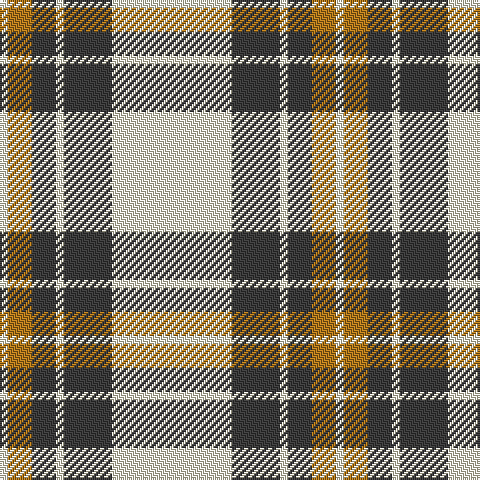

In pattern [WBWBRW](/patterns/wbwbrw/).

This was sourced from tartans-authority.  It is a [6 stripes tartan](/stripes/stripes6/).

Original link http://www.tartansauthority.com/tartan-ferret/display/3774/

## Attestations

This cloth appears in 2 source records; the oldest owns this page.

- pre 2002 — Burns (Fashion) (tartans-authority, [record](http://www.tartansauthority.com/tartan-ferret/display/3774/))
- undated — Burns (register-of-tartans, [record](https://www.tartanregister.gov.uk/tartanDetails.aspx?ref=5040))

## Thread count
LY/4 LT12 N12 LY4 N24 LY/60

## Palette
Each colour and its ΔE from the base-6 reference it is a variant of.

| Colour | Shade | Base | ΔE (OKLab) |
|---|---|---|---|
| LT | <code style="background-color:#B0781C;">#B0781C</code> `#B0781C` | R <code style="background-color:#CC0000;">#CC0000</code> | 0.18 |
| LY | <code style="background-color:#F8F4D0;">#F8F4D0</code> `#F8F4D0` | W <code style="background-color:#F7F7F7;">#F7F7F7</code> | 0.05 |
| N | <code style="background-color:#3C3C3C;">#3C3C3C</code> `#3C3C3C` | B <code style="background-color:#2A418A;">#2A418A</code> | 0.13 |

# Sample pattern

## Nearest tartans

The nearest existing variants by ΔTartan distance.

1. [WVU Mountaineer Tartan](/setts/s6/b8y18w8b18y36w2-b000080-wffffff-yffe700/) — ΔT 1.23
1. [WVU Mountaineer (Corporate)](/setts/s6/b8y18w8b18y36w2-b003c64-wfcfcfc-yfccc00/) — ΔT 1.32
1. [Clackson Arisaid (Name?)](/setts/s7/w48g4w16b10y8b10y8-b2c2c80-g006818-we0e0e0-ye8c000/) — ΔT 1.34
1. [MacPherson #10](/setts/s6/r4w56k24w4k12y4-k101010-rdc0000-we0e0e0-ye8c000/) — ΔT 1.43
1. [O'Neill Pipe Band 1999/ Oliver dress](/setts/s9/w8g4w8r24w40g24w8r4w8-g289c18-rc80028-we0e0e0/) — ΔT 1.50
1. [MacPherson of Cluny (Black and White)](/setts/s7/w10r6w70k56w8k22w4-k101010-rc80000-wfcfcfc/) — ΔT 1.55
1. [O'Neill](/setts/s9/w4g2w4r12w20g12w4r2w4-g008000-r806050-we0e0e0/) — ΔT 1.60
1. [Stutterheim](/setts/s6/k4y18b44k3y10k4-b565c76-k101010-yecdc8e/) — ΔT 1.60
1. [Lister (Misty Mountain)](/setts/s7/g16y58g16ya6g16y16ya6-g5d321f-yccbaaf-yae0a126/) — ΔT 1.62
1. [Forbes Dress (Clans Originaux)](/setts/s7/w12b6w40k4w6k50w6-b1474b4-k101010-wfcfcfc/) — ΔT 1.65

## Neighbour map

Every grey dot is one of 15726 variants placed by the first two principal components of the ΔTartan feature space (44% of its variance). Red is this tartan; blue dots are its nearest — click one to open its page.

<svg viewBox="0 0 640 380" role="img" style="max-width:100%;height:auto;border:1px solid #e0e0e0;border-radius:4px;display:block" xmlns="http://www.w3.org/2000/svg"><image href="/nn/cloud.v1.png" width="640" height="380"/><a href="/setts/s6/b8y18w8b18y36w2-b000080-wffffff-yffe700/"><circle cx="301.3" cy="183.5" r="4" fill="#3465a4"><title>WVU Mountaineer Tartan</title></circle></a><a href="/setts/s6/b8y18w8b18y36w2-b003c64-wfcfcfc-yfccc00/"><circle cx="317.1" cy="186.7" r="4" fill="#3465a4"><title>WVU Mountaineer (Corporate)</title></circle></a><a href="/setts/s7/w48g4w16b10y8b10y8-b2c2c80-g006818-we0e0e0-ye8c000/"><circle cx="304.0" cy="164.1" r="4" fill="#3465a4"><title>Clackson Arisaid (Name?)</title></circle></a><a href="/setts/s6/r4w56k24w4k12y4-k101010-rdc0000-we0e0e0-ye8c000/"><circle cx="300.4" cy="153.0" r="4" fill="#3465a4"><title>MacPherson #10</title></circle></a><a href="/setts/s9/w8g4w8r24w40g24w8r4w8-g289c18-rc80028-we0e0e0/"><circle cx="287.6" cy="186.4" r="4" fill="#3465a4"><title>O'Neill Pipe Band 1999/ Oliver dress</title></circle></a><a href="/setts/s7/w10r6w70k56w8k22w4-k101010-rc80000-wfcfcfc/"><circle cx="301.1" cy="161.0" r="4" fill="#3465a4"><title>MacPherson of Cluny (Black and White)</title></circle></a><a href="/setts/s9/w4g2w4r12w20g12w4r2w4-g008000-r806050-we0e0e0/"><circle cx="286.0" cy="192.9" r="4" fill="#3465a4"><title>O'Neill</title></circle></a><a href="/setts/s6/k4y18b44k3y10k4-b565c76-k101010-yecdc8e/"><circle cx="304.6" cy="179.1" r="4" fill="#3465a4"><title>Stutterheim</title></circle></a><a href="/setts/s7/g16y58g16ya6g16y16ya6-g5d321f-yccbaaf-yae0a126/"><circle cx="312.8" cy="202.0" r="4" fill="#3465a4"><title>Lister (Misty Mountain)</title></circle></a><a href="/setts/s7/w12b6w40k4w6k50w6-b1474b4-k101010-wfcfcfc/"><circle cx="281.0" cy="173.0" r="4" fill="#3465a4"><title>Forbes Dress (Clans Originaux)</title></circle></a><circle cx="323.2" cy="169.7" r="5" fill="#c00000"/></svg>

ID: /setts/s6/w60b24w4b12r12w4-b3c3c3c-rb0781c-wf8f4d0/
