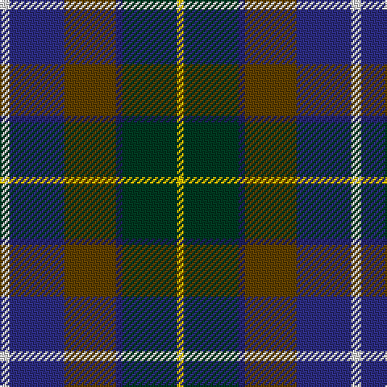

In pattern [WBGBGY](/patterns/wbgbgy/).

This was sourced from house-of-tartan.  It is a [6 stripes tartan](/stripes/stripes6/).

Original link http://www.house-of-tartan.scotland.net/house/TartanViewjs.asp?colr=Def&tnam=1781

## Thread count
LN/6 DB34 T32 DBa4 DG34 Y/4

## Palette
Each colour and its ΔE from the base-6 reference it is a variant of.

| Colour | Shade | Base | ΔE (OKLab) |
|---|---|---|---|
| DB | <code style="background-color:#2C2C80;">#2C2C80</code> `#2C2C80` | B <code style="background-color:#2A418A;">#2A418A</code> | 0.06 |
| DBa | <code style="background-color:#202060;">#202060</code> `#202060` | B <code style="background-color:#2A418A;">#2A418A</code> | 0.11 |
| DG | <code style="background-color:#003820;">#003820</code> `#003820` | G <code style="background-color:#006100;">#006100</code> | 0.15 |
| LN | <code style="background-color:#E0E0E0;">#E0E0E0</code> `#E0E0E0` | W <code style="background-color:#F7F7F7;">#F7F7F7</code> | 0.07 |
| T | <code style="background-color:#604000;">#604000</code> `#604000` | G <code style="background-color:#006100;">#006100</code> | 0.14 |
| Y | <code style="background-color:#E8C000;">#E8C000</code> `#E8C000` | Y <code style="background-color:#F2BF00;">#F2BF00</code> | 0.02 |

# Sample pattern

## Nearest tartans

The nearest existing variants by ΔTartan distance.

1. [Atlantic, Ancient](/setts/s6/w6b34r32ba4g34y4-b304080-ba000050-g003000-r806050-we0e0e0-yf0c000/) — ΔT 0.58
1. [Ancient Atlantic (Fashion)](/setts/s6/w6b34ba32bb4g34y4-b1c0070-ba441800-bb14283c-g003820-wc0c0c0-yd09800/) — ΔT 0.73
1. [Gracey (2013)](/setts/s7/r6b16g40k40ba34k6y6-b780078-ba202060-g006818-k101010-rc80050-y48a4c0/) — ΔT 0.83
1. [Ayrshire (International Tartans)](/setts/s7/b22ba4bb8ba42k32g38y8-b5a008c-ba2c4084-bb3c82af-g005020-k101010-ye8c000/) — ΔT 0.98
1. [MacDonald (Flora.. )](/setts/s7/g34y4k28r4b18r4b20-b2c4084-g005020-k101010-rdc0000-ye8c000/) — ΔT 1.05
1. [State Seal of Michigan (Fashion)](/setts/s6/r8b54y12ba38bb76w8-b441800-ba5c5c5c-bb1474b4-r880000-we8ccb8-ya08858/) — ΔT 1.06
1. [Royal Burgh of Peebles (District)](/setts/s7/r6g6b8g34k26ba52w6-b2c2c80-ba14283c-g006818-k101010-rc80000-wf8f8f8/) — ΔT 1.06
1. [Porteous Family Tartan Tartan Number: 1264. Earliest known date: 1978 Designed for the Porteous Family Association, and submitted to the Monitoring Committee of the Scottish Tartan Society by Captain Barry Porteous who was president of the association at that time. See products available Copyright © Blair Urquhart, Comrie, 2015](/setts/s6/k2y2b16g20ba14w2-b2c2c80-ba1c4874-g006818-k101010-we0e0e0-ye8c000/) — ΔT 1.06
1. [Meeson Hunting Name Tartan Tartan Number: 6027. Earliest known date: 2007 Hunting version. The black and gray were originally woven with a melange or marled yarn. See products available Copyright © Blair Urquhart, Comrie, 2015](/setts/s6/k52b20ba38r12y4bb18-b787478-ba184458-bb105088-k101010-r880000-yc4a820/) — ΔT 1.08
1. [Falardeau-Murphy (Canada) (Personal)](/setts/s7/g42b42y6r42ba6bb10ba6-b5f749c-ba14283c-bb5a008c-g004c00-r960028-yffe600/) — ΔT 1.08

## Neighbour map

Every grey dot is one of 15726 variants placed by the first two principal components of the ΔTartan feature space (44% of its variance). Red is this tartan; blue dots are its nearest — click one to open its page.

<svg viewBox="0 0 640 380" role="img" style="max-width:100%;height:auto;border:1px solid #e0e0e0;border-radius:4px;display:block" xmlns="http://www.w3.org/2000/svg"><image href="/nn/cloud.v1.png" width="640" height="380"/><a href="/setts/s6/w6b34r32ba4g34y4-b304080-ba000050-g003000-r806050-we0e0e0-yf0c000/"><circle cx="115.1" cy="194.5" r="4" fill="#3465a4"><title>Atlantic, Ancient</title></circle></a><a href="/setts/s6/w6b34ba32bb4g34y4-b1c0070-ba441800-bb14283c-g003820-wc0c0c0-yd09800/"><circle cx="138.3" cy="208.2" r="4" fill="#3465a4"><title>Ancient Atlantic (Fashion)</title></circle></a><a href="/setts/s7/r6b16g40k40ba34k6y6-b780078-ba202060-g006818-k101010-rc80050-y48a4c0/"><circle cx="106.5" cy="208.0" r="4" fill="#3465a4"><title>Gracey (2013)</title></circle></a><a href="/setts/s7/b22ba4bb8ba42k32g38y8-b5a008c-ba2c4084-bb3c82af-g005020-k101010-ye8c000/"><circle cx="105.8" cy="197.0" r="4" fill="#3465a4"><title>Ayrshire (International Tartans)</title></circle></a><a href="/setts/s7/g34y4k28r4b18r4b20-b2c4084-g005020-k101010-rdc0000-ye8c000/"><circle cx="156.7" cy="216.1" r="4" fill="#3465a4"><title>MacDonald (Flora.. )</title></circle></a><a href="/setts/s6/r8b54y12ba38bb76w8-b441800-ba5c5c5c-bb1474b4-r880000-we8ccb8-ya08858/"><circle cx="169.7" cy="191.4" r="4" fill="#3465a4"><title>State Seal of Michigan (Fashion)</title></circle></a><a href="/setts/s7/r6g6b8g34k26ba52w6-b2c2c80-ba14283c-g006818-k101010-rc80000-wf8f8f8/"><circle cx="150.6" cy="186.1" r="4" fill="#3465a4"><title>Royal Burgh of Peebles (District)</title></circle></a><a href="/setts/s6/k2y2b16g20ba14w2-b2c2c80-ba1c4874-g006818-k101010-we0e0e0-ye8c000/"><circle cx="159.8" cy="196.1" r="4" fill="#3465a4"><title>Porteous Family Tartan Tartan Number: 1264. Earliest known date: 1978 Designed for the Porteous Family Association, and submitted to the Monitoring Committee of the Scottish Tartan Society by Captain Barry Porteous who was president of the association at that time. See products available Copyright © Blair Urquhart, Comrie, 2015</title></circle></a><a href="/setts/s6/k52b20ba38r12y4bb18-b787478-ba184458-bb105088-k101010-r880000-yc4a820/"><circle cx="163.5" cy="201.1" r="4" fill="#3465a4"><title>Meeson Hunting Name Tartan Tartan Number: 6027. Earliest known date: 2007 Hunting version. The black and gray were originally woven with a melange or marled yarn. See products available Copyright © Blair Urquhart, Comrie, 2015</title></circle></a><a href="/setts/s7/g42b42y6r42ba6bb10ba6-b5f749c-ba14283c-bb5a008c-g004c00-r960028-yffe600/"><circle cx="101.0" cy="188.6" r="4" fill="#3465a4"><title>Falardeau-Murphy (Canada) (Personal)</title></circle></a><circle cx="127.9" cy="201.9" r="5" fill="#c00000"/></svg>

ID: /setts/s6/w6b34g32ba4ga34y4-b2c2c80-ba202060-g604000-ga003820-we0e0e0-ye8c000/
