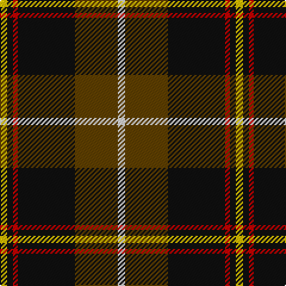

In pattern [WGKRKY](/stripes/wgkrky/).

This was sourced from register-of-tartans.  It is a [6 stripe tartan](/stripes/stripes6/).

Original link https://www.tartanregister.gov.uk/tartanDetails.aspx?ref=973

## Attestations

This cloth appears in 2 source records; the oldest owns this page.

- 01/07/1998 — Drambuie Dress (register-of-tartans, [record](https://www.tartanregister.gov.uk/tartanDetails.aspx?ref=973))
- pre 1998 — Drambuie Dress (Corporate) (tartans-authority, [record](http://www.tartansauthority.com/tartan-ferret/display/2485/))

## Register references

External register numbers recorded for this tartan.

- Scottish Register of Tartans: [973](https://www.tartanregister.gov.uk/tartanDetails.aspx?ref=973)
- Scottish Tartans Authority (ITI): 2485
- Scottish Tartans World Register: 2485

## Thread count
Y/6 K5 R4 K48 T36 LN/6

## Palette
Each colour and the base-6 reference it is a variant of.

| Colour | Shade | Base |
|---|---|---|
| K | <code style="background-color:#101010;">#101010</code> `oklch(17.3% 0.000 89.9)` <small>#101010</small> | K <code style="background-color:#000000;">#000000</code> |
| LN | <code style="background-color:#E0E0E0;">#E0E0E0</code> `oklch(90.7% 0.000 89.9)` <small>#E0E0E0</small> | W <code style="background-color:#F7F7F7;">#F7F7F7</code> |
| R | <code style="background-color:#C80000;">#C80000</code> `oklch(52.3% 0.215 29.2)` <small>#C80000</small> | R <code style="background-color:#CC0000;">#CC0000</code> |
| T | <code style="background-color:#604000;">#604000</code> `oklch(39.8% 0.083 76.8)` <small>#604000</small> | G <code style="background-color:#006100;">#006100</code> |
| Y | <code style="background-color:#E8C000;">#E8C000</code> `oklch(81.9% 0.168 93.7)` <small>#E8C000</small> | Y <code style="background-color:#F2BF00;">#F2BF00</code> |

# Sample pattern

## Nearest tartans

The nearest existing variants by ΔTartan distance, with this tartan at the top so the swatches line up against it.

ΔTartan

Tartan

Sett

—

<a href="/ttd/edit/#slug=w6dy36k48r4k5ly6">Drambuie Dress</a> <a class="nn-out" href="/setts/s6/w6dy36k48r4k5ly6/" title="open its dictionary page">↗</a>

0.78

<a href="/ttd/edit/#slug=w6r36k48lo4k5ly6">Drambuie</a> <a class="nn-out" href="/setts/s6/w6r36k48lo4k5ly6/" title="open its dictionary page">↗</a>

1.01

<a href="/ttd/edit/#slug=k17dg48ly4r10lb12dg4">Asheville Firefighters, The</a> <a class="nn-out" href="/setts/s6/k17dg48ly4r10lb12dg4/" title="open its dictionary page">↗</a>

1.02

<a href="/ttd/edit/#slug=n6dp4n2w2n25k26ly4~x2">New York State Troopers</a> <a class="nn-out" href="/setts/s7/n6dp4n2w2n25k26ly4~x2/" title="open its dictionary page">↗</a>

1.05

<a href="/ttd/edit/#slug=w6o36k48r4k5ly6">Drambuie dress</a> <a class="nn-out" href="/setts/s6/w6o36k48r4k5ly6/" title="open its dictionary page">↗</a>

1.08

<a href="/ttd/edit/#slug=dy30ly5t10k10w2k2~x2">Bryan Wedding (Personal)</a> <a class="nn-out" href="/setts/s6/dy30ly5t10k10w2k2~x2/" title="open its dictionary page">↗</a>

1.08

<a href="/ttd/edit/#slug=k3dy3lo6k12lo1o2dy2~x4">Strummer, Joe (Commemorative)</a> <a class="nn-out" href="/setts/s7/k3dy3lo6k12lo1o2dy2~x4/" title="open its dictionary page">↗</a>

1.11

<a href="/ttd/edit/#slug=g3ly5r14k36w3~x2">Papua New Guinea</a> <a class="nn-out" href="/setts/s5/g3ly5r14k36w3~x2/" title="open its dictionary page">↗</a>

1.11

<a href="/ttd/edit/#slug=dg37k22w4r15ly3~x2">Oakley (2015)</a> <a class="nn-out" href="/setts/s5/dg37k22w4r15ly3~x2/" title="open its dictionary page">↗</a>

1.12

<a href="/ttd/edit/#slug=r6dt4w2g27dt37ly2~x2">Highlands of Durham (Corporate)</a> <a class="nn-out" href="/setts/s6/r6dt4w2g27dt37ly2~x2/" title="open its dictionary page">↗</a>

1.14

<a href="/ttd/edit/#slug=lo6dy36k48r4k5lo6">Drambuie Hunting</a> <a class="nn-out" href="/setts/s6/lo6dy36k48r4k5lo6/" title="open its dictionary page">↗</a>

## Neighbour map

Every grey dot is one of 14299 variants placed by the first two principal components of the ΔTartan feature space (44% of its variance). Red is this tartan; blue dots are its nearest — click one to open its page.

<svg viewBox="0 0 640 380" role="img" style="max-width:100%;height:auto;border:1px solid #e0e0e0;border-radius:4px;display:block" xmlns="http://www.w3.org/2000/svg"><image href="/nn/cloud.v1.png" width="640" height="380"/><a href="/setts/s6/w6r36k48lo4k5ly6/"><circle cx="266.4" cy="166.6" r="4" fill="#3465a4"><title>Drambuie</title></circle></a><a href="/setts/s6/k17dg48ly4r10lb12dg4/"><circle cx="262.0" cy="178.0" r="4" fill="#3465a4"><title>Asheville Firefighters, The</title></circle></a><a href="/setts/s7/n6dp4n2w2n25k26ly4~x2/"><circle cx="258.2" cy="167.0" r="4" fill="#3465a4"><title>New York State Troopers</title></circle></a><a href="/setts/s6/w6o36k48r4k5ly6/"><circle cx="242.8" cy="163.4" r="4" fill="#3465a4"><title>Drambuie dress</title></circle></a><a href="/setts/s6/dy30ly5t10k10w2k2~x2/"><circle cx="252.7" cy="161.5" r="4" fill="#3465a4"><title>Bryan Wedding (Personal)</title></circle></a><a href="/setts/s7/k3dy3lo6k12lo1o2dy2~x4/"><circle cx="264.7" cy="193.5" r="4" fill="#3465a4"><title>Strummer, Joe (Commemorative)</title></circle></a><a href="/setts/s5/g3ly5r14k36w3~x2/"><circle cx="299.0" cy="169.4" r="4" fill="#3465a4"><title>Papua New Guinea</title></circle></a><a href="/setts/s5/dg37k22w4r15ly3~x2/"><circle cx="213.5" cy="197.1" r="4" fill="#3465a4"><title>Oakley (2015)</title></circle></a><a href="/setts/s6/r6dt4w2g27dt37ly2~x2/"><circle cx="301.7" cy="159.2" r="4" fill="#3465a4"><title>Highlands of Durham (Corporate)</title></circle></a><a href="/setts/s6/lo6dy36k48r4k5lo6/"><circle cx="300.8" cy="189.9" r="4" fill="#3465a4"><title>Drambuie Hunting</title></circle></a><circle cx="266.9" cy="173.8" r="5" fill="#c00000"/></svg>

ID: /setts/s6/w6dy36k48r4k5ly6/
