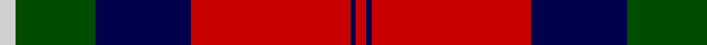
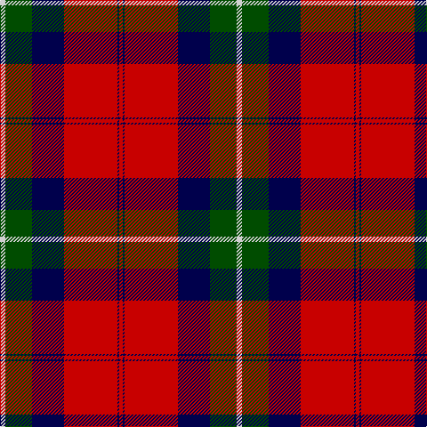

In pattern [RBRBGW](/patterns/rbrbgw/).

This was sourced from weddslist.  It is a [6 stripes tartan](/stripes/stripes6/).

Original link http://www.weddslist.com/cgi-bin/tartans/pg.pl?source=rb

## Thread count
N/6 G30 DB36 R60 DB2 R/4

## Palette
Each colour and its ΔE from the base-6 reference it is a variant of.

| Colour | Shade | Base | ΔE (OKLab) |
|---|---|---|---|
| DB | <code style="background-color:#00004C;">#00004C</code> `#00004C` | B <code style="background-color:#2C4084;">#2C4084</code> | 0.21 |
| G | <code style="background-color:#004C00;">#004C00</code> `#004C00` | G <code style="background-color:#006400;">#006400</code> | 0.08 |
| N | <code style="background-color:#D0D0D0;">#D0D0D0</code> `#D0D0D0` | W <code style="background-color:#F4F4F0;">#F4F4F0</code> | 0.11 |
| R | <code style="background-color:#C80000;">#C80000</code> `#C80000` | R <code style="background-color:#C80000;">#C80000</code> | 0.00 |

# Sample pattern

## Nearest tartans

The nearest existing variants by ΔTartan distance.

1. [Ruthven](/setts/s6/y6g30b36r60g2r4-b000052-g11450d-raa0000-yaaaaaa/) — ΔT 0.71
1. [Ruthven](/setts/s6/y3g15b18r30g1r2-b000052-g11450d-raa0000-yaaaaaa/) — ΔT 0.71
1. [Ruthven Clan Tartan Tartan Number: 1521. Earliest known date: 1842 The name Ruthven comes from the old Barony of Ruthven in Angus. Ruthvens were Earls of Gowrie at the time of James VI of Scotland. More recently Sir Alexander Hore- Ruthven of Freeland, Governor General of Australia, was created Earl of Gowrie in 1945. The Ruthven tartan was not named until the publication of the romantic fiction known as the Vestiarium Scoticum in 1842. See products available Copyright © Blair Urquhart, Comrie, 2015](/setts/s6/w6g30b36r60g2r4-b2c2c80-g006818-rc80000-we0e0e0/) — ΔT 0.80
1. [Fraser](/setts/s6/r4b24r4g24r48w2-b000050-g003000-rc00000-we0e0e0/) — ΔT 0.85
1. [Ruthven](/setts/s6/w6g30b36r60g2r4-b304080-g008000-rc00000-we0e0e0/) — ΔT 1.10
1. [Loch Ness](/setts/s6/r20w4k20w20g70k10-g503c14-k101010-rdc0000-we0e0e0/) — ΔT 1.16
1. [Loch Ness Trade Tartan Tartan Number: 1219. Earliest known date: pre 2003 Nothing See products available Copyright © Blair Urquhart, Comrie, 2015](/setts/s6/r20w4k20w20g70k10-g604000-k101010-rc80000-we0e0e0/) — ΔT 1.20
1. [Loch Ness](/setts/s6/r20w4k20w20ra70k10-k000000-rc00000-ra806050-we0e0e0/) — ΔT 1.23
1. [Clyde (Personal)](/setts/s7/r64k30g30b18w4b2w3-b1474b4-g006818-k101010-rc8002c-wfcfcfc/) — ΔT 1.23
1. [Fraser (1745)](/setts/s6/r4b24r4g24r48w2-b2c2c80-g006818-rc80000-wfcfcfc/) — ΔT 1.24

## Neighbour map

Every grey dot is one of 15726 variants placed by the first two principal components of the ΔTartan feature space (44% of its variance). Red is this tartan; blue dots are its nearest — click one to open its page.

<svg viewBox="0 0 640 380" role="img" style="max-width:100%;height:auto;border:1px solid #e0e0e0;border-radius:4px;display:block" xmlns="http://www.w3.org/2000/svg"><image href="/nn/cloud.v1.png" width="640" height="380"/><a href="/setts/s6/y6g30b36r60g2r4-b000052-g11450d-raa0000-yaaaaaa/"><circle cx="298.7" cy="161.6" r="4" fill="#3465a4"><title>Ruthven</title></circle></a><a href="/setts/s6/y3g15b18r30g1r2-b000052-g11450d-raa0000-yaaaaaa/"><circle cx="298.7" cy="161.6" r="4" fill="#3465a4"><title>Ruthven</title></circle></a><a href="/setts/s6/w6g30b36r60g2r4-b2c2c80-g006818-rc80000-we0e0e0/"><circle cx="295.0" cy="153.8" r="4" fill="#3465a4"><title>Ruthven Clan Tartan Tartan Number: 1521. Earliest known date: 1842 The name Ruthven comes from the old Barony of Ruthven in Angus. Ruthvens were Earls of Gowrie at the time of James VI of Scotland. More recently Sir Alexander Hore- Ruthven of Freeland, Governor General of Australia, was created Earl of Gowrie in 1945. The Ruthven tartan was not named until the publication of the romantic fiction known as the Vestiarium Scoticum in 1842. See products available Copyright © Blair Urquhart, Comrie, 2015</title></circle></a><a href="/setts/s6/r4b24r4g24r48w2-b000050-g003000-rc00000-we0e0e0/"><circle cx="320.9" cy="162.0" r="4" fill="#3465a4"><title>Fraser</title></circle></a><a href="/setts/s6/w6g30b36r60g2r4-b304080-g008000-rc00000-we0e0e0/"><circle cx="297.8" cy="155.8" r="4" fill="#3465a4"><title>Ruthven</title></circle></a><a href="/setts/s6/r20w4k20w20g70k10-g503c14-k101010-rdc0000-we0e0e0/"><circle cx="251.5" cy="170.1" r="4" fill="#3465a4"><title>Loch Ness</title></circle></a><a href="/setts/s6/r20w4k20w20g70k10-g604000-k101010-rc80000-we0e0e0/"><circle cx="254.5" cy="170.2" r="4" fill="#3465a4"><title>Loch Ness Trade Tartan Tartan Number: 1219. Earliest known date: pre 2003 Nothing See products available Copyright © Blair Urquhart, Comrie, 2015</title></circle></a><a href="/setts/s6/r20w4k20w20ra70k10-k000000-rc00000-ra806050-we0e0e0/"><circle cx="239.5" cy="162.9" r="4" fill="#3465a4"><title>Loch Ness</title></circle></a><a href="/setts/s7/r64k30g30b18w4b2w3-b1474b4-g006818-k101010-rc8002c-wfcfcfc/"><circle cx="227.0" cy="119.7" r="4" fill="#3465a4"><title>Clyde (Personal)</title></circle></a><a href="/setts/s6/r4b24r4g24r48w2-b2c2c80-g006818-rc80000-wfcfcfc/"><circle cx="332.7" cy="163.3" r="4" fill="#3465a4"><title>Fraser (1745)</title></circle></a><circle cx="281.2" cy="151.0" r="5" fill="#c00000"/></svg>

ID: /setts/s6/w6g30b36r60b2r4-b00004c-g004c00-rc80000-wd0d0d0/
