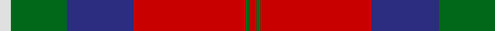

In pattern [RGRBGW](/patterns/rgrbgw/).

This was sourced from house-of-tartan.  It is a [6 stripes tartan](/stripes/stripes6/).

Original link http://www.house-of-tartan.scotland.net/house/TartanViewjs.asp?colr=Def&tnam=1521

## Thread count
LN/6 G30 DB36 R60 G2 R/4

## Palette
Each colour and its ΔE from the base-6 reference it is a variant of.

| Colour | Shade | Base | ΔE (OKLab) |
|---|---|---|---|
| DB | <code style="background-color:#2C2C80;">#2C2C80</code> `#2C2C80` | B <code style="background-color:#2C4084;">#2C4084</code> | 0.05 |
| G | <code style="background-color:#006818;">#006818</code> `#006818` | G <code style="background-color:#006400;">#006400</code> | 0.02 |
| LN | <code style="background-color:#E0E0E0;">#E0E0E0</code> `#E0E0E0` | W <code style="background-color:#F4F4F0;">#F4F4F0</code> | 0.06 |
| R | <code style="background-color:#C80000;">#C80000</code> `#C80000` | R <code style="background-color:#C80000;">#C80000</code> | 0.00 |

# Sample pattern

## Nearest tartans

The nearest existing variants by ΔTartan distance.

1. [Ruthven](/setts/s6/w6g30b36r60g2r4-b304080-g008000-rc00000-we0e0e0/) — ΔT 0.43
1. [Ruthven](/setts/s6/w6g30b36r60b2r4-b00004c-g004c00-rc80000-wd0d0d0/) — ΔT 0.80
1. [Fraser (1745)](/setts/s6/r4b24r4g24r48w2-b2c2c80-g006818-rc80000-wfcfcfc/) — ΔT 0.83
1. [Ruthven](/setts/s6/y6g30b36r60g2r4-b000052-g11450d-raa0000-yaaaaaa/) — ΔT 0.88
1. [Ruthven](/setts/s6/y3g15b18r30g1r2-b000052-g11450d-raa0000-yaaaaaa/) — ΔT 0.88
1. [Abernethy (Colerain USA) (Personal)](/setts/s7/y2b28r56g28r2g28y2-b2c2c80-g006818-rc80000-ydc943c/) — ΔT 1.06
1. [Shaw](/setts/s8/w5k1r30b15r8g30r8b2-b5a3094-g004c00-k000000-rc80000-wd0d0d0/) — ΔT 1.09
1. [Fraser](/setts/s6/r4b24r4g24r48w2-b000050-g003000-rc00000-we0e0e0/) — ΔT 1.13
1. [MacKintosh Geddes](/setts/s7/b4r20g72r16b36r40w4-b2c4084-g005020-rdc0000-we0e0e0/) — ΔT 1.15
1. [Unidentified #20](/setts/s9/b4r98b102r18w4r18g102r98b4-b2c4084-g005020-rdc0000-we0e0e0/) — ΔT 1.16

## Neighbour map

Every grey dot is one of 15726 variants placed by the first two principal components of the ΔTartan feature space (44% of its variance). Red is this tartan; blue dots are its nearest — click one to open its page.

<svg viewBox="0 0 640 380" role="img" style="max-width:100%;height:auto;border:1px solid #e0e0e0;border-radius:4px;display:block" xmlns="http://www.w3.org/2000/svg"><image href="/nn/cloud.v1.png" width="640" height="380"/><a href="/setts/s6/w6g30b36r60g2r4-b304080-g008000-rc00000-we0e0e0/"><circle cx="297.8" cy="155.8" r="4" fill="#3465a4"><title>Ruthven</title></circle></a><a href="/setts/s6/w6g30b36r60b2r4-b00004c-g004c00-rc80000-wd0d0d0/"><circle cx="281.2" cy="151.0" r="4" fill="#3465a4"><title>Ruthven</title></circle></a><a href="/setts/s6/r4b24r4g24r48w2-b2c2c80-g006818-rc80000-wfcfcfc/"><circle cx="332.7" cy="163.3" r="4" fill="#3465a4"><title>Fraser (1745)</title></circle></a><a href="/setts/s6/y6g30b36r60g2r4-b000052-g11450d-raa0000-yaaaaaa/"><circle cx="298.7" cy="161.6" r="4" fill="#3465a4"><title>Ruthven</title></circle></a><a href="/setts/s6/y3g15b18r30g1r2-b000052-g11450d-raa0000-yaaaaaa/"><circle cx="298.7" cy="161.6" r="4" fill="#3465a4"><title>Ruthven</title></circle></a><a href="/setts/s7/y2b28r56g28r2g28y2-b2c2c80-g006818-rc80000-ydc943c/"><circle cx="276.5" cy="160.2" r="4" fill="#3465a4"><title>Abernethy (Colerain USA) (Personal)</title></circle></a><a href="/setts/s8/w5k1r30b15r8g30r8b2-b5a3094-g004c00-k000000-rc80000-wd0d0d0/"><circle cx="273.4" cy="129.5" r="4" fill="#3465a4"><title>Shaw</title></circle></a><a href="/setts/s6/r4b24r4g24r48w2-b000050-g003000-rc00000-we0e0e0/"><circle cx="320.9" cy="162.0" r="4" fill="#3465a4"><title>Fraser</title></circle></a><a href="/setts/s7/b4r20g72r16b36r40w4-b2c4084-g005020-rdc0000-we0e0e0/"><circle cx="248.0" cy="179.1" r="4" fill="#3465a4"><title>MacKintosh Geddes</title></circle></a><a href="/setts/s9/b4r98b102r18w4r18g102r98b4-b2c4084-g005020-rdc0000-we0e0e0/"><circle cx="324.1" cy="145.9" r="4" fill="#3465a4"><title>Unidentified #20</title></circle></a><circle cx="295.0" cy="153.8" r="5" fill="#c00000"/></svg>

ID: /setts/s6/w6g30b36r60g2r4-b2c2c80-g006818-rc80000-we0e0e0/
