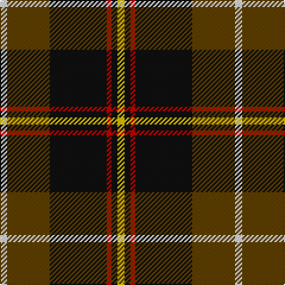

In pattern [WGKRKY](/patterns/wgkrky/).

This was sourced from register-of-tartans.  It is a [6 stripes tartan](/stripes/stripes6/).

Original link https://www.tartanregister.gov.uk/tartanDetails.aspx?ref=973

## Attestations

This cloth appears in 2 source records; the oldest owns this page.

- 01/07/1998 — Drambuie Dress (register-of-tartans, [record](https://www.tartanregister.gov.uk/tartanDetails.aspx?ref=973))
- pre 1998 — Drambuie Dress (Corporate) (tartans-authority, [record](http://www.tartansauthority.com/tartan-ferret/display/2485/))

## Register references

External register numbers recorded for this tartan.

- Scottish Register of Tartans: [973](https://www.tartanregister.gov.uk/tartanDetails.aspx?ref=973)
- Scottish Tartans Authority (ITI): 2485
- Scottish Tartans World Register: 2485

## Thread count
LN/6 T36 K48 R4 K5 Y/6

## Palette
Each colour and its ΔE from the base-6 reference it is a variant of.

| Colour | Shade | Base | ΔE (OKLab) |
|---|---|---|---|
| K | <code style="background-color:#101010;">#101010</code> `#101010` | K <code style="background-color:#000000;">#000000</code> | 0.17 |
| LN | <code style="background-color:#E0E0E0;">#E0E0E0</code> `#E0E0E0` | W <code style="background-color:#F7F7F7;">#F7F7F7</code> | 0.07 |
| R | <code style="background-color:#C80000;">#C80000</code> `#C80000` | R <code style="background-color:#CC0000;">#CC0000</code> | 0.01 |
| T | <code style="background-color:#604000;">#604000</code> `#604000` | G <code style="background-color:#006100;">#006100</code> | 0.14 |
| Y | <code style="background-color:#E8C000;">#E8C000</code> `#E8C000` | Y <code style="background-color:#F2BF00;">#F2BF00</code> | 0.02 |

# Sample pattern

## Nearest tartans

The nearest existing variants by ΔTartan distance.

1. [Drambuie](/setts/s6/w6r36k48y4k5ya6~k101010-r880000-we0e0e0-ya08858-yae8c000/) — ΔT 0.78
1. [Asheville Firefighters, The](/setts/s6/k17g48y4r10w12g4~g004028-k101010-rc80000-wa8ace8-yffe600/) — ΔT 1.01
1. [New York State Troopers](/setts/s7/b6ba4b2w2b25k26y4~b575757-ba551a8b-k101010-wffffff-yd9d919~x2/) — ΔT 1.02
1. [Drambuie dress](/setts/s6/w6r36k48ra4k5y6~k000000-r806050-rac00000-we0e0e0-yf0c000/) — ΔT 1.05
1. [Tott (Personal))](/setts/s7/k51r21y4r12g8b4r5~b2c2c80-g006818-k101010-rc80000-yc4bc68~x2/) — ΔT 1.06
1. [Bryan Wedding (Personal)](/setts/s6/g30y5b10k10w2k2~b5c8ca8-g604000-k101010-wfcfcfc-yfccc00~x2/) — ΔT 1.07
1. [Strummer, Joe (Commemorative)](/setts/s7/k3g3y6k12y1r2g2~g604000-k101010-r888888-ybc8c00~x4/) — ΔT 1.07
1. [Oakley (2015)](/setts/s5/g37k22w4r15y3~g003820-k101010-rc80000-wfcfcfc-ye8c000~x2/) — ΔT 1.11
1. [Papua New Guinea](/setts/s5/g3y5r14k36w3~g006818-k101010-rc80000-we0e0e0-ye8c000~x2/) — ΔT 1.11
1. [Highlands of Durham (Corporate)](/setts/s6/r6b4w2g27b37y2~b1c1c1c-g408060-rc80000-wfcfcfc-ye8c000~x2/) — ΔT 1.12

## Neighbour map

Every grey dot is one of 15726 variants placed by the first two principal components of the ΔTartan feature space (44% of its variance). Red is this tartan; blue dots are its nearest — click one to open its page.

<svg viewBox="0 0 640 380" role="img" style="max-width:100%;height:auto;border:1px solid #e0e0e0;border-radius:4px;display:block" xmlns="http://www.w3.org/2000/svg"><image href="/nn/cloud.v1.png" width="640" height="380"/><a href="/setts/s6/w6r36k48y4k5ya6~k101010-r880000-we0e0e0-ya08858-yae8c000/"><circle cx="264.7" cy="169.4" r="4" fill="#3465a4"><title>Drambuie</title></circle></a><a href="/setts/s6/k17g48y4r10w12g4~g004028-k101010-rc80000-wa8ace8-yffe600/"><circle cx="259.4" cy="178.9" r="4" fill="#3465a4"><title>Asheville Firefighters, The</title></circle></a><a href="/setts/s7/b6ba4b2w2b25k26y4~b575757-ba551a8b-k101010-wffffff-yd9d919~x2/"><circle cx="255.5" cy="167.0" r="4" fill="#3465a4"><title>New York State Troopers</title></circle></a><a href="/setts/s6/w6r36k48ra4k5y6~k000000-r806050-rac00000-we0e0e0-yf0c000/"><circle cx="240.1" cy="167.4" r="4" fill="#3465a4"><title>Drambuie dress</title></circle></a><a href="/setts/s7/k51r21y4r12g8b4r5~b2c2c80-g006818-k101010-rc80000-yc4bc68~x2/"><circle cx="266.7" cy="158.7" r="4" fill="#3465a4"><title>Tott (Personal))</title></circle></a><a href="/setts/s6/g30y5b10k10w2k2~b5c8ca8-g604000-k101010-wfcfcfc-yfccc00~x2/"><circle cx="250.7" cy="162.7" r="4" fill="#3465a4"><title>Bryan Wedding (Personal)</title></circle></a><a href="/setts/s7/k3g3y6k12y1r2g2~g604000-k101010-r888888-ybc8c00~x4/"><circle cx="262.6" cy="195.2" r="4" fill="#3465a4"><title>Strummer, Joe (Commemorative)</title></circle></a><a href="/setts/s5/g37k22w4r15y3~g003820-k101010-rc80000-wfcfcfc-ye8c000~x2/"><circle cx="211.1" cy="197.6" r="4" fill="#3465a4"><title>Oakley (2015)</title></circle></a><a href="/setts/s5/g3y5r14k36w3~g006818-k101010-rc80000-we0e0e0-ye8c000~x2/"><circle cx="297.3" cy="174.2" r="4" fill="#3465a4"><title>Papua New Guinea</title></circle></a><a href="/setts/s6/r6b4w2g27b37y2~b1c1c1c-g408060-rc80000-wfcfcfc-ye8c000~x2/"><circle cx="299.2" cy="159.8" r="4" fill="#3465a4"><title>Highlands of Durham (Corporate)</title></circle></a><circle cx="264.7" cy="175.2" r="5" fill="#c00000"/></svg>

ID: /setts/s6/w6g36k48r4k5y6~g604000-k101010-rc80000-we0e0e0-ye8c000/
