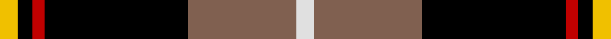
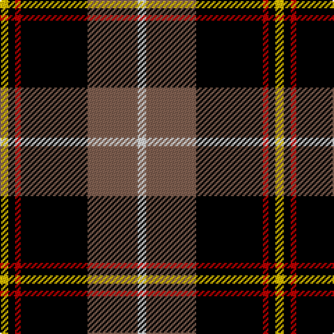

This page is one **sett** — a single exact thread-count. It belongs to the [tartan](/tartans/y6k5r4k48lt36ln6/)
(the same proportion at any scale), whose colour order is pattern [WRKRKY](/stripes/wrkrky/).

Sourced from weddslist.  It is a [6 stripe tartan](/stripes/stripes6/).

Original link http://www.weddslist.com/cgi-bin/tartans/pg.pl?source=sts

## Thread count
Y/6 K5 R4 K48 LT36 LN/6

## Palette
Each colour and the base-6 reference it is a variant of.

| Colour | Shade | Base |
|---|---|---|
| K | <code style="background-color:#000000;">#000000</code> `oklch(0.0% 0.000 0.0)` <small>#000000</small> | K <code style="background-color:#000000;">#000000</code> |
| LN | <code style="background-color:#E0E0E0;">#E0E0E0</code> `oklch(90.7% 0.000 89.9)` <small>#E0E0E0</small> | W <code style="background-color:#F7F7F7;">#F7F7F7</code> |
| LT | <code style="background-color:#806050;">#806050</code> `oklch(51.7% 0.049 47.8)` <small>#806050</small> | R <code style="background-color:#CC0000;">#CC0000</code> |
| R | <code style="background-color:#C00000;">#C00000</code> `oklch(50.7% 0.208 29.2)` <small>#C00000</small> | R <code style="background-color:#CC0000;">#CC0000</code> |
| Y | <code style="background-color:#F0C000;">#F0C000</code> `oklch(82.7% 0.169 90.5)` <small>#F0C000</small> | Y <code style="background-color:#F2BF00;">#F2BF00</code> |

# Sample pattern

## Nearest tartans

The nearest existing variants by ΔTartan distance, with this tartan at the top so the swatches line up against it.

ΔTartan

Tartan

Sett

—

<a href="/ttd/edit/#slug=w6o36k48r4k5ly6">Drambuie dress</a> <a class="nn-out" href="/setts/s6/w6o36k48r4k5ly6/" title="open its dictionary page">↗</a>

0.66

<a href="/ttd/edit/#slug=k40dp5k6o26lr13k9dy3~x2">de Meuron (Neuchâtel) Dress, The</a> <a class="nn-out" href="/setts/s7/k40dp5k6o26lr13k9dy3~x2/" title="open its dictionary page">↗</a>

0.81

<a href="/ttd/edit/#slug=w6r36k48o4k5ly6">Drambuie</a> <a class="nn-out" href="/setts/s6/w6r36k48o4k5ly6/" title="open its dictionary page">↗</a>

1.05

<a href="/ttd/edit/#slug=w6dy36k48r4k5ly6">Drambuie Dress</a> <a class="nn-out" href="/setts/s6/w6dy36k48r4k5ly6/" title="open its dictionary page">↗</a>

1.10

<a href="/ttd/edit/#slug=w6r36k48lo4k5ly6">Drambuie</a> <a class="nn-out" href="/setts/s6/w6r36k48lo4k5ly6/" title="open its dictionary page">↗</a>

1.16

<a href="/ttd/edit/#slug=g3ly5r14k36w3~x2">Papua New Guinea</a> <a class="nn-out" href="/setts/s5/g3ly5r14k36w3~x2/" title="open its dictionary page">↗</a>

1.33

<a href="/ttd/edit/#slug=g3ly5r13k33w2~x2">Papua New Guinea Pipes and Drums</a> <a class="nn-out" href="/setts/s5/g3ly5r13k33w2~x2/" title="open its dictionary page">↗</a>

1.40

<a href="/ttd/edit/#slug=k2r1ly1y8k15y2dp1~x4">Coalfields Regeneration Trust, The</a> <a class="nn-out" href="/setts/s7/k2r1ly1y8k15y2dp1~x4/" title="open its dictionary page">↗</a>

1.45

<a href="/ttd/edit/#slug=ly3k9b1k1r6k2ly3~x4">LP Cover (Dance)</a> <a class="nn-out" href="/setts/s7/ly3k9b1k1r6k2ly3~x4/" title="open its dictionary page">↗</a>

1.49

<a href="/ttd/edit/#slug=r2k28y5w12y14r2~x2">Callaway</a> <a class="nn-out" href="/setts/s6/r2k28y5w12y14r2~x2/" title="open its dictionary page">↗</a>

1.49

<a href="/ttd/edit/#slug=w5k26lo26t7k3r3~x2">Cornish National (District)</a> <a class="nn-out" href="/setts/s6/w5k26lo26t7k3r3~x2/" title="open its dictionary page">↗</a>

## Neighbour map

Every grey dot is one of 14299 variants placed by the first two principal components of the ΔTartan feature space (44% of its variance). Red is this tartan; blue dots are its nearest — click one to open its page.

<svg viewBox="0 0 640 380" role="img" style="max-width:100%;height:auto;border:1px solid #e0e0e0;border-radius:4px;display:block" xmlns="http://www.w3.org/2000/svg"><image href="/nn/cloud.v1.png" width="640" height="380"/><a href="/setts/s7/k40dp5k6o26lr13k9dy3~x2/"><circle cx="239.5" cy="164.4" r="4" fill="#3465a4"><title>de Meuron (Neuchâtel) Dress, The</title></circle></a><a href="/setts/s6/w6r36k48o4k5ly6/"><circle cx="252.9" cy="164.1" r="4" fill="#3465a4"><title>Drambuie</title></circle></a><a href="/setts/s6/w6dy36k48r4k5ly6/"><circle cx="266.9" cy="173.8" r="4" fill="#3465a4"><title>Drambuie Dress</title></circle></a><a href="/setts/s6/w6r36k48lo4k5ly6/"><circle cx="266.4" cy="166.6" r="4" fill="#3465a4"><title>Drambuie</title></circle></a><a href="/setts/s5/g3ly5r14k36w3~x2/"><circle cx="299.0" cy="169.4" r="4" fill="#3465a4"><title>Papua New Guinea</title></circle></a><a href="/setts/s5/g3ly5r13k33w2~x2/"><circle cx="307.5" cy="155.4" r="4" fill="#3465a4"><title>Papua New Guinea Pipes and Drums</title></circle></a><a href="/setts/s7/k2r1ly1y8k15y2dp1~x4/"><circle cx="310.7" cy="149.4" r="4" fill="#3465a4"><title>Coalfields Regeneration Trust, The</title></circle></a><a href="/setts/s7/ly3k9b1k1r6k2ly3~x4/"><circle cx="210.4" cy="198.7" r="4" fill="#3465a4"><title>LP Cover (Dance)</title></circle></a><a href="/setts/s6/r2k28y5w12y14r2~x2/"><circle cx="205.3" cy="175.3" r="4" fill="#3465a4"><title>Callaway</title></circle></a><a href="/setts/s6/w5k26lo26t7k3r3~x2/"><circle cx="162.4" cy="174.2" r="4" fill="#3465a4"><title>Cornish National (District)</title></circle></a><circle cx="242.8" cy="163.4" r="5" fill="#c00000"/></svg>

ID: /setts/s6/w6o36k48r4k5ly6/
