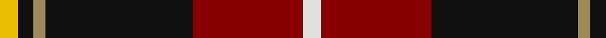
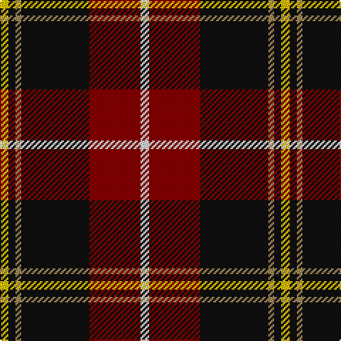

This page is one **sett** — a single exact thread-count. It belongs to the [tartan](/tartans/w6r36k48lo4k5ly6/)
(the same proportion at any scale), whose colour order is pattern [WRKYKY](/stripes/wrkyky/).

Sourced from register-of-tartans.  It is a [6 stripe tartan](/stripes/stripes6/).

Original link https://www.tartanregister.gov.uk/tartanDetails.aspx?ref=972

2 attestations — the source records this cloth was collapsed from (oldest owns this page)

<ul>
<li>01/01/1998 — Drambuie (register-of-tartans, <a href="https://www.tartanregister.gov.uk/tartanDetails.aspx?ref=972">record</a>)</li>
<li>1998 — Drambuie (Corporate) (tartans-authority, <a href="http://www.tartansauthority.com/tartan-ferret/display/2474/">record</a>)</li>
</ul>

## Register references

External register numbers recorded for this tartan.

- Scottish Register of Tartans: [972](https://www.tartanregister.gov.uk/tartanDetails.aspx?ref=972)
- Scottish Tartans Authority (ITI): 2474
- Scottish Tartans World Register: 2474

## Thread count
Y/6 K5 LT4 K48 DR36 LN/6

## Palette

Palette: <strong>Tartan Register</strong>
<table><thead><tr><th>Colour</th><th>Threads</th><th>Shade</th><th>Base</th><th>OKLCh</th></tr></thead><tbody><tr><td>Y/</td><td style="text-align:right;font-variant-numeric:tabular-nums">6</td><td><code style="background-color:#E8C000;">#E8C000</code> <small style="color:#888">#E8C000</small></td><td>Y <code style="background-color:#F2BF00;">#F2BF00</code></td><td><small style="color:#888">oklch(81.9% 0.168 93.7)</small></td></tr><tr><td>K</td><td style="text-align:right;font-variant-numeric:tabular-nums">5</td><td><code style="background-color:#101010;">#101010</code> <small style="color:#888">#101010</small></td><td>K <code style="background-color:#000000;">#000000</code></td><td><small style="color:#888">oklch(17.3% 0.000 89.9)</small></td></tr><tr><td>LT</td><td style="text-align:right;font-variant-numeric:tabular-nums">4</td><td><code style="background-color:#A08858;">#A08858</code> <small style="color:#888">#A08858</small></td><td>Y <code style="background-color:#F2BF00;">#F2BF00</code></td><td><small style="color:#888">oklch(63.7% 0.071 84.0)</small></td></tr><tr><td>K</td><td style="text-align:right;font-variant-numeric:tabular-nums">48</td><td><code style="background-color:#101010;">#101010</code> <small style="color:#888">#101010</small></td><td>K <code style="background-color:#000000;">#000000</code></td><td><small style="color:#888">oklch(17.3% 0.000 89.9)</small></td></tr><tr><td>DR</td><td style="text-align:right;font-variant-numeric:tabular-nums">36</td><td><code style="background-color:#880000;">#880000</code> <small style="color:#888">#880000</small></td><td>R <code style="background-color:#CC0000;">#CC0000</code></td><td><small style="color:#888">oklch(39.4% 0.162 29.2)</small></td></tr><tr><td>LN/</td><td style="text-align:right;font-variant-numeric:tabular-nums">6</td><td><code style="background-color:#E0E0E0;">#E0E0E0</code> <small style="color:#888">#E0E0E0</small></td><td>W <code style="background-color:#F7F7F7;">#F7F7F7</code></td><td><small style="color:#888">oklch(90.7% 0.000 89.9)</small></td></tr></tbody></table>

# Sample pattern

## Nearest tartans

The nearest existing variants by ΔTartan distance, with this tartan at the top so the swatches line up against it.

ΔTartan

Tartan

Sett

—

<a href="/ttd/edit/#slug=w6r36k48lo4k5ly6">Drambuie</a> <a class="nn-out" href="/setts/s6/w6r36k48lo4k5ly6/" title="open its dictionary page">↗</a>

0.78

<a href="/ttd/edit/#slug=w6dy36k48r4k5ly6">Drambuie Dress</a> <a class="nn-out" href="/setts/s6/w6dy36k48r4k5ly6/" title="open its dictionary page">↗</a>

0.93

<a href="/ttd/edit/#slug=k51r21ly4r12g8db4r5~x2">Totté (from Hofstade de Baerebeeck) (Personal)</a> <a class="nn-out" href="/setts/s7/k51r21ly4r12g8db4r5~x2/" title="open its dictionary page">↗</a>

0.93

<a href="/ttd/edit/#slug=g3ly5r14k36w3~x2">Papua New Guinea</a> <a class="nn-out" href="/setts/s5/g3ly5r14k36w3~x2/" title="open its dictionary page">↗</a>

1.02

<a href="/ttd/edit/#slug=w6r36k48o4k5ly6">Drambuie</a> <a class="nn-out" href="/setts/s6/w6r36k48o4k5ly6/" title="open its dictionary page">↗</a>

1.08

<a href="/ttd/edit/#slug=db4lo4r33k30w2~x2">Wormeck (2013) Germany</a> <a class="nn-out" href="/setts/s5/db4lo4r33k30w2~x2/" title="open its dictionary page">↗</a>

1.10

<a href="/ttd/edit/#slug=w6o36k48r4k5ly6">Drambuie dress</a> <a class="nn-out" href="/setts/s6/w6o36k48r4k5ly6/" title="open its dictionary page">↗</a>

1.10

<a href="/ttd/edit/#slug=g3ly5r13k33w2~x2">Papua New Guinea Pipes and Drums</a> <a class="nn-out" href="/setts/s5/g3ly5r13k33w2~x2/" title="open its dictionary page">↗</a>

1.26

<a href="/ttd/edit/#slug=r8m12k6m33k72o6k8w6">Sreijsener (Name)</a> <a class="nn-out" href="/setts/s8/r8m12k6m33k72o6k8w6/" title="open its dictionary page">↗</a>

1.32

<a href="/ttd/edit/#slug=k23r27db3r5w3k14ly6~x2">Hoffman Texas German</a> <a class="nn-out" href="/setts/s7/k23r27db3r5w3k14ly6~x2/" title="open its dictionary page">↗</a>

1.32

<a href="/ttd/edit/#slug=r1db6r1dg6r12lb1">Fraser VS</a> <a class="nn-out" href="/setts/s6/r1db6r1dg6r12lb1/" title="open its dictionary page">↗</a>

## Neighbour map

Every grey dot is one of 14359 variants placed by the first two principal components of the ΔTartan feature space (44% of its variance). Red is this tartan; blue dots are its nearest — click one to open its page.

<svg viewBox="0 0 640 380" role="img" style="max-width:100%;height:auto;border:1px solid #e0e0e0;border-radius:4px;display:block" xmlns="http://www.w3.org/2000/svg"><image href="/nn/cloud.v1.png" width="640" height="380"/><a href="/setts/s6/w6dy36k48r4k5ly6/"><circle cx="266.3" cy="174.6" r="4" fill="#3465a4"><title>Drambuie Dress</title></circle></a><a href="/setts/s7/k51r21ly4r12g8db4r5~x2/"><circle cx="245.5" cy="142.3" r="4" fill="#3465a4"><title>Totté (from Hofstade de Baerebeeck) (Personal)</title></circle></a><a href="/setts/s5/g3ly5r14k36w3~x2/"><circle cx="298.1" cy="170.2" r="4" fill="#3465a4"><title>Papua New Guinea</title></circle></a><a href="/setts/s6/w6r36k48o4k5ly6/"><circle cx="252.3" cy="165.2" r="4" fill="#3465a4"><title>Drambuie</title></circle></a><a href="/setts/s5/db4lo4r33k30w2~x2/"><circle cx="267.0" cy="164.5" r="4" fill="#3465a4"><title>Wormeck (2013) Germany</title></circle></a><a href="/setts/s6/w6o36k48r4k5ly6/"><circle cx="242.2" cy="164.4" r="4" fill="#3465a4"><title>Drambuie dress</title></circle></a><a href="/setts/s5/g3ly5r13k33w2~x2/"><circle cx="306.6" cy="156.1" r="4" fill="#3465a4"><title>Papua New Guinea Pipes and Drums</title></circle></a><a href="/setts/s8/r8m12k6m33k72o6k8w6/"><circle cx="318.8" cy="154.4" r="4" fill="#3465a4"><title>Sreijsener (Name)</title></circle></a><a href="/setts/s7/k23r27db3r5w3k14ly6~x2/"><circle cx="206.5" cy="174.2" r="4" fill="#3465a4"><title>Hoffman Texas German</title></circle></a><a href="/setts/s6/r1db6r1dg6r12lb1/"><circle cx="280.6" cy="185.4" r="4" fill="#3465a4"><title>Fraser VS</title></circle></a><circle cx="265.6" cy="167.5" r="5" fill="#c00000"/></svg>

ID: /setts/s6/w6r36k48lo4k5ly6/
