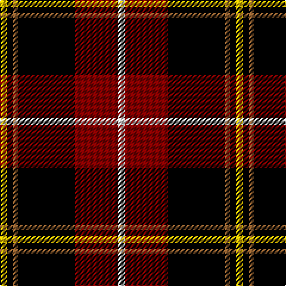

In pattern [WRKRKY](/stripes/wrkrky/).

This was sourced from weddslist.  It is a [6 stripe tartan](/stripes/stripes6/).

Original link http://www.weddslist.com/cgi-bin/tartans/pg.pl?source=sts

## Thread count
Y/6 K5 LT4 K48 DR36 LN/6

## Palette
Each colour and the base-6 reference it is a variant of.

| Colour | Shade | Base |
|---|---|---|
| DR | <code style="background-color:#800000;">#800000</code> `oklch(37.7% 0.155 29.2)` <small>#800000</small> | R <code style="background-color:#CC0000;">#CC0000</code> |
| K | <code style="background-color:#000000;">#000000</code> `oklch(0.0% 0.000 0.0)` <small>#000000</small> | K <code style="background-color:#000000;">#000000</code> |
| LN | <code style="background-color:#E0E0E0;">#E0E0E0</code> `oklch(90.7% 0.000 89.9)` <small>#E0E0E0</small> | W <code style="background-color:#F7F7F7;">#F7F7F7</code> |
| LT | <code style="background-color:#906030;">#906030</code> `oklch(53.1% 0.089 63.7)` <small>#906030</small> | R <code style="background-color:#CC0000;">#CC0000</code> |
| Y | <code style="background-color:#F0C000;">#F0C000</code> `oklch(82.7% 0.169 90.5)` <small>#F0C000</small> | Y <code style="background-color:#F2BF00;">#F2BF00</code> |

# Sample pattern

## Nearest tartans

The nearest existing variants by ΔTartan distance.

1. [Drambuie dress](/setts/s6/w6o36k48r4k5ly6/) — ΔT 0.81
1. [Drambuie](/setts/s6/w6r36k48lo4k5ly6/) — ΔT 1.02
1. [de Meuron (Neuchâtel) Dress, The](/setts/s7/k40dp5k6o26lr13k9dy3~x2/) — ΔT 1.09
1. [Papua New Guinea](/setts/s5/g3ly5r14k36w3~x2/) — ΔT 1.28
1. [MacDonald, Sir John A.](/setts/s11/r12k4g2w2k21db3k22r4g4r15w3~x2/) — ΔT 1.31
1. [Drambuie Dress](/setts/s6/w6dy36k48r4k5ly6/) — ΔT 1.35
1. [Drambuie hunting](/setts/s6/o6dr36k48r4k5y6/) — ΔT 1.37
1. [York Region Pipe Band](/setts/s11/r10k3g2lb2k22db4k22r4g4r14lb3~x2/) — ΔT 1.40
1. [LP Cover (Dance)](/setts/s7/ly3k9b1k1r6k2ly3~x4/) — ΔT 1.41
1. [MacDonald, Sir John A](/setts/s11/r10k3dg2lb2k22db4k22r4dg4r14lb3~x2/) — ΔT 1.43

## Neighbour map

Every grey dot is one of 14299 variants placed by the first two principal components of the ΔTartan feature space (44% of its variance). Red is this tartan; blue dots are its nearest — click one to open its page.

<svg viewBox="0 0 640 380" role="img" style="max-width:100%;height:auto;border:1px solid #e0e0e0;border-radius:4px;display:block" xmlns="http://www.w3.org/2000/svg"><image href="/nn/cloud.v1.png" width="640" height="380"/><a href="/setts/s6/w6o36k48r4k5ly6/"><circle cx="242.8" cy="163.4" r="4" fill="#3465a4"><title>Drambuie dress</title></circle></a><a href="/setts/s6/w6r36k48lo4k5ly6/"><circle cx="266.4" cy="166.6" r="4" fill="#3465a4"><title>Drambuie</title></circle></a><a href="/setts/s7/k40dp5k6o26lr13k9dy3~x2/"><circle cx="239.5" cy="164.4" r="4" fill="#3465a4"><title>de Meuron (Neuchâtel) Dress, The</title></circle></a><a href="/setts/s5/g3ly5r14k36w3~x2/"><circle cx="299.0" cy="169.4" r="4" fill="#3465a4"><title>Papua New Guinea</title></circle></a><a href="/setts/s11/r12k4g2w2k21db3k22r4g4r15w3~x2/"><circle cx="228.7" cy="148.9" r="4" fill="#3465a4"><title>MacDonald, Sir John A.</title></circle></a><a href="/setts/s6/w6dy36k48r4k5ly6/"><circle cx="266.9" cy="173.8" r="4" fill="#3465a4"><title>Drambuie Dress</title></circle></a><a href="/setts/s6/o6dr36k48r4k5y6/"><circle cx="286.1" cy="188.1" r="4" fill="#3465a4"><title>Drambuie hunting</title></circle></a><a href="/setts/s11/r10k3g2lb2k22db4k22r4g4r14lb3~x2/"><circle cx="240.8" cy="157.1" r="4" fill="#3465a4"><title>York Region Pipe Band</title></circle></a><a href="/setts/s7/ly3k9b1k1r6k2ly3~x4/"><circle cx="210.4" cy="198.7" r="4" fill="#3465a4"><title>LP Cover (Dance)</title></circle></a><a href="/setts/s11/r10k3dg2lb2k22db4k22r4dg4r14lb3~x2/"><circle cx="244.2" cy="158.8" r="4" fill="#3465a4"><title>MacDonald, Sir John A</title></circle></a><circle cx="252.9" cy="164.1" r="5" fill="#c00000"/></svg>

ID: /setts/s6/w6r36k48o4k5ly6/
