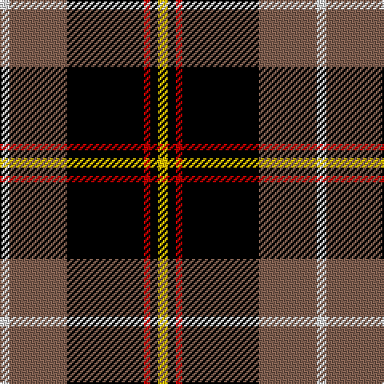

In pattern [WRKRKY](/patterns/wrkrky/).

This was sourced from weddslist.  It is a [6 stripes tartan](/stripes/stripes6/).

Original link http://www.weddslist.com/cgi-bin/tartans/pg.pl?source=sts

## Thread count
LN/6 LT36 K48 R4 K5 Y/6

## Palette
Each colour and its ΔE from the base-6 reference it is a variant of.

| Colour | Shade | Base | ΔE (OKLab) |
|---|---|---|---|
| K | <code style="background-color:#000000;">#000000</code> `#000000` | K <code style="background-color:#000000;">#000000</code> | 0.00 |
| LN | <code style="background-color:#E0E0E0;">#E0E0E0</code> `#E0E0E0` | W <code style="background-color:#F7F7F7;">#F7F7F7</code> | 0.07 |
| LT | <code style="background-color:#806050;">#806050</code> `#806050` | R <code style="background-color:#CC0000;">#CC0000</code> | 0.17 |
| R | <code style="background-color:#C00000;">#C00000</code> `#C00000` | R <code style="background-color:#CC0000;">#CC0000</code> | 0.03 |
| Y | <code style="background-color:#F0C000;">#F0C000</code> `#F0C000` | Y <code style="background-color:#F2BF00;">#F2BF00</code> | 0.00 |

# Sample pattern

## Nearest tartans

The nearest existing variants by ΔTartan distance.

1. [de Meuron (Neuchâtel) Dress, The](/setts/s7/k80b10k12r52y26k18g6-b240f4c-g5b340a-k000000-rb28230-yceb7a1/) — ΔT 0.66
1. [Drambuie](/setts/s6/w6r36k48ra4k5y6-k000000-r800000-ra906030-we0e0e0-yf0c000/) — ΔT 0.81
1. [Drambuie Dress](/setts/s6/w6g36k48r4k5y6-g604000-k101010-rc80000-we0e0e0-ye8c000/) — ΔT 1.04
1. [Drambuie](/setts/s6/w6r36k48y4k5ya6-k101010-r880000-we0e0e0-ya08858-yae8c000/) — ΔT 1.09
1. [Papua New Guinea](/setts/s5/g6y10r28k72w6-g006818-k101010-rc80000-we0e0e0-ye8c000/) — ΔT 1.16
1. [Papua New Guinea Pipes and Drums](/setts/s5/g6y10r26k66w4-g309c18-k101010-rdc0000-we0e0e0-ye8c000/) — ΔT 1.33
1. [Coalfields Regeneration Trust, The](/setts/s7/k8r4y4g32k60g8b4-b780078-g789484-k101010-ra00000-ye8c000/) — ΔT 1.40
1. [LP Cover (Dance)](/setts/s7/y12k36b4k4r24k8y12-b3474fc-k000000-r8c0000-yc89800/) — ΔT 1.44
1. [Tott (Personal))](/setts/s7/k102r42y8r24g16b8r10-b2c2c80-g006818-k101010-rc80000-yc4bc68/) — ΔT 1.46
1. [Callaway](/setts/s6/r4k56g10w24g28r4-g808080-k000000-rc00000-we0e0e0/) — ΔT 1.48

## Neighbour map

Every grey dot is one of 15726 variants placed by the first two principal components of the ΔTartan feature space (44% of its variance). Red is this tartan; blue dots are its nearest — click one to open its page.

<svg viewBox="0 0 640 380" role="img" style="max-width:100%;height:auto;border:1px solid #e0e0e0;border-radius:4px;display:block" xmlns="http://www.w3.org/2000/svg"><image href="/nn/cloud.v1.png" width="640" height="380"/><a href="/setts/s7/k80b10k12r52y26k18g6-b240f4c-g5b340a-k000000-rb28230-yceb7a1/"><circle cx="237.0" cy="165.4" r="4" fill="#3465a4"><title>de Meuron (Neuchâtel) Dress, The</title></circle></a><a href="/setts/s6/w6r36k48ra4k5y6-k000000-r800000-ra906030-we0e0e0-yf0c000/"><circle cx="250.7" cy="165.2" r="4" fill="#3465a4"><title>Drambuie</title></circle></a><a href="/setts/s6/w6g36k48r4k5y6-g604000-k101010-rc80000-we0e0e0-ye8c000/"><circle cx="264.4" cy="173.2" r="4" fill="#3465a4"><title>Drambuie Dress</title></circle></a><a href="/setts/s6/w6r36k48y4k5ya6-k101010-r880000-we0e0e0-ya08858-yae8c000/"><circle cx="264.5" cy="167.1" r="4" fill="#3465a4"><title>Drambuie</title></circle></a><a href="/setts/s5/g6y10r28k72w6-g006818-k101010-rc80000-we0e0e0-ye8c000/"><circle cx="297.7" cy="170.7" r="4" fill="#3465a4"><title>Papua New Guinea</title></circle></a><a href="/setts/s5/g6y10r26k66w4-g309c18-k101010-rdc0000-we0e0e0-ye8c000/"><circle cx="306.2" cy="157.0" r="4" fill="#3465a4"><title>Papua New Guinea Pipes and Drums</title></circle></a><a href="/setts/s7/k8r4y4g32k60g8b4-b780078-g789484-k101010-ra00000-ye8c000/"><circle cx="307.7" cy="149.0" r="4" fill="#3465a4"><title>Coalfields Regeneration Trust, The</title></circle></a><a href="/setts/s7/y12k36b4k4r24k8y12-b3474fc-k000000-r8c0000-yc89800/"><circle cx="209.0" cy="200.4" r="4" fill="#3465a4"><title>LP Cover (Dance)</title></circle></a><a href="/setts/s7/k102r42y8r24g16b8r10-b2c2c80-g006818-k101010-rc80000-yc4bc68/"><circle cx="266.2" cy="156.6" r="4" fill="#3465a4"><title>Tott (Personal))</title></circle></a><a href="/setts/s6/r4k56g10w24g28r4-g808080-k000000-rc00000-we0e0e0/"><circle cx="202.7" cy="176.9" r="4" fill="#3465a4"><title>Callaway</title></circle></a><circle cx="240.1" cy="164.4" r="5" fill="#c00000"/></svg>

ID: /setts/s6/w6r36k48ra4k5y6-k000000-r806050-rac00000-we0e0e0-yf0c000/
