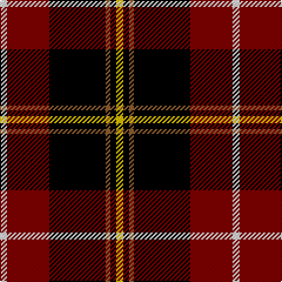

In pattern [WRKRKY](/patterns/wrkrky/).

This was sourced from weddslist.  It is a [6 stripes tartan](/stripes/stripes6/).

Original link http://www.weddslist.com/cgi-bin/tartans/pg.pl?source=sts

## Thread count
LN/6 DR36 K48 LT4 K5 Y/6

## Palette
Each colour and its ΔE from the base-6 reference it is a variant of.

| Colour | Shade | Base | ΔE (OKLab) |
|---|---|---|---|
| DR | <code style="background-color:#800000;">#800000</code> `#800000` | R <code style="background-color:#CC0000;">#CC0000</code> | 0.17 |
| K | <code style="background-color:#000000;">#000000</code> `#000000` | K <code style="background-color:#000000;">#000000</code> | 0.00 |
| LN | <code style="background-color:#E0E0E0;">#E0E0E0</code> `#E0E0E0` | W <code style="background-color:#F7F7F7;">#F7F7F7</code> | 0.07 |
| LT | <code style="background-color:#906030;">#906030</code> `#906030` | R <code style="background-color:#CC0000;">#CC0000</code> | 0.15 |
| Y | <code style="background-color:#F0C000;">#F0C000</code> `#F0C000` | Y <code style="background-color:#F2BF00;">#F2BF00</code> | 0.00 |

# Sample pattern

## Nearest tartans

The nearest existing variants by ΔTartan distance.

1. [Drambuie dress](/setts/s6/w6r36k48ra4k5y6~k000000-r806050-rac00000-we0e0e0-yf0c000/) — ΔT 0.81
1. [Drambuie](/setts/s6/w6r36k48y4k5ya6~k101010-r880000-we0e0e0-ya08858-yae8c000/) — ΔT 1.02
1. [de Meuron (Neuchâtel) Dress, The](/setts/s7/k40b5k6r26y13k9g3~b240f4c-g5b340a-k000000-rb28230-yceb7a1~x2/) — ΔT 1.08
1. [Papua New Guinea](/setts/s5/g3y5r14k36w3~g006818-k101010-rc80000-we0e0e0-ye8c000~x2/) — ΔT 1.28
1. [Tott (Personal))](/setts/s7/k51r21y4r12g8b4r5~b2c2c80-g006818-k101010-rc80000-yc4bc68~x2/) — ΔT 1.28
1. [MacDonald, Sir John A.](/setts/s11/r12k4g2w2k21b3k22r4g4r15w3~b304080-g008000-k000000-rc00000-we0e0e0~x2/) — ΔT 1.31
1. [Drambuie Dress](/setts/s6/w6g36k48r4k5y6~g604000-k101010-rc80000-we0e0e0-ye8c000/) — ΔT 1.34
1. [Drambuie hunting](/setts/s6/g6k5r4k48b36ra6~b401000-g908000-k000000-rc00000-ra906030/) — ΔT 1.37
1. [York Region Pipe Band](/setts/s11/r10k3g2w2k22b4k22r4g4r14w3~b00008c-g007800-k000000-r8c0000-wc8c8c8~x2/) — ΔT 1.40
1. [LP Cover (Dance)](/setts/s7/y3k9b1k1r6k2y3~b3474fc-k000000-r8c0000-yc89800~x4/) — ΔT 1.41

## Neighbour map

Every grey dot is one of 15726 variants placed by the first two principal components of the ΔTartan feature space (44% of its variance). Red is this tartan; blue dots are its nearest — click one to open its page.

<svg viewBox="0 0 640 380" role="img" style="max-width:100%;height:auto;border:1px solid #e0e0e0;border-radius:4px;display:block" xmlns="http://www.w3.org/2000/svg"><image href="/nn/cloud.v1.png" width="640" height="380"/><a href="/setts/s6/w6r36k48ra4k5y6~k000000-r806050-rac00000-we0e0e0-yf0c000/"><circle cx="240.1" cy="167.4" r="4" fill="#3465a4"><title>Drambuie dress</title></circle></a><a href="/setts/s6/w6r36k48y4k5ya6~k101010-r880000-we0e0e0-ya08858-yae8c000/"><circle cx="264.7" cy="169.4" r="4" fill="#3465a4"><title>Drambuie</title></circle></a><a href="/setts/s7/k40b5k6r26y13k9g3~b240f4c-g5b340a-k000000-rb28230-yceb7a1~x2/"><circle cx="236.8" cy="168.4" r="4" fill="#3465a4"><title>de Meuron (Neuchâtel) Dress, The</title></circle></a><a href="/setts/s5/g3y5r14k36w3~g006818-k101010-rc80000-we0e0e0-ye8c000~x2/"><circle cx="297.3" cy="174.2" r="4" fill="#3465a4"><title>Papua New Guinea</title></circle></a><a href="/setts/s7/k51r21y4r12g8b4r5~b2c2c80-g006818-k101010-rc80000-yc4bc68~x2/"><circle cx="266.7" cy="158.7" r="4" fill="#3465a4"><title>Tott (Personal))</title></circle></a><a href="/setts/s11/r12k4g2w2k21b3k22r4g4r15w3~b304080-g008000-k000000-rc00000-we0e0e0~x2/"><circle cx="226.6" cy="152.7" r="4" fill="#3465a4"><title>MacDonald, Sir John A.</title></circle></a><a href="/setts/s6/w6g36k48r4k5y6~g604000-k101010-rc80000-we0e0e0-ye8c000/"><circle cx="264.7" cy="175.2" r="4" fill="#3465a4"><title>Drambuie Dress</title></circle></a><a href="/setts/s6/g6k5r4k48b36ra6~b401000-g908000-k000000-rc00000-ra906030/"><circle cx="283.7" cy="187.8" r="4" fill="#3465a4"><title>Drambuie hunting</title></circle></a><a href="/setts/s11/r10k3g2w2k22b4k22r4g4r14w3~b00008c-g007800-k000000-r8c0000-wc8c8c8~x2/"><circle cx="238.3" cy="159.3" r="4" fill="#3465a4"><title>York Region Pipe Band</title></circle></a><a href="/setts/s7/y3k9b1k1r6k2y3~b3474fc-k000000-r8c0000-yc89800~x4/"><circle cx="208.1" cy="203.3" r="4" fill="#3465a4"><title>LP Cover (Dance)</title></circle></a><circle cx="250.7" cy="168.4" r="5" fill="#c00000"/></svg>

ID: /setts/s6/w6r36k48ra4k5y6~k000000-r800000-ra906030-we0e0e0-yf0c000/
