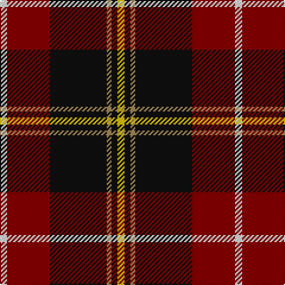

In pattern [WRKYKY](/patterns/wrkyky/).

This was sourced from register-of-tartans.  It is a [6 stripes tartan](/stripes/stripes6/).

Original link https://www.tartanregister.gov.uk/tartanDetails.aspx?ref=972

## Attestations

This cloth appears in 2 source records; the oldest owns this page.

- 01/01/1998 — Drambuie (register-of-tartans, [record](https://www.tartanregister.gov.uk/tartanDetails.aspx?ref=972))
- 1998 — Drambuie (Corporate) (tartans-authority, [record](http://www.tartansauthority.com/tartan-ferret/display/2474/))

## Register references

External register numbers recorded for this tartan.

- Scottish Register of Tartans: [972](https://www.tartanregister.gov.uk/tartanDetails.aspx?ref=972)
- Scottish Tartans Authority (ITI): 2474
- Scottish Tartans World Register: 2474

## Thread count
LN/6 DR36 K48 LT4 K5 Y/6

## Palette
Each colour and its ΔE from the base-6 reference it is a variant of.

| Colour | Shade | Base | ΔE (OKLab) |
|---|---|---|---|
| DR | <code style="background-color:#880000;">#880000</code> `#880000` | R <code style="background-color:#CC0000;">#CC0000</code> | 0.15 |
| K | <code style="background-color:#101010;">#101010</code> `#101010` | K <code style="background-color:#000000;">#000000</code> | 0.17 |
| LN | <code style="background-color:#E0E0E0;">#E0E0E0</code> `#E0E0E0` | W <code style="background-color:#F7F7F7;">#F7F7F7</code> | 0.07 |
| LT | <code style="background-color:#A08858;">#A08858</code> `#A08858` | Y <code style="background-color:#F2BF00;">#F2BF00</code> | 0.21 |
| Y | <code style="background-color:#E8C000;">#E8C000</code> `#E8C000` | Y <code style="background-color:#F2BF00;">#F2BF00</code> | 0.02 |

# Sample pattern

## Nearest tartans

The nearest existing variants by ΔTartan distance.

1. [Tott (Personal))](/setts/s7/k51r21y4r12g8b4r5~b2c2c80-g006818-k101010-rc80000-yc4bc68~x2/) — ΔT 0.51
1. [Drambuie Dress](/setts/s6/w6g36k48r4k5y6~g604000-k101010-rc80000-we0e0e0-ye8c000/) — ΔT 0.78
1. [Totté (from Hofstade de Baerebeeck) (Personal)](/setts/s7/k51r21y4r12g8b4r5~b0000cd-g008b00-k101010-rff0000-yffe600~x2/) — ΔT 0.93
1. [Papua New Guinea](/setts/s5/g3y5r14k36w3~g006818-k101010-rc80000-we0e0e0-ye8c000~x2/) — ΔT 0.94
1. [Drambuie](/setts/s6/w6r36k48ra4k5y6~k000000-r800000-ra906030-we0e0e0-yf0c000/) — ΔT 1.02
1. [Wormeck (2013) Germany](/setts/s5/b4y4r33k30w2~b271b86-k120a01-ra90725-wf7f1e8-yebaa57~x2/) — ΔT 1.08
1. [Drambuie dress](/setts/s6/w6r36k48ra4k5y6~k000000-r806050-rac00000-we0e0e0-yf0c000/) — ΔT 1.10
1. [Papua New Guinea Pipes and Drums](/setts/s5/g3y5r13k33w2~g309c18-k101010-rdc0000-we0e0e0-ye8c000~x2/) — ΔT 1.11
1. [Sreijsener (Name)](/setts/s8/r8ra12k6ra33k72rb6k8w6~k101010-rc8002c-ra980044-rb888888-we0e0e0/) — ΔT 1.26
1. [Hoffman Texas German](/setts/s7/k23r27b3r5w3k14y6~b0000cd-k1c1714-rca2625-wffffff-yffe700~x2/) — ΔT 1.32

## Neighbour map

Every grey dot is one of 15726 variants placed by the first two principal components of the ΔTartan feature space (44% of its variance). Red is this tartan; blue dots are its nearest — click one to open its page.

<svg viewBox="0 0 640 380" role="img" style="max-width:100%;height:auto;border:1px solid #e0e0e0;border-radius:4px;display:block" xmlns="http://www.w3.org/2000/svg"><image href="/nn/cloud.v1.png" width="640" height="380"/><a href="/setts/s7/k51r21y4r12g8b4r5~b2c2c80-g006818-k101010-rc80000-yc4bc68~x2/"><circle cx="266.7" cy="158.7" r="4" fill="#3465a4"><title>Tott (Personal))</title></circle></a><a href="/setts/s6/w6g36k48r4k5y6~g604000-k101010-rc80000-we0e0e0-ye8c000/"><circle cx="264.7" cy="175.2" r="4" fill="#3465a4"><title>Drambuie Dress</title></circle></a><a href="/setts/s7/k51r21y4r12g8b4r5~b0000cd-g008b00-k101010-rff0000-yffe600~x2/"><circle cx="245.1" cy="146.3" r="4" fill="#3465a4"><title>Totté (from Hofstade de Baerebeeck) (Personal)</title></circle></a><a href="/setts/s5/g3y5r14k36w3~g006818-k101010-rc80000-we0e0e0-ye8c000~x2/"><circle cx="297.3" cy="174.2" r="4" fill="#3465a4"><title>Papua New Guinea</title></circle></a><a href="/setts/s6/w6r36k48ra4k5y6~k000000-r800000-ra906030-we0e0e0-yf0c000/"><circle cx="250.7" cy="168.4" r="4" fill="#3465a4"><title>Drambuie</title></circle></a><a href="/setts/s5/b4y4r33k30w2~b271b86-k120a01-ra90725-wf7f1e8-yebaa57~x2/"><circle cx="266.7" cy="166.9" r="4" fill="#3465a4"><title>Wormeck (2013) Germany</title></circle></a><a href="/setts/s6/w6r36k48ra4k5y6~k000000-r806050-rac00000-we0e0e0-yf0c000/"><circle cx="240.1" cy="167.4" r="4" fill="#3465a4"><title>Drambuie dress</title></circle></a><a href="/setts/s5/g3y5r13k33w2~g309c18-k101010-rdc0000-we0e0e0-ye8c000~x2/"><circle cx="305.9" cy="160.7" r="4" fill="#3465a4"><title>Papua New Guinea Pipes and Drums</title></circle></a><a href="/setts/s8/r8ra12k6ra33k72rb6k8w6~k101010-rc8002c-ra980044-rb888888-we0e0e0/"><circle cx="318.0" cy="155.4" r="4" fill="#3465a4"><title>Sreijsener (Name)</title></circle></a><a href="/setts/s7/k23r27b3r5w3k14y6~b0000cd-k1c1714-rca2625-wffffff-yffe700~x2/"><circle cx="206.0" cy="177.5" r="4" fill="#3465a4"><title>Hoffman Texas German</title></circle></a><circle cx="264.7" cy="169.4" r="5" fill="#c00000"/></svg>

ID: /setts/s6/w6r36k48y4k5ya6~k101010-r880000-we0e0e0-ya08858-yae8c000/
