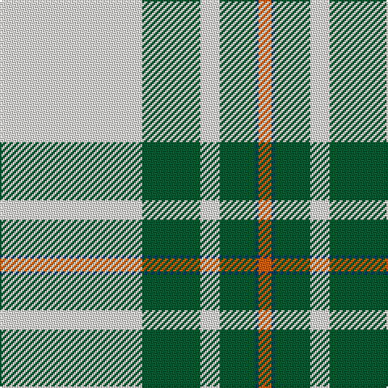

In pattern [RBGWGW](/patterns/rbgwgw/).

This was sourced from tartans-authority.  It is a [6 stripes tartan](/stripes/stripes6/).

Original link http://www.tartansauthority.com/tartan-ferret/display/7501/

## Attestations

This cloth appears in 3 source records; the oldest owns this page.

- June 2002 — Westfalia Dress (Corporate) (tartans-authority, [record](http://www.tartansauthority.com/tartan-ferret/display/7501/))
- undated — Westfalia Dress (register-of-tartans, [record](https://www.tartanregister.gov.uk/tartanDetails.aspx?ref=5541))
- undated — Westfalia Dress Corporate Tartan Tartan Number: 7501. Earliest known date: June 2002 A worsted stole for a German dairy machinery company. See products available Copyright © Blair Urquhart, Comrie, 2015 (house-of-tartan, [record](http://www.house-of-tartan.scotland.net/house/TartanViewjs.asp?colr=Def&tnam=7501))

## Thread count
LY/88 G36 LY12 G22 DB2 O/8

## Palette
Each colour and its ΔE from the base-6 reference it is a variant of.

| Colour | Shade | Base | ΔE (OKLab) |
|---|---|---|---|
| DB | <code style="background-color:#003C64;">#003C64</code> `#003C64` | B <code style="background-color:#2A418A;">#2A418A</code> | 0.08 |
| G | <code style="background-color:#005C30;">#005C30</code> `#005C30` | G <code style="background-color:#006100;">#006100</code> | 0.05 |
| LY | <code style="background-color:#F8F0E4;">#F8F0E4</code> `#F8F0E4` | W <code style="background-color:#F7F7F7;">#F7F7F7</code> | 0.03 |
| O | <code style="background-color:#E86000;">#E86000</code> `#E86000` | R <code style="background-color:#CC0000;">#CC0000</code> | 0.14 |

# Sample pattern

## Nearest tartans

The nearest existing variants by ΔTartan distance.

1. [MacGregor Dress Green Clan Tartan Tartan Number: 1577. Earliest known date: pre 1992 A dancers tartan. See products available Copyright © Blair Urquhart, Comrie, 2015](/setts/s6/w94g40w12g16k2r6-g006818-k101010-rc80000-we0e0e0/) — ΔT 0.52
1. [MacGregor Dress Green (Dance)](/setts/s6/w104g44w12g16k2r6-g004c00-k000000-re87878-wf8f8f8/) — ΔT 0.63
1. [MacGregor - 1975 (Dance, Green)](/setts/s6/w104g44w12g16k2r6-g006400-k000000-re87878-wf8f8f8/) — ΔT 0.64
1. [MacGregor, Green](/setts/s6/w94g40w12g16k2r6-g008000-k000000-rc00000-we0e0e0/) — ΔT 0.71
1. [Skye, Green (Dance)](/setts/s6/b8w4b2w72g42y8-b506878-g006818-wf0e0c8-yfce888/) — ΔT 0.97
1. [Westfalia (Corporate)](/setts/s6/g88w36g12w22b2r8-b003c64-g005c30-re86000-wf8f0e4/) — ΔT 1.26
1. [Unidentified, Blanket](/setts/s8/w100k2r24w2g24r26w2r4-g008000-k000000-rc00000-we0e0e0/) — ΔT 1.74
1. [Young, Christina](/setts/s6/w108k14r14y12ya8r2-k101010-rc80000-we0e0e0-yd87c00-yae8c000/) — ΔT 1.79
1. [MacGregor Dress Burgundy (Dance)](/setts/s6/w104r44w12r16k2ra6-k000000-r800028-rae87878-wf8f8f8/) — ΔT 1.80
1. [MMK 1777](/setts/s7/w120k4r28g28r32w4r8-g285800-k101010-rc80000-we0e0e0/) — ΔT 1.86

## Neighbour map

Every grey dot is one of 15726 variants placed by the first two principal components of the ΔTartan feature space (44% of its variance). Red is this tartan; blue dots are its nearest — click one to open its page.

<svg viewBox="0 0 640 380" role="img" style="max-width:100%;height:auto;border:1px solid #e0e0e0;border-radius:4px;display:block" xmlns="http://www.w3.org/2000/svg"><image href="/nn/cloud.v1.png" width="640" height="380"/><a href="/setts/s6/w94g40w12g16k2r6-g006818-k101010-rc80000-we0e0e0/"><circle cx="391.2" cy="115.9" r="4" fill="#3465a4"><title>MacGregor Dress Green Clan Tartan Tartan Number: 1577. Earliest known date: pre 1992 A dancers tartan. See products available Copyright © Blair Urquhart, Comrie, 2015</title></circle></a><a href="/setts/s6/w104g44w12g16k2r6-g004c00-k000000-re87878-wf8f8f8/"><circle cx="383.5" cy="103.7" r="4" fill="#3465a4"><title>MacGregor Dress Green (Dance)</title></circle></a><a href="/setts/s6/w104g44w12g16k2r6-g006400-k000000-re87878-wf8f8f8/"><circle cx="387.4" cy="105.1" r="4" fill="#3465a4"><title>MacGregor - 1975 (Dance, Green)</title></circle></a><a href="/setts/s6/w94g40w12g16k2r6-g008000-k000000-rc00000-we0e0e0/"><circle cx="395.1" cy="117.7" r="4" fill="#3465a4"><title>MacGregor, Green</title></circle></a><a href="/setts/s6/b8w4b2w72g42y8-b506878-g006818-wf0e0c8-yfce888/"><circle cx="335.1" cy="122.4" r="4" fill="#3465a4"><title>Skye, Green (Dance)</title></circle></a><a href="/setts/s6/g88w36g12w22b2r8-b003c64-g005c30-re86000-wf8f0e4/"><circle cx="360.6" cy="128.7" r="4" fill="#3465a4"><title>Westfalia (Corporate)</title></circle></a><a href="/setts/s8/w100k2r24w2g24r26w2r4-g008000-k000000-rc00000-we0e0e0/"><circle cx="362.5" cy="79.2" r="4" fill="#3465a4"><title>Unidentified, Blanket</title></circle></a><a href="/setts/s6/w108k14r14y12ya8r2-k101010-rc80000-we0e0e0-yd87c00-yae8c000/"><circle cx="415.0" cy="74.9" r="4" fill="#3465a4"><title>Young, Christina</title></circle></a><a href="/setts/s6/w104r44w12r16k2ra6-k000000-r800028-rae87878-wf8f8f8/"><circle cx="396.1" cy="95.7" r="4" fill="#3465a4"><title>MacGregor Dress Burgundy (Dance)</title></circle></a><a href="/setts/s7/w120k4r28g28r32w4r8-g285800-k101010-rc80000-we0e0e0/"><circle cx="331.4" cy="110.6" r="4" fill="#3465a4"><title>MMK 1777</title></circle></a><circle cx="358.1" cy="118.2" r="5" fill="#c00000"/></svg>

ID: /setts/s6/w88g36w12g22b2r8-b003c64-g005c30-re86000-wf8f0e4/
