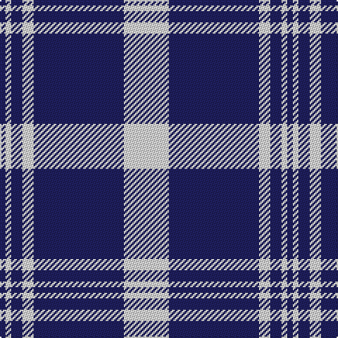

In pattern [BWBWBW](/patterns/bwbwbw/).

This was sourced from tartans-authority.  It is a [6 stripes tartan](/stripes/stripes6/).

Original link http://www.tartansauthority.com/tartan-ferret/display/2210/

## Thread count
DB/4 LN4 DB8 LN8 DB64 LN/32

## Palette
Each colour and its ΔE from the base-6 reference it is a variant of.

| Colour | Shade | Base | ΔE (OKLab) |
|---|---|---|---|
| DB | <code style="background-color:#202060;">#202060</code> `#202060` | B <code style="background-color:#2A418A;">#2A418A</code> | 0.11 |
| LN | <code style="background-color:#E0E0E0;">#E0E0E0</code> `#E0E0E0` | W <code style="background-color:#F7F7F7;">#F7F7F7</code> | 0.07 |

# Sample pattern

## Nearest tartans

The nearest existing variants by ΔTartan distance.

1. [Nike ACG Lunarstorm (Fashion)](/setts/s7/b8r2b18r1b2w10b4x2~b2c2c80-rc80000-wf8f8f8/) — ΔT 1.41
1. [Ikelman No 1](/setts/s6/w8k16w2b2w1k1x4~b304080-k000030-we0e0e0/) — ΔT 1.45
1. [Glen Moy Trade Tartan Tartan Number: 635. Earliest known date: pre 1992 Its mainly Sheep farming in Glen Moy. Off the beaten track, its a very quiet area of the Angus glens close to Cortachy castle and great for walking if you like it to yourself! Its also close to Glen Clova which is the busiest glen around here with some fantastic mountains for walking and taking photos. See products available Copyright © Blair Urquhart, Comrie, 2015](/setts/s5/b37w9b3r9w3x2~b202060-rc80000-we0e0e0/) — ΔT 1.45
1. [Erskine Royal Blue Dress Clan Tartan Tartan Number: 632. Earliest known date: 1980 One of a number of dress tartans produced by Hugh Macpherson, a kiltmaker in Edinburgh, intended for dancing and other informal occassions. The 'dress' version of clan tartan is usually created by substituting white for one of the 'ground' colours. See products available Copyright © Blair Urquhart, Comrie, 2015](/setts/s6/b6w2b29w29b2w6x2~b2c2c80-we0e0e0/) — ΔT 1.51
1. [Ikelman (Personal)](/setts/s10/b16w2b2w1b1w1b2w2b16w8x4~b202060-we0e0e0/) — ΔT 1.51
1. [Unidentified Tartan Tartan Number: 622. Earliest known date: Carmichael collection. See products available Copyright © Blair Urquhart, Comrie, 2015](/setts/s10/b5w12b4w4b4w3b37w3b3r4x2~b2c2c80-rc80000-we0e0e0/) — ΔT 1.58
1. [Antigonish](/setts/s8/b4ba1b4ba24w6ba4w1ba2x4~b5c8ca8-ba2c2c80-wfcfcfc/) — ΔT 1.58
1. [Unidentified #26](/setts/s10/b5w12b4w4b4w3b37w3b3r4x2~b2c4084-rdc0000-we0e0e0/) — ΔT 1.59
1. [Glen Moy](/setts/s5/b37w9b3r9w3x2~b000050-rc00000-we0e0e0/) — ΔT 1.60
1. [Unidentified 19](/setts/s10/b5w12b4w4b4w3b37w3b3r4x2~b304080-rc00000-we0e0e0/) — ΔT 1.60

## Neighbour map

Every grey dot is one of 15726 variants placed by the first two principal components of the ΔTartan feature space (44% of its variance). Red is this tartan; blue dots are its nearest — click one to open its page.

<svg viewBox="0 0 640 380" role="img" style="max-width:100%;height:auto;border:1px solid #e0e0e0;border-radius:4px;display:block" xmlns="http://www.w3.org/2000/svg"><image href="/nn/cloud.v1.png" width="640" height="380"/><a href="/setts/s7/b8r2b18r1b2w10b4x2~b2c2c80-rc80000-wf8f8f8/"><circle cx="407.1" cy="190.7" r="4" fill="#3465a4"><title>Nike ACG Lunarstorm (Fashion)</title></circle></a><a href="/setts/s6/w8k16w2b2w1k1x4~b304080-k000030-we0e0e0/"><circle cx="322.5" cy="181.7" r="4" fill="#3465a4"><title>Ikelman No 1</title></circle></a><a href="/setts/s5/b37w9b3r9w3x2~b202060-rc80000-we0e0e0/"><circle cx="375.8" cy="205.4" r="4" fill="#3465a4"><title>Glen Moy Trade Tartan Tartan Number: 635. Earliest known date: pre 1992 Its mainly Sheep farming in Glen Moy. Off the beaten track, its a very quiet area of the Angus glens close to Cortachy castle and great for walking if you like it to yourself! Its also close to Glen Clova which is the busiest glen around here with some fantastic mountains for walking and taking photos. See products available Copyright © Blair Urquhart, Comrie, 2015</title></circle></a><a href="/setts/s6/b6w2b29w29b2w6x2~b2c2c80-we0e0e0/"><circle cx="326.0" cy="202.9" r="4" fill="#3465a4"><title>Erskine Royal Blue Dress Clan Tartan Tartan Number: 632. Earliest known date: 1980 One of a number of dress tartans produced by Hugh Macpherson, a kiltmaker in Edinburgh, intended for dancing and other informal occassions. The 'dress' version of clan tartan is usually created by substituting white for one of the 'ground' colours. See products available Copyright © Blair Urquhart, Comrie, 2015</title></circle></a><a href="/setts/s10/b16w2b2w1b1w1b2w2b16w8x4~b202060-we0e0e0/"><circle cx="448.9" cy="182.6" r="4" fill="#3465a4"><title>Ikelman (Personal)</title></circle></a><a href="/setts/s10/b5w12b4w4b4w3b37w3b3r4x2~b2c2c80-rc80000-we0e0e0/"><circle cx="389.2" cy="161.9" r="4" fill="#3465a4"><title>Unidentified Tartan Tartan Number: 622. Earliest known date: Carmichael collection. See products available Copyright © Blair Urquhart, Comrie, 2015</title></circle></a><a href="/setts/s8/b4ba1b4ba24w6ba4w1ba2x4~b5c8ca8-ba2c2c80-wfcfcfc/"><circle cx="413.9" cy="155.4" r="4" fill="#3465a4"><title>Antigonish</title></circle></a><a href="/setts/s10/b5w12b4w4b4w3b37w3b3r4x2~b2c4084-rdc0000-we0e0e0/"><circle cx="392.4" cy="163.0" r="4" fill="#3465a4"><title>Unidentified #26</title></circle></a><a href="/setts/s5/b37w9b3r9w3x2~b000050-rc00000-we0e0e0/"><circle cx="366.2" cy="208.3" r="4" fill="#3465a4"><title>Glen Moy</title></circle></a><a href="/setts/s10/b5w12b4w4b4w3b37w3b3r4x2~b304080-rc00000-we0e0e0/"><circle cx="393.6" cy="163.2" r="4" fill="#3465a4"><title>Unidentified 19</title></circle></a><circle cx="396.0" cy="198.4" r="5" fill="#c00000"/></svg>

ID: /setts/s6/w8b16w2b2w1b1x4~b202060-we0e0e0/
