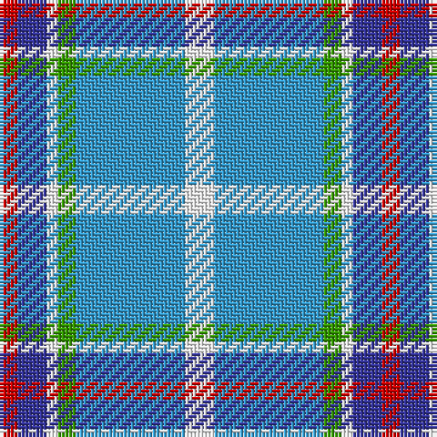

In pattern [RBWGBW](/patterns/rbwgbw/).

This was sourced from register-of-tartans.  It is a [6 stripes tartan](/stripes/stripes6/).

Original link https://www.tartanregister.gov.uk/tartanDetails.aspx?ref=10065

## Register references

External register numbers recorded for this tartan.

- Scottish Register of Tartans: [10065](https://www.tartanregister.gov.uk/tartanDetails.aspx?ref=10065)

## Thread count
R/5 B8 W3 G5 Ba30 W/8

## Palette
Each colour and its ΔE from the base-6 reference it is a variant of.

| Colour | Shade | Base | ΔE (OKLab) |
|---|---|---|---|
| B | <code style="background-color:#333399;">#333399</code> `#333399` | B <code style="background-color:#2A418A;">#2A418A</code> | 0.04 |
| Ba | <code style="background-color:#3399CC;">#3399CC</code> `#3399CC` | B <code style="background-color:#2A418A;">#2A418A</code> | 0.26 |
| G | <code style="background-color:#339900;">#339900</code> `#339900` | G <code style="background-color:#006100;">#006100</code> | 0.18 |
| R | <code style="background-color:#CC0000;">#CC0000</code> `#CC0000` | R <code style="background-color:#CC0000;">#CC0000</code> | 0.00 |
| W | <code style="background-color:#FFFFFF;">#FFFFFF</code> `#FFFFFF` | W <code style="background-color:#F7F7F7;">#F7F7F7</code> | 0.02 |

# Sample pattern

## Nearest tartans

The nearest existing variants by ΔTartan distance.

1. [Roseberry (Name)](/setts/s6/w8b30g5w3ba8r5~b5c8ca8-ba2c2c80-g289c18-rc80000-we0e0e0/) — ΔT 0.85
1. [MacTavish of Dunardry (Clan)](/setts/s7/b8w28y3g3b8k9b4~b5c8ca8-g408060-k101010-we0e0e0-ya08858~x2/) — ΔT 1.14
1. [Afternoon Tea / Mint Tea](/setts/s6/w15y98b72ba25b8ya15~b003c64-ba1474b4-wffffff-y48a4c0-yaf8e38c/) — ΔT 1.17
1. [Manx Laxey](/setts/s6/b4g16y2ba7b28w4~b8080d0-ba800080-g008000-we0e0e0-yf0c000~x2/) — ΔT 1.22
1. [Eeraerts, Laurent (Personal)](/setts/s6/w3b12ba1g15r3w1~b3474fc-ba2c2c80-g006818-r9c68a4-wffffff~x4/) — ΔT 1.27
1. [St Andrews, Earl of, dress](/setts/s7/w28b19ba19w4bb2wa2ba7~b5480b0-ba304080-bb000050-we0e0e0-wac0a0e0~x2/) — ΔT 1.28
1. [Allanton Dress (Fashion)](/setts/s6/g4w28b14y2ba17g4~b2c2c80-ba5c8ca8-g006818-we0e0e0-ye8c000~x2/) — ΔT 1.28
1. [Manx, dress](/setts/s6/g4w28b8y2ba17g4~b800080-ba304080-g008000-we0e0e0-yf0c000~x2/) — ΔT 1.32
1. [St. Christopher's School (Corporate)](/setts/s6/w20wa2w5k2b10r3~b3c3cb8-k101010-rc80000-w98c8e8-wae0e0e0~x2/) — ΔT 1.32
1. [St Andrews Dress, Earl of.. District Tartan Tartan Number: 45. Earliest known date: pre 2003 See products available Copyright © Blair Urquhart, Comrie, 2015](/setts/s7/w28b19ba19w4bb2wa2ba7~b5c8ca8-ba2c2c80-bb202060-we0e0e0-wac49cd8~x2/) — ΔT 1.36

## Neighbour map

Every grey dot is one of 15726 variants placed by the first two principal components of the ΔTartan feature space (44% of its variance). Red is this tartan; blue dots are its nearest — click one to open its page.

<svg viewBox="0 0 640 380" role="img" style="max-width:100%;height:auto;border:1px solid #e0e0e0;border-radius:4px;display:block" xmlns="http://www.w3.org/2000/svg"><image href="/nn/cloud.v1.png" width="640" height="380"/><a href="/setts/s6/w8b30g5w3ba8r5~b5c8ca8-ba2c2c80-g289c18-rc80000-we0e0e0/"><circle cx="233.7" cy="179.4" r="4" fill="#3465a4"><title>Roseberry (Name)</title></circle></a><a href="/setts/s7/b8w28y3g3b8k9b4~b5c8ca8-g408060-k101010-we0e0e0-ya08858~x2/"><circle cx="174.4" cy="163.1" r="4" fill="#3465a4"><title>MacTavish of Dunardry (Clan)</title></circle></a><a href="/setts/s6/w15y98b72ba25b8ya15~b003c64-ba1474b4-wffffff-y48a4c0-yaf8e38c/"><circle cx="189.5" cy="179.5" r="4" fill="#3465a4"><title>Afternoon Tea / Mint Tea</title></circle></a><a href="/setts/s6/b4g16y2ba7b28w4~b8080d0-ba800080-g008000-we0e0e0-yf0c000~x2/"><circle cx="270.1" cy="174.5" r="4" fill="#3465a4"><title>Manx Laxey</title></circle></a><a href="/setts/s6/w3b12ba1g15r3w1~b3474fc-ba2c2c80-g006818-r9c68a4-wffffff~x4/"><circle cx="201.4" cy="163.9" r="4" fill="#3465a4"><title>Eeraerts, Laurent (Personal)</title></circle></a><a href="/setts/s7/w28b19ba19w4bb2wa2ba7~b5480b0-ba304080-bb000050-we0e0e0-wac0a0e0~x2/"><circle cx="171.1" cy="158.4" r="4" fill="#3465a4"><title>St Andrews, Earl of, dress</title></circle></a><a href="/setts/s6/g4w28b14y2ba17g4~b2c2c80-ba5c8ca8-g006818-we0e0e0-ye8c000~x2/"><circle cx="159.6" cy="164.6" r="4" fill="#3465a4"><title>Allanton Dress (Fashion)</title></circle></a><a href="/setts/s6/g4w28b8y2ba17g4~b800080-ba304080-g008000-we0e0e0-yf0c000~x2/"><circle cx="182.2" cy="154.2" r="4" fill="#3465a4"><title>Manx, dress</title></circle></a><a href="/setts/s6/w20wa2w5k2b10r3~b3c3cb8-k101010-rc80000-w98c8e8-wae0e0e0~x2/"><circle cx="275.4" cy="175.0" r="4" fill="#3465a4"><title>St. Christopher's School (Corporate)</title></circle></a><a href="/setts/s7/w28b19ba19w4bb2wa2ba7~b5c8ca8-ba2c2c80-bb202060-we0e0e0-wac49cd8~x2/"><circle cx="166.8" cy="156.4" r="4" fill="#3465a4"><title>St Andrews Dress, Earl of.. District Tartan Tartan Number: 45. Earliest known date: pre 2003 See products available Copyright © Blair Urquhart, Comrie, 2015</title></circle></a><circle cx="214.0" cy="173.1" r="5" fill="#c00000"/></svg>

ID: /setts/s6/w8b30g5w3ba8r5~b3399cc-ba333399-g339900-rcc0000-wffffff/
