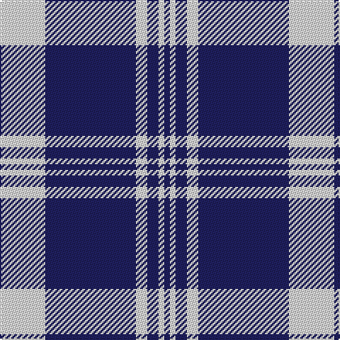

In pattern [BWBWBW](/stripes/bwbwbw/).

This was sourced from tartans-authority.  It is a [6 stripe tartan](/stripes/stripes6/).

Original link http://www.tartansauthority.com/tartan-ferret/display/2210/

## Thread count
LN/32 DB64 LN8 DB8 LN4 DB/4

## Palette
Each colour and the base-6 reference it is a variant of.

| Colour | Shade | Base |
|---|---|---|
| DB | <code style="background-color:#202060;">#202060</code> `oklch(28.9% 0.111 276.9)` <small>#202060</small> | B <code style="background-color:#2A418A;">#2A418A</code> |
| LN | <code style="background-color:#E0E0E0;">#E0E0E0</code> `oklch(90.7% 0.000 89.9)` <small>#E0E0E0</small> | W <code style="background-color:#F7F7F7;">#F7F7F7</code> |

# Sample pattern

## Nearest tartans

The nearest existing variants by ΔTartan distance, with this tartan at the top so the swatches line up against it.

ΔTartan

Tartan

Sett

—

<a href="/ttd/edit/#slug=w8db16w2db2w1db1~x4">Ikelman #1 (Personal)</a> <a class="nn-out" href="/setts/s6/w8db16w2db2w1db1~x4/" title="open its dictionary page">↗</a>

1.41

<a href="/ttd/edit/#slug=db8r2db18r1db2w10db4~x2">Nike ACG Lunarstorm (Fashion)</a> <a class="nn-out" href="/setts/s7/db8r2db18r1db2w10db4~x2/" title="open its dictionary page">↗</a>

1.45

<a href="/ttd/edit/#slug=w8k16w2db2w1k1~x4">Ikelman No 1</a> <a class="nn-out" href="/setts/s6/w8k16w2db2w1k1~x4/" title="open its dictionary page">↗</a>

1.51

<a href="/ttd/edit/#slug=db16w2db2w1db1w1db2w2db16w8~x4">Ikelman (Personal)</a> <a class="nn-out" href="/setts/s10/db16w2db2w1db1w1db2w2db16w8~x4/" title="open its dictionary page">↗</a>

1.58

<a href="/ttd/edit/#slug=t4db1t4db24w6db4w1db2~x4">Antigonish</a> <a class="nn-out" href="/setts/s8/t4db1t4db24w6db4w1db2~x4/" title="open its dictionary page">↗</a>

1.59

<a href="/ttd/edit/#slug=db5w12db4w4db4w3db37w3db3r4~x2">Unidentified #26</a> <a class="nn-out" href="/setts/s10/db5w12db4w4db4w3db37w3db3r4~x2/" title="open its dictionary page">↗</a>

1.60

<a href="/ttd/edit/#slug=db96ly11db8ly11db16ly6w4ly16w8">University of North Carolina at Greensboro, The</a> <a class="nn-out" href="/setts/s9/db96ly11db8ly11db16ly6w4ly16w8/" title="open its dictionary page">↗</a>

1.60

<a href="/ttd/edit/#slug=db37w9db3r9w3~x2">Glen Moy</a> <a class="nn-out" href="/setts/s5/db37w9db3r9w3~x2/" title="open its dictionary page">↗</a>

1.62

<a href="/ttd/edit/#slug=db26lp11db3lp4k2~x4">Debbie Munro Memorial (Corporate)</a> <a class="nn-out" href="/setts/s5/db26lp11db3lp4k2~x4/" title="open its dictionary page">↗</a>

1.71

<a href="/ttd/edit/#slug=db13lb3db1r3lb1~x6">Glen Moy</a> <a class="nn-out" href="/setts/s5/db13lb3db1r3lb1~x6/" title="open its dictionary page">↗</a>

1.73

<a href="/ttd/edit/#slug=t37w9t3db9w3~x2">Loch Lomond</a> <a class="nn-out" href="/setts/s5/t37w9t3db9w3~x2/" title="open its dictionary page">↗</a>

## Neighbour map

Every grey dot is one of 14299 variants placed by the first two principal components of the ΔTartan feature space (44% of its variance). Red is this tartan; blue dots are its nearest — click one to open its page.

<svg viewBox="0 0 640 380" role="img" style="max-width:100%;height:auto;border:1px solid #e0e0e0;border-radius:4px;display:block" xmlns="http://www.w3.org/2000/svg"><image href="/nn/cloud.v1.png" width="640" height="380"/><a href="/setts/s7/db8r2db18r1db2w10db4~x2/"><circle cx="409.3" cy="183.5" r="4" fill="#3465a4"><title>Nike ACG Lunarstorm (Fashion)</title></circle></a><a href="/setts/s6/w8k16w2db2w1k1~x4/"><circle cx="325.8" cy="175.5" r="4" fill="#3465a4"><title>Ikelman No 1</title></circle></a><a href="/setts/s10/db16w2db2w1db1w1db2w2db16w8~x4/"><circle cx="451.4" cy="175.0" r="4" fill="#3465a4"><title>Ikelman (Personal)</title></circle></a><a href="/setts/s8/t4db1t4db24w6db4w1db2~x4/"><circle cx="416.7" cy="150.8" r="4" fill="#3465a4"><title>Antigonish</title></circle></a><a href="/setts/s10/db5w12db4w4db4w3db37w3db3r4~x2/"><circle cx="394.8" cy="157.6" r="4" fill="#3465a4"><title>Unidentified #26</title></circle></a><a href="/setts/s9/db96ly11db8ly11db16ly6w4ly16w8/"><circle cx="425.5" cy="129.7" r="4" fill="#3465a4"><title>University of North Carolina at Greensboro, The</title></circle></a><a href="/setts/s5/db37w9db3r9w3~x2/"><circle cx="369.0" cy="201.6" r="4" fill="#3465a4"><title>Glen Moy</title></circle></a><a href="/setts/s5/db26lp11db3lp4k2~x4/"><circle cx="378.3" cy="206.0" r="4" fill="#3465a4"><title>Debbie Munro Memorial (Corporate)</title></circle></a><a href="/setts/s5/db13lb3db1r3lb1~x6/"><circle cx="395.4" cy="200.9" r="4" fill="#3465a4"><title>Glen Moy</title></circle></a><a href="/setts/s5/t37w9t3db9w3~x2/"><circle cx="382.6" cy="206.0" r="4" fill="#3465a4"><title>Loch Lomond</title></circle></a><circle cx="398.5" cy="190.5" r="5" fill="#c00000"/></svg>

ID: /setts/s6/w8db16w2db2w1db1~x4/
