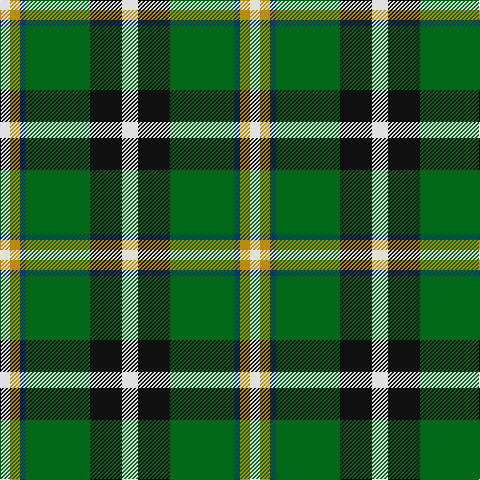

**Bands:** [WKGBYW](/stripes/wkgbyw/) · **Stripes:** [W K G DT LO W](/stripes/stripes6/) W K G DT LO W

This was sourced from tartans-authority.  It is a [6 band tartan](/bands/bands6/).

Original link http://www.tartansauthority.com/tartan-ferret/display/10320/

## Attestations

This cloth appears in 2 source records; the oldest owns this page.

- 10th Oct. 2009 — Mellor (Name) (tartans-authority, [record](http://www.tartansauthority.com/tartan-ferret/display/10320/))
- undated — Mellor Name Tartan Tartan Number: 10320. Earliest known date: 10th Oct. 2009 Designed by a Phillip Mellor of Oldham who is happy for all of the name to wear it. See products available Copyright © Blair Urquhart, Comrie, 2015 (house-of-tartan, [record](http://www.house-of-tartan.scotland.net/house/TartanViewjs.asp?colr=Def&tnam=10320))

## Thread count
LN/10 DY10 DB6 G64 K32 LN/16

## Palette
Each colour and its ΔE from the base-6 reference it is a variant of.

| Colour | Shade | Base | ΔE (OKLab) |
|---|---|---|---|
| DB | <code style="background-color:#003C64;">#003C64</code> `#003C64` | B <code style="background-color:#2A418A;">#2A418A</code> | 0.08 |
| DY | <code style="background-color:#BC8C00;">#BC8C00</code> `#BC8C00` | Y <code style="background-color:#F2BF00;">#F2BF00</code> | 0.16 |
| G | <code style="background-color:#006818;">#006818</code> `#006818` | G <code style="background-color:#006100;">#006100</code> | 0.02 |
| K | <code style="background-color:#101010;">#101010</code> `#101010` | K <code style="background-color:#000000;">#000000</code> | 0.17 |
| LN | <code style="background-color:#E0E0E0;">#E0E0E0</code> `#E0E0E0` | W <code style="background-color:#F7F7F7;">#F7F7F7</code> | 0.07 |

# Sample pattern

## Nearest tartans

The nearest existing variants by ΔTartan distance.

1. [Lindley-Highfield Name Tartan Tartan Number: 10002. Earliest known date: 13 February 2009 'Lindley-Highfield of Ballumbie Castle' is a tartan of the family of the Lindley-Highfields of Ballumbie Castle, sometime Barons of Cartsburn. The colours of this particular tartan are taken from the armorial bearings of the Head of the Family of Lindley-Highfield of Ballumbie Castle. See products available Copyright © Blair Urquhart, Comrie, 2015](/setts/s7/g7p3w1lg2g1k2p1~x8/) — ΔT 0.90
1. [Hackett (Personal)](/setts/s7/k20w4r4g20w5g2g2~x2/) — ΔT 0.90
1. [Driver (Name)](/setts/s6/g11w11k3ly3dg36lo7~x2/) — ΔT 1.00
1. [Turnbull, hunting](/setts/s5/k7ly3g28db28w3~x2/) — ΔT 1.11
1. [Lindley-Highfield of Ballumbie Castle](/setts/s7/g7p3w1lg2g1lp2p1~x8/) — ΔT 1.13
1. [Hamilton of Brandon (Fashion)](/setts/s6/lo16k7w1g7k1ly3~x4/) — ΔT 1.15
1. [Bannockbane, Green](/setts/s7/dg8g6dg48w31o42g6o8/) — ΔT 1.17
1. [Afternoon Tea / Afternoon Tea](/setts/s6/ly15g98k72m25k8w15/) — ΔT 1.17
1. [Bannockbane Dark Green](/setts/s7/dg4g3dg24w15lo21g3lo4~x2/) — ΔT 1.21
1. [Driver, RC](/setts/s6/g11w11k3ly3dg36r7~x2/) — ΔT 1.21

## Neighbour map

Every grey dot is one of 14313 variants placed by the first two principal components of the ΔTartan feature space (44% of its variance). Red is this tartan; blue dots are its nearest — click one to open its page.

<svg viewBox="0 0 640 380" role="img" style="max-width:100%;height:auto;border:1px solid #e0e0e0;border-radius:4px;display:block" xmlns="http://www.w3.org/2000/svg"><image href="/nn/cloud.v1.png" width="640" height="380"/><a href="/setts/s7/g7p3w1lg2g1k2p1~x8/"><circle cx="163.1" cy="189.3" r="4" fill="#3465a4"><title>Lindley-Highfield Name Tartan Tartan Number: 10002. Earliest known date: 13 February 2009 'Lindley-Highfield of Ballumbie Castle' is a tartan of the family of the Lindley-Highfields of Ballumbie Castle, sometime Barons of Cartsburn. The colours of this particular tartan are taken from the armorial bearings of the Head of the Family of Lindley-Highfield of Ballumbie Castle. See products available Copyright © Blair Urquhart, Comrie, 2015</title></circle></a><a href="/setts/s7/k20w4r4g20w5g2g2~x2/"><circle cx="153.4" cy="166.1" r="4" fill="#3465a4"><title>Hackett (Personal)</title></circle></a><a href="/setts/s6/g11w11k3ly3dg36lo7~x2/"><circle cx="202.1" cy="154.9" r="4" fill="#3465a4"><title>Driver (Name)</title></circle></a><a href="/setts/s5/k7ly3g28db28w3~x2/"><circle cx="185.6" cy="202.5" r="4" fill="#3465a4"><title>Turnbull, hunting</title></circle></a><a href="/setts/s7/g7p3w1lg2g1lp2p1~x8/"><circle cx="170.5" cy="187.2" r="4" fill="#3465a4"><title>Lindley-Highfield of Ballumbie Castle</title></circle></a><a href="/setts/s6/lo16k7w1g7k1ly3~x4/"><circle cx="216.1" cy="162.9" r="4" fill="#3465a4"><title>Hamilton of Brandon (Fashion)</title></circle></a><a href="/setts/s7/dg8g6dg48w31o42g6o8/"><circle cx="143.1" cy="184.1" r="4" fill="#3465a4"><title>Bannockbane, Green</title></circle></a><a href="/setts/s6/ly15g98k72m25k8w15/"><circle cx="201.5" cy="180.7" r="4" fill="#3465a4"><title>Afternoon Tea / Afternoon Tea</title></circle></a><a href="/setts/s7/dg4g3dg24w15lo21g3lo4~x2/"><circle cx="144.9" cy="184.5" r="4" fill="#3465a4"><title>Bannockbane Dark Green</title></circle></a><a href="/setts/s6/g11w11k3ly3dg36r7~x2/"><circle cx="194.6" cy="150.3" r="4" fill="#3465a4"><title>Driver, RC</title></circle></a><circle cx="187.3" cy="178.7" r="5" fill="#c00000"/></svg>

ID: /setts/s6/w8k16g32dt3lo5w5~x2/
