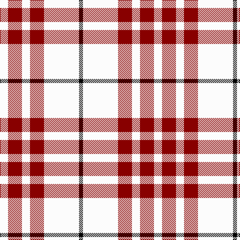

**Bands:** [KWRWRW](/stripes/kwrwrw/) · **Stripes:** [K W R W R W](/stripes/stripes6/) K W R W R W

This was sourced from tartans-authority.  It is a [6 band tartan](/bands/bands6/).

Original link http://www.tartansauthority.com/tartan-ferret/display/4529/

## Variants

Other setts woven to the same stripe pattern.

- [Buchanan #5](/setts/s6/k2w28r13w2r13w2~x2/)

## Thread count
W/16 DR28 W16 DR28 W70 K/8

## Palette
Each colour and its ΔE from the base-6 reference it is a variant of.

| Colour | Shade | Base | ΔE (OKLab) |
|---|---|---|---|
| DR | <code style="background-color:#880000;">#880000</code> `#880000` | R <code style="background-color:#CC0000;">#CC0000</code> | 0.15 |
| K | <code style="background-color:#000000;">#000000</code> `#000000` | K <code style="background-color:#000000;">#000000</code> | 0.00 |
| W | <code style="background-color:#FCFCFC;">#FCFCFC</code> `#FCFCFC` | W <code style="background-color:#F7F7F7;">#F7F7F7</code> | 0.01 |

# Sample pattern

## Nearest tartans

The nearest existing variants by ΔTartan distance.

1. [Clayton Dress (Dance)](/setts/s8/r14w35k4w35r14w8r14w8~x2/) — ΔT 0.79
1. [Buchanan VS](/setts/s6/lb2r4lb2r4lb9k1~x2/) — ΔT 1.22
1. [Milne Dress Family Tartan Tartan Number: 634. Earliest known date: pre 2003 Milnes are usually regarded as being a Sept of the Gordons or of the Ogilvys. See products available Copyright © Blair Urquhart, Comrie, 2015](/setts/s8/w18db4w18r30w18db4w9dp4/) — ΔT 1.41
1. [Milne, Dress (Dance)](/setts/s8/w12t2w12r17w12t2w5dp2~x4/) — ΔT 1.41
1. [Milne, dress](/setts/s8/w18db4w18r30w18db4w9p4/) — ΔT 1.42
1. [Buchanan #5](/setts/s6/k2w28r13w2r13w2~x2/) — ΔT 1.49
1. [Bull-Dog Sauce](/setts/s7/w20g2w20k8r20g3r2~x2/) — ΔT 1.53
1. [Boswell Dress Personal Tartan Tartan Number: 6359. Earliest known date: 2004 A tartan for William Boswell of Balmuto in Fife. See products available Copyright © Blair Urquhart, Comrie, 2015](/setts/s8/w13r3w2k5w2r3w13db8~x2/) — ΔT 1.63
1. [Milne (Personal)](/setts/s8/w12dg2w12r17w12dg2w5b2~x4/) — ΔT 1.63
1. [McPartlin (Personal)](/setts/s5/k27w29k5w14r2~x2/) — ΔT 1.69

## Neighbour map

Every grey dot is one of 14299 variants placed by the first two principal components of the ΔTartan feature space (44% of its variance). Red is this tartan; blue dots are its nearest — click one to open its page.

<svg viewBox="0 0 640 380" role="img" style="max-width:100%;height:auto;border:1px solid #e0e0e0;border-radius:4px;display:block" xmlns="http://www.w3.org/2000/svg"><image href="/nn/cloud.v1.png" width="640" height="380"/><a href="/setts/s8/r14w35k4w35r14w8r14w8~x2/"><circle cx="317.5" cy="191.9" r="4" fill="#3465a4"><title>Clayton Dress (Dance)</title></circle></a><a href="/setts/s6/lb2r4lb2r4lb9k1~x2/"><circle cx="321.8" cy="205.5" r="4" fill="#3465a4"><title>Buchanan VS</title></circle></a><a href="/setts/s8/w18db4w18r30w18db4w9dp4/"><circle cx="269.7" cy="188.9" r="4" fill="#3465a4"><title>Milne Dress Family Tartan Tartan Number: 634. Earliest known date: pre 2003 Milnes are usually regarded as being a Sept of the Gordons or of the Ogilvys. See products available Copyright © Blair Urquhart, Comrie, 2015</title></circle></a><a href="/setts/s8/w12t2w12r17w12t2w5dp2~x4/"><circle cx="297.0" cy="179.0" r="4" fill="#3465a4"><title>Milne, Dress (Dance)</title></circle></a><a href="/setts/s8/w18db4w18r30w18db4w9p4/"><circle cx="270.7" cy="189.9" r="4" fill="#3465a4"><title>Milne, dress</title></circle></a><a href="/setts/s6/k2w28r13w2r13w2~x2/"><circle cx="322.9" cy="170.6" r="4" fill="#3465a4"><title>Buchanan #5</title></circle></a><a href="/setts/s7/w20g2w20k8r20g3r2~x2/"><circle cx="230.2" cy="166.8" r="4" fill="#3465a4"><title>Bull-Dog Sauce</title></circle></a><a href="/setts/s8/w13r3w2k5w2r3w13db8~x2/"><circle cx="246.5" cy="190.5" r="4" fill="#3465a4"><title>Boswell Dress Personal Tartan Tartan Number: 6359. Earliest known date: 2004 A tartan for William Boswell of Balmuto in Fife. See products available Copyright © Blair Urquhart, Comrie, 2015</title></circle></a><a href="/setts/s8/w12dg2w12r17w12dg2w5b2~x4/"><circle cx="299.4" cy="182.3" r="4" fill="#3465a4"><title>Milne (Personal)</title></circle></a><a href="/setts/s5/k27w29k5w14r2~x2/"><circle cx="299.8" cy="200.8" r="4" fill="#3465a4"><title>McPartlin (Personal)</title></circle></a><circle cx="303.4" cy="198.2" r="5" fill="#c00000"/></svg>

ID: /setts/s6/w8r14w8r14w35k4~x2/
