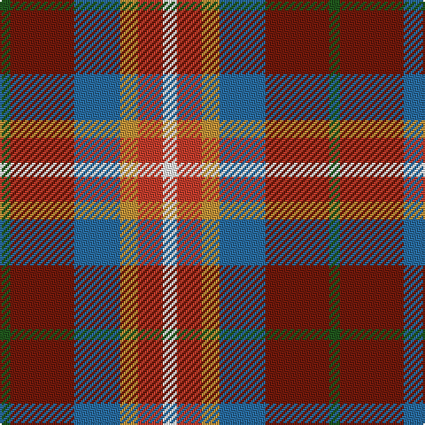

In pattern [GRBYRW](/patterns/grbyrw/).

This was sourced from register-of-tartans.  It is a [6 stripes tartan](/stripes/stripes6/).

Original link https://www.tartanregister.gov.uk/tartanDetails.aspx?ref=10483

## Thread count
G/6 DR36 B26 O10 R14 W/8

## Palette
Each colour and its ΔE from the base-6 reference it is a variant of.

| Colour | Shade | Base | ΔE (OKLab) |
|---|---|---|---|
| B | <code style="background-color:#296CA0;">#296CA0</code> `#296CA0` | B <code style="background-color:#2C4084;">#2C4084</code> | 0.13 |
| DR | <code style="background-color:#71190B;">#71190B</code> `#71190B` | R <code style="background-color:#C80000;">#C80000</code> | 0.18 |
| G | <code style="background-color:#20561C;">#20561C</code> `#20561C` | G <code style="background-color:#006400;">#006400</code> | 0.05 |
| O | <code style="background-color:#C29339;">#C29339</code> `#C29339` | Y <code style="background-color:#E8C000;">#E8C000</code> | 0.14 |
| R | <code style="background-color:#C23D2C;">#C23D2C</code> `#C23D2C` | R <code style="background-color:#C80000;">#C80000</code> | 0.05 |
| W | <code style="background-color:#FFFFFF;">#FFFFFF</code> `#FFFFFF` | W <code style="background-color:#F4F4F0;">#F4F4F0</code> | 0.03 |

# Sample pattern

ID: /setts/s6/w8r14y10b26ra36g6-b296ca0-g20561c-rc23d2c-ra71190b-wffffff-yc29339/
