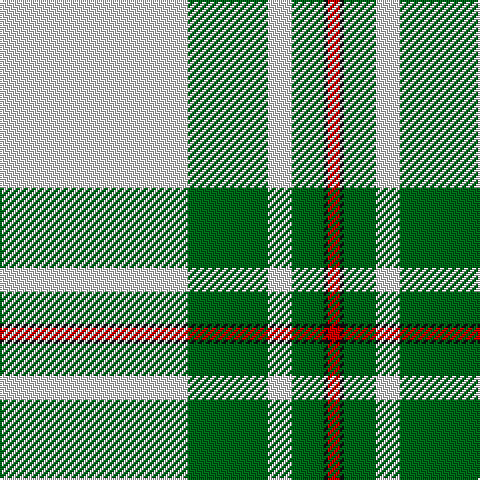

In pattern [RKGWGW](/patterns/rkgwgw/).

This was sourced from house-of-tartan.  It is a [6 stripes tartan](/stripes/stripes6/).

Original link http://www.house-of-tartan.scotland.net/house/TartanViewjs.asp?colr=Def&tnam=1577

## Thread count
LN/94 G40 LN12 G16 K2 R/6

## Palette
Each colour and its ΔE from the base-6 reference it is a variant of.

| Colour | Shade | Base | ΔE (OKLab) |
|---|---|---|---|
| G | <code style="background-color:#006818;">#006818</code> `#006818` | G <code style="background-color:#006100;">#006100</code> | 0.02 |
| K | <code style="background-color:#101010;">#101010</code> `#101010` | K <code style="background-color:#000000;">#000000</code> | 0.17 |
| LN | <code style="background-color:#E0E0E0;">#E0E0E0</code> `#E0E0E0` | W <code style="background-color:#F7F7F7;">#F7F7F7</code> | 0.07 |
| R | <code style="background-color:#C80000;">#C80000</code> `#C80000` | R <code style="background-color:#CC0000;">#CC0000</code> | 0.01 |

# Sample pattern

## Nearest tartans

The nearest existing variants by ΔTartan distance.

1. [MacGregor, Green](/setts/s6/w94g40w12g16k2r6-g008000-k000000-rc00000-we0e0e0/) — ΔT 0.36
1. [Westfalia Dress (Corporate)](/setts/s6/w88g36w12g22b2r8-b003c64-g005c30-re86000-wf8f0e4/) — ΔT 0.52
1. [MacGregor - 1975 (Dance, Green)](/setts/s6/w104g44w12g16k2r6-g006400-k000000-re87878-wf8f8f8/) — ΔT 0.57
1. [MacGregor Dress Green (Dance)](/setts/s6/w104g44w12g16k2r6-g004c00-k000000-re87878-wf8f8f8/) — ΔT 0.63
1. [Skye, Green (Dance)](/setts/s6/b8w4b2w72g42y8-b506878-g006818-wf0e0c8-yfce888/) — ΔT 1.10
1. [Westfalia (Corporate)](/setts/s6/g88w36g12w22b2r8-b003c64-g005c30-re86000-wf8f0e4/) — ΔT 1.19
1. [Young, Christina](/setts/s6/w108k14r14y12ya8r2-k101010-rc80000-we0e0e0-yd87c00-yae8c000/) — ΔT 1.70
1. [Summer Spirit (Fashion)](/setts/s8/r4w4k4w56k16w18k2y4-k101010-rc80000-wfcfcec-ye8c000/) — ΔT 1.84
1. [Unidentified, Blanket](/setts/s8/w100k2r24w2g24r26w2r4-g008000-k000000-rc00000-we0e0e0/) — ΔT 1.86
1. [Boucherville Formal District Tartan Tartan Number: 2118. Earliest known date: 1990 Three designers from La Navette d'Art ENR, Jeanette Blanchette, Pauline Bastien and Jacqueline Provost, based their design on symbolic colours. Le bleu azur represente la loyaute, le gris argent la serenite, le jaune (l'or) la generosite, le vert represente l'esperance, et le blanc symbole de purete et d'innocence "nous rappelle notre appartenance au Quebec." "Les tisserands, c'est nous tous...!" See products available Copyright © Blair Urquhart, Comrie, 2015](/setts/s9/w40y4r10w8b4r4b4r4g1-b2c2c80-g006818-r888888-we0e0e0-ye8c000/) — ΔT 1.91

## Neighbour map

Every grey dot is one of 15726 variants placed by the first two principal components of the ΔTartan feature space (44% of its variance). Red is this tartan; blue dots are its nearest — click one to open its page.

<svg viewBox="0 0 640 380" role="img" style="max-width:100%;height:auto;border:1px solid #e0e0e0;border-radius:4px;display:block" xmlns="http://www.w3.org/2000/svg"><image href="/nn/cloud.v1.png" width="640" height="380"/><a href="/setts/s6/w94g40w12g16k2r6-g008000-k000000-rc00000-we0e0e0/"><circle cx="395.1" cy="117.7" r="4" fill="#3465a4"><title>MacGregor, Green</title></circle></a><a href="/setts/s6/w88g36w12g22b2r8-b003c64-g005c30-re86000-wf8f0e4/"><circle cx="358.1" cy="118.2" r="4" fill="#3465a4"><title>Westfalia Dress (Corporate)</title></circle></a><a href="/setts/s6/w104g44w12g16k2r6-g006400-k000000-re87878-wf8f8f8/"><circle cx="387.4" cy="105.1" r="4" fill="#3465a4"><title>MacGregor - 1975 (Dance, Green)</title></circle></a><a href="/setts/s6/w104g44w12g16k2r6-g004c00-k000000-re87878-wf8f8f8/"><circle cx="383.5" cy="103.7" r="4" fill="#3465a4"><title>MacGregor Dress Green (Dance)</title></circle></a><a href="/setts/s6/b8w4b2w72g42y8-b506878-g006818-wf0e0c8-yfce888/"><circle cx="335.1" cy="122.4" r="4" fill="#3465a4"><title>Skye, Green (Dance)</title></circle></a><a href="/setts/s6/g88w36g12w22b2r8-b003c64-g005c30-re86000-wf8f0e4/"><circle cx="360.6" cy="128.7" r="4" fill="#3465a4"><title>Westfalia (Corporate)</title></circle></a><a href="/setts/s6/w108k14r14y12ya8r2-k101010-rc80000-we0e0e0-yd87c00-yae8c000/"><circle cx="415.0" cy="74.9" r="4" fill="#3465a4"><title>Young, Christina</title></circle></a><a href="/setts/s8/r4w4k4w56k16w18k2y4-k101010-rc80000-wfcfcec-ye8c000/"><circle cx="414.1" cy="101.5" r="4" fill="#3465a4"><title>Summer Spirit (Fashion)</title></circle></a><a href="/setts/s8/w100k2r24w2g24r26w2r4-g008000-k000000-rc00000-we0e0e0/"><circle cx="362.5" cy="79.2" r="4" fill="#3465a4"><title>Unidentified, Blanket</title></circle></a><a href="/setts/s9/w40y4r10w8b4r4b4r4g1-b2c2c80-g006818-r888888-we0e0e0-ye8c000/"><circle cx="361.8" cy="81.6" r="4" fill="#3465a4"><title>Boucherville Formal District Tartan Tartan Number: 2118. Earliest known date: 1990 Three designers from La Navette d'Art ENR, Jeanette Blanchette, Pauline Bastien and Jacqueline Provost, based their design on symbolic colours. Le bleu azur represente la loyaute, le gris argent la serenite, le jaune (l'or) la generosite, le vert represente l'esperance, et le blanc symbole de purete et d'innocence &quot;nous rappelle notre appartenance au Quebec.&quot; &quot;Les tisserands, c'est nous tous...!&quot; See products available Copyright © Blair Urquhart, Comrie, 2015</title></circle></a><circle cx="391.2" cy="115.9" r="5" fill="#c00000"/></svg>

ID: /setts/s6/w94g40w12g16k2r6-g006818-k101010-rc80000-we0e0e0/
