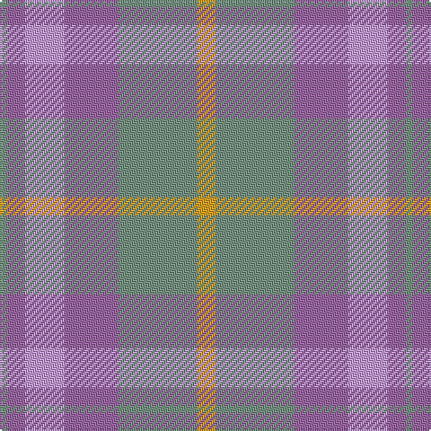

In pattern [GRWRGY](/patterns/grwrgy/).

This was sourced from register-of-tartans.  It is a [6 stripes tartan](/stripes/stripes6/).

Original link https://www.tartanregister.gov.uk/tartanDetails.aspx?ref=10896

## Thread count
LG/4 LP10 LPa22 LP30 LG44 Y/10

## Palette
Each colour and its ΔE from the base-6 reference it is a variant of.

| Colour | Shade | Base | ΔE (OKLab) |
|---|---|---|---|
| LG | <code style="background-color:#789484;">#789484</code> `#789484` | G <code style="background-color:#006100;">#006100</code> | 0.24 |
| LP | <code style="background-color:#9C68A4;">#9C68A4</code> `#9C68A4` | R <code style="background-color:#CC0000;">#CC0000</code> | 0.21 |
| LPa | <code style="background-color:#C49CD8;">#C49CD8</code> `#C49CD8` | W <code style="background-color:#F7F7F7;">#F7F7F7</code> | 0.25 |
| Y | <code style="background-color:#E0A126;">#E0A126</code> `#E0A126` | Y <code style="background-color:#F2BF00;">#F2BF00</code> | 0.08 |

# Sample pattern

## Nearest tartans

The nearest existing variants by ΔTartan distance.

1. [Tenmaya](/setts/s8/w3g36wa6b6wa6b12wa32w3-b8080d0-g808080-we0e0e0-wac0a0e0/) — ΔT 1.39
1. [Froach's Grian](/setts/s8/y4r48ya28y50ya28y50yb40y4-r9c68a4-y94acc4-yaa08858-ybe8c000/) — ΔT 1.54
1. [Porcelanosa](/setts/s4/y48r18b46ya6-b5c5c5c-r888888-ya0a0a0-yae8c000/) — ΔT 1.76
1. [Turnberry (MacArthur)](/setts/s8/r48b6r6b6r6b40y44b8-b5c5c5c-r888888-ya0a0a0/) — ΔT 1.86
1. [Clyde](/setts/s10/r10b6r44ra6b12ba34ra4ba8ra4ba8-b646464-ba5c5c5c-r8c8c8c-ra8c0000/) — ΔT 1.90
1. [Outlander #2](/setts/s9/r56b48w8y48b8y48b48w8r48-b5c5c5c-r888888-w98c8e8-ya08858/) — ΔT 1.99
1. [Outlander #2](/setts/s9/g56b48w8y48b8y48b48w8g48-b5c5c5c-g808080-w82cffd-ya08858/) — ΔT 2.04
1. [Trinity Bicycles](/setts/s5/g8y22g28r60ra8-g6b4226-r8b7355-racd0000-y6ca6cd/) — ΔT 2.04
1. [Dunans Rising](/setts/s5/g70ga50r30b4b42-b5e82a3-g006752-ga5e6639-raf23a5/) — ΔT 2.06
1. [Lawrence's Seven Pillars of Khaki](/setts/s9/g6b24g20b12g16ga12g16r46ra6-b5f749c-g767e52-ga008b00-rbe7832-rac8002c/) — ΔT 2.17

## Neighbour map

Every grey dot is one of 15726 variants placed by the first two principal components of the ΔTartan feature space (44% of its variance). Red is this tartan; blue dots are its nearest — click one to open its page.

<svg viewBox="0 0 640 380" role="img" style="max-width:100%;height:auto;border:1px solid #e0e0e0;border-radius:4px;display:block" xmlns="http://www.w3.org/2000/svg"><image href="/nn/cloud.v1.png" width="640" height="380"/><a href="/setts/s8/w3g36wa6b6wa6b12wa32w3-b8080d0-g808080-we0e0e0-wac0a0e0/"><circle cx="338.1" cy="217.6" r="4" fill="#3465a4"><title>Tenmaya</title></circle></a><a href="/setts/s8/y4r48ya28y50ya28y50yb40y4-r9c68a4-y94acc4-yaa08858-ybe8c000/"><circle cx="265.8" cy="237.8" r="4" fill="#3465a4"><title>Froach's Grian</title></circle></a><a href="/setts/s4/y48r18b46ya6-b5c5c5c-r888888-ya0a0a0-yae8c000/"><circle cx="280.3" cy="285.2" r="4" fill="#3465a4"><title>Porcelanosa</title></circle></a><a href="/setts/s8/r48b6r6b6r6b40y44b8-b5c5c5c-r888888-ya0a0a0/"><circle cx="343.6" cy="270.5" r="4" fill="#3465a4"><title>Turnberry (MacArthur)</title></circle></a><a href="/setts/s10/r10b6r44ra6b12ba34ra4ba8ra4ba8-b646464-ba5c5c5c-r8c8c8c-ra8c0000/"><circle cx="334.6" cy="224.9" r="4" fill="#3465a4"><title>Clyde</title></circle></a><a href="/setts/s9/r56b48w8y48b8y48b48w8r48-b5c5c5c-r888888-w98c8e8-ya08858/"><circle cx="261.6" cy="286.6" r="4" fill="#3465a4"><title>Outlander #2</title></circle></a><a href="/setts/s9/g56b48w8y48b8y48b48w8g48-b5c5c5c-g808080-w82cffd-ya08858/"><circle cx="262.0" cy="287.6" r="4" fill="#3465a4"><title>Outlander #2</title></circle></a><a href="/setts/s5/g8y22g28r60ra8-g6b4226-r8b7355-racd0000-y6ca6cd/"><circle cx="316.6" cy="263.5" r="4" fill="#3465a4"><title>Trinity Bicycles</title></circle></a><a href="/setts/s5/g70ga50r30b4b42-b5e82a3-g006752-ga5e6639-raf23a5/"><circle cx="260.0" cy="262.3" r="4" fill="#3465a4"><title>Dunans Rising</title></circle></a><a href="/setts/s9/g6b24g20b12g16ga12g16r46ra6-b5f749c-g767e52-ga008b00-rbe7832-rac8002c/"><circle cx="253.8" cy="250.1" r="4" fill="#3465a4"><title>Lawrence's Seven Pillars of Khaki</title></circle></a><circle cx="307.6" cy="256.7" r="5" fill="#c00000"/></svg>

ID: /setts/s6/y10g44r30w22r10g4-g789484-r9c68a4-wc49cd8-ye0a126/
