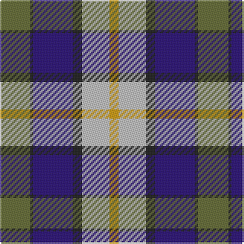

This page is one **sett** — a single exact thread-count. It belongs to the [tartan](/tartans/g10k1db13k3n9dy3/)
(the same proportion at any scale), whose colour order is pattern [GKBKWY](/stripes/gkbkwy/).

Sourced from register-of-tartans.  It is a [6 stripe tartan](/stripes/stripes6/).

Original link https://www.tartanregister.gov.uk/tartanDetails.aspx?ref=1838

2 attestations — the source records this cloth was collapsed from (oldest owns this page)

<ul>
<li>01/01/2002 — Inverary (register-of-tartans, <a href="https://www.tartanregister.gov.uk/tartanDetails.aspx?ref=1838">record</a>)</li>
<li>pre 2002 — Inverary (District) (tartans-authority, <a href="http://www.tartansauthority.com/tartan-ferret/display/772/">record</a>)</li>
</ul>

## Register references

External register numbers recorded for this tartan.

- Scottish Register of Tartans: [1838](https://www.tartanregister.gov.uk/tartanDetails.aspx?ref=1838)
- Scottish Tartans Authority (ITI): 772
- Scottish Tartans World Register: 772

## Thread count
G/20 K2 DB26 K6 N18 DY/6

## Palette
Each colour and the base-6 reference it is a variant of.

| Colour | Shade | Base |
|---|---|---|
| DB | <code style="background-color:#1C0070;">#1C0070</code> `oklch(26.3% 0.162 277.1)` <small>#1C0070</small> | B <code style="background-color:#2A418A;">#2A418A</code> |
| DR | <code style="background-color:#880000;">#880000</code> `oklch(39.4% 0.162 29.2)` <small>#880000</small> | R <code style="background-color:#CC0000;">#CC0000</code> |
| DY | <code style="background-color:#D09800;">#D09800</code> `oklch(71.4% 0.147 82.1)` <small>#D09800</small> | Y <code style="background-color:#F2BF00;">#F2BF00</code> |
| G | <code style="background-color:#5C6428;">#5C6428</code> `oklch(48.3% 0.084 116.0)` <small>#5C6428</small> | G <code style="background-color:#006100;">#006100</code> |
| K | <code style="background-color:#101010;">#101010</code> `oklch(17.3% 0.000 89.9)` <small>#101010</small> | K <code style="background-color:#000000;">#000000</code> |
| N | <code style="background-color:#C0C0C0;">#C0C0C0</code> `oklch(80.8% 0.000 89.9)` <small>#C0C0C0</small> | W <code style="background-color:#F7F7F7;">#F7F7F7</code> |

# Sample pattern

## Nearest tartans

The nearest existing variants by ΔTartan distance, with this tartan at the top so the swatches line up against it.

ΔTartan

Tartan

Sett

—

<a href="/ttd/edit/#slug=y10k1db13k3lb9lo3~x2">Inverary</a> <a class="nn-out" href="/setts/s6/y10k1db13k3lb9lo3~x2/" title="open its dictionary page">↗</a>

0.67

<a href="/ttd/edit/#slug=g10k1db13k3w9ly3~x2">Inverary Clan Tartan Tartan Number: 772. Earliest known date: pre 2003 From a miniature of Elizabeth Innes at (sic) Edingight from Adam See products available Copyright © Blair Urquhart, Comrie, 2015</a> <a class="nn-out" href="/setts/s6/g10k1db13k3w9ly3~x2/" title="open its dictionary page">↗</a>

0.76

<a href="/ttd/edit/#slug=dg10k1db13k3w9ly3~x2">Inverary</a> <a class="nn-out" href="/setts/s6/dg10k1db13k3w9ly3~x2/" title="open its dictionary page">↗</a>

0.87

<a href="/ttd/edit/#slug=lo15db2lr8db21w2db21db6w7~x2">Monaghan County Crest (Fashion)</a> <a class="nn-out" href="/setts/s8/lo15db2lr8db21w2db21db6w7~x2/" title="open its dictionary page">↗</a>

0.90

<a href="/ttd/edit/#slug=w6db24k7o11k2ly6~x2">Clunie (Name)</a> <a class="nn-out" href="/setts/s6/w6db24k7o11k2ly6~x2/" title="open its dictionary page">↗</a>

0.95

<a href="/ttd/edit/#slug=do7w1r6db10g10w1~x4">McEachern, Andrew</a> <a class="nn-out" href="/setts/s6/do7w1r6db10g10w1~x4/" title="open its dictionary page">↗</a>

1.04

<a href="/ttd/edit/#slug=m3k17n11m2o20w2~x2">Commonwealth Games Council (Corp.)</a> <a class="nn-out" href="/setts/s6/m3k17n11m2o20w2~x2/" title="open its dictionary page">↗</a>

1.08

<a href="/ttd/edit/#slug=w2k1m10k6b12lo2~x2">Soroptimist International (Corporate</a> <a class="nn-out" href="/setts/s6/w2k1m10k6b12lo2~x2/" title="open its dictionary page">↗</a>

1.10

<a href="/ttd/edit/#slug=k4lb2db5lb7db9g14o4g1o4~x2">Antigonish Centennial</a> <a class="nn-out" href="/setts/s9/k4lb2db5lb7db9g14o4g1o4~x2/" title="open its dictionary page">↗</a>

1.12

<a href="/ttd/edit/#slug=db49ly12r12ly12dg32w8db3">Kuznetsov (2014)</a> <a class="nn-out" href="/setts/s7/db49ly12r12ly12dg32w8db3/" title="open its dictionary page">↗</a>

1.22

<a href="/ttd/edit/#slug=t4n19lr2k19n2lr25lb2~x2">Ritchie, Stephen James (Personal)</a> <a class="nn-out" href="/setts/s7/t4n19lr2k19n2lr25lb2~x2/" title="open its dictionary page">↗</a>

## Neighbour map

Every grey dot is one of 14299 variants placed by the first two principal components of the ΔTartan feature space (44% of its variance). Red is this tartan; blue dots are its nearest — click one to open its page.

<svg viewBox="0 0 640 380" role="img" style="max-width:100%;height:auto;border:1px solid #e0e0e0;border-radius:4px;display:block" xmlns="http://www.w3.org/2000/svg"><image href="/nn/cloud.v1.png" width="640" height="380"/><a href="/setts/s6/g10k1db13k3w9ly3~x2/"><circle cx="106.9" cy="181.0" r="4" fill="#3465a4"><title>Inverary Clan Tartan Tartan Number: 772. Earliest known date: pre 2003 From a miniature of Elizabeth Innes at (sic) Edingight from Adam See products available Copyright © Blair Urquhart, Comrie, 2015</title></circle></a><a href="/setts/s6/dg10k1db13k3w9ly3~x2/"><circle cx="103.3" cy="179.7" r="4" fill="#3465a4"><title>Inverary</title></circle></a><a href="/setts/s8/lo15db2lr8db21w2db21db6w7~x2/"><circle cx="110.1" cy="178.5" r="4" fill="#3465a4"><title>Monaghan County Crest (Fashion)</title></circle></a><a href="/setts/s6/w6db24k7o11k2ly6~x2/"><circle cx="154.7" cy="176.3" r="4" fill="#3465a4"><title>Clunie (Name)</title></circle></a><a href="/setts/s6/do7w1r6db10g10w1~x4/"><circle cx="104.6" cy="209.9" r="4" fill="#3465a4"><title>McEachern, Andrew</title></circle></a><a href="/setts/s6/m3k17n11m2o20w2~x2/"><circle cx="160.2" cy="191.2" r="4" fill="#3465a4"><title>Commonwealth Games Council (Corp.)</title></circle></a><a href="/setts/s6/w2k1m10k6b12lo2~x2/"><circle cx="164.2" cy="188.5" r="4" fill="#3465a4"><title>Soroptimist International (Corporate</title></circle></a><a href="/setts/s9/k4lb2db5lb7db9g14o4g1o4~x2/"><circle cx="100.4" cy="172.5" r="4" fill="#3465a4"><title>Antigonish Centennial</title></circle></a><a href="/setts/s7/db49ly12r12ly12dg32w8db3/"><circle cx="157.0" cy="152.3" r="4" fill="#3465a4"><title>Kuznetsov (2014)</title></circle></a><a href="/setts/s7/t4n19lr2k19n2lr25lb2~x2/"><circle cx="175.6" cy="167.6" r="4" fill="#3465a4"><title>Ritchie, Stephen James (Personal)</title></circle></a><circle cx="117.5" cy="184.7" r="5" fill="#c00000"/></svg>

ID: /setts/s6/y10k1db13k3lb9lo3~x2/
