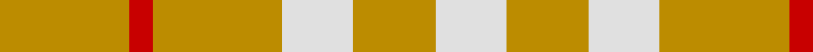

In pattern [WYWYRY](/patterns/wywyry/).

This was sourced from register-of-tartans.  It is a [6 stripes tartan](/stripes/stripes6/).

Original link https://www.tartanregister.gov.uk/tartanDetails.aspx?ref=5074

## Register references

External register numbers recorded for this tartan.

- Scottish Register of Tartans: [5074](https://www.tartanregister.gov.uk/tartanDetails.aspx?ref=5074)
- Scottish Tartans Authority (ITI): 3842

## Thread count
DY/22 R4 DY22 LN12 DY14 LN/12

## Palette
Each colour and its ΔE from the base-6 reference it is a variant of.

| Colour | Shade | Base | ΔE (OKLab) |
|---|---|---|---|
| DY | <code style="background-color:#BC8C00;">#BC8C00</code> `#BC8C00` | Y <code style="background-color:#F2BF00;">#F2BF00</code> | 0.16 |
| LN | <code style="background-color:#E0E0E0;">#E0E0E0</code> `#E0E0E0` | W <code style="background-color:#F7F7F7;">#F7F7F7</code> | 0.07 |
| R | <code style="background-color:#C80000;">#C80000</code> `#C80000` | R <code style="background-color:#CC0000;">#CC0000</code> | 0.01 |
| Y | <code style="background-color:#E8C000;">#E8C000</code> `#E8C000` | Y <code style="background-color:#F2BF00;">#F2BF00</code> | 0.02 |

# Sample pattern

## Nearest tartans

The nearest existing variants by ΔTartan distance.

1. [Virgin One (Corporate)](/setts/s4/y7w6y11r2~rc80000-we0e0e0-ybc8c00~x2/) — ΔT 0.91
1. [One Account](/setts/s6/y12w5y6w5y12r2~rc80000-wfcfcfc-ye8c000~x2/) — ΔT 1.39
1. [One Account (Corporate)](/setts/s4/y6w5y12r2~rc80000-wfcfcfc-ye8c000~x2/) — ΔT 1.65
1. [Glufree](/setts/s8/y8r2y8g1r6y3g4y2~g649848-re87878-yf8e38c~x4/) — ΔT 1.67
1. [Amber Rose (Fashion)](/setts/s5/w1r6y4r4ya1~r844c04-wf0e4cc-ya08858-yabc8c00~x10/) — ΔT 2.41
1. [Burt's Highlanders (Fashion)](/setts/s5/y40g13y6b13y22~b2c2c80-g006818-yfcb464~x2/) — ΔT 2.45
1. [Fallow Deer, The](/setts/s6/r3w17r11w2r11w2~r9c8000-wf8f4d0~x4/) — ΔT 2.58
1. [Caspari (Corporate)](/setts/s7/r8y2r15g10r4g10r4~g006818-rc80000-ye8c000~x2/) — ΔT 2.60
1. [Unidentified 24](/setts/s7/y1r3g7r3g7r3y1~g008000-rc00000-yf0c000~x4/) — ΔT 2.67
1. [Twilfit](/setts/s9/b25r46w11r11w7r11w11r46b12~b5c8ca8-re87878-wffffff/) — ΔT 2.68

## Neighbour map

Every grey dot is one of 15726 variants placed by the first two principal components of the ΔTartan feature space (44% of its variance). Red is this tartan; blue dots are its nearest — click one to open its page.

<svg viewBox="0 0 640 380" role="img" style="max-width:100%;height:auto;border:1px solid #e0e0e0;border-radius:4px;display:block" xmlns="http://www.w3.org/2000/svg"><image href="/nn/cloud.v1.png" width="640" height="380"/><a href="/setts/s4/y7w6y11r2~rc80000-we0e0e0-ybc8c00~x2/"><circle cx="401.9" cy="307.5" r="4" fill="#3465a4"><title>Virgin One (Corporate)</title></circle></a><a href="/setts/s6/y12w5y6w5y12r2~rc80000-wfcfcfc-ye8c000~x2/"><circle cx="416.4" cy="278.7" r="4" fill="#3465a4"><title>One Account</title></circle></a><a href="/setts/s4/y6w5y12r2~rc80000-wfcfcfc-ye8c000~x2/"><circle cx="419.9" cy="286.0" r="4" fill="#3465a4"><title>One Account (Corporate)</title></circle></a><a href="/setts/s8/y8r2y8g1r6y3g4y2~g649848-re87878-yf8e38c~x4/"><circle cx="348.6" cy="240.5" r="4" fill="#3465a4"><title>Glufree</title></circle></a><a href="/setts/s5/w1r6y4r4ya1~r844c04-wf0e4cc-ya08858-yabc8c00~x10/"><circle cx="375.0" cy="281.5" r="4" fill="#3465a4"><title>Amber Rose (Fashion)</title></circle></a><a href="/setts/s5/y40g13y6b13y22~b2c2c80-g006818-yfcb464~x2/"><circle cx="374.7" cy="253.7" r="4" fill="#3465a4"><title>Burt's Highlanders (Fashion)</title></circle></a><a href="/setts/s6/r3w17r11w2r11w2~r9c8000-wf8f4d0~x4/"><circle cx="343.6" cy="245.0" r="4" fill="#3465a4"><title>Fallow Deer, The</title></circle></a><a href="/setts/s7/r8y2r15g10r4g10r4~g006818-rc80000-ye8c000~x2/"><circle cx="342.0" cy="259.4" r="4" fill="#3465a4"><title>Caspari (Corporate)</title></circle></a><a href="/setts/s7/y1r3g7r3g7r3y1~g008000-rc00000-yf0c000~x4/"><circle cx="307.4" cy="252.3" r="4" fill="#3465a4"><title>Unidentified 24</title></circle></a><a href="/setts/s9/b25r46w11r11w7r11w11r46b12~b5c8ca8-re87878-wffffff/"><circle cx="364.3" cy="228.5" r="4" fill="#3465a4"><title>Twilfit</title></circle></a><circle cx="377.2" cy="296.7" r="5" fill="#c00000"/></svg>

ID: /setts/s6/y11r2y11w6y7w6~rc80000-we0e0e0-ybc8c00~x2/
