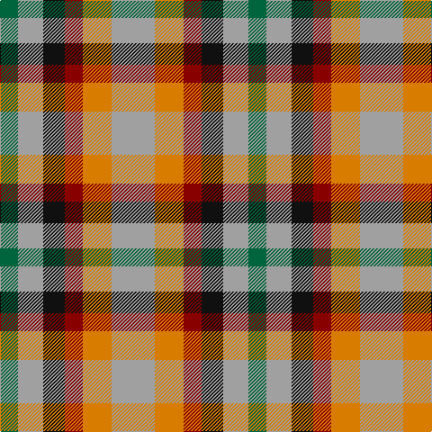

In pattern [GYKRYY](/patterns/gykryy/).

This was sourced from register-of-tartans.  It is a [6 stripes tartan](/stripes/stripes6/).

Original link https://www.tartanregister.gov.uk/tartanDetails.aspx?ref=11501

## Register references

External register numbers recorded for this tartan.

- Scottish Register of Tartans: [11501](https://www.tartanregister.gov.uk/tartanDetails.aspx?ref=11501)

## Thread count
G/20 N28 K24 DR20 O32 N/48

## Palette
Each colour and its ΔE from the base-6 reference it is a variant of.

| Colour | Shade | Base | ΔE (OKLab) |
|---|---|---|---|
| DR | <code style="background-color:#880000;">#880000</code> `#880000` | R <code style="background-color:#CC0000;">#CC0000</code> | 0.15 |
| G | <code style="background-color:#00643C;">#00643C</code> `#00643C` | G <code style="background-color:#006100;">#006100</code> | 0.05 |
| K | <code style="background-color:#101010;">#101010</code> `#101010` | K <code style="background-color:#000000;">#000000</code> | 0.17 |
| N | <code style="background-color:#A0A0A0;">#A0A0A0</code> `#A0A0A0` | Y <code style="background-color:#F2BF00;">#F2BF00</code> | 0.21 |
| O | <code style="background-color:#D87C00;">#D87C00</code> `#D87C00` | Y <code style="background-color:#F2BF00;">#F2BF00</code> | 0.17 |

# Sample pattern

## Nearest tartans

The nearest existing variants by ΔTartan distance.

1. [Dunoon Burgh Hall Trust](/setts/s5/b2r3g3ra6y2~b1c1c50-g008b00-rb458ac-ra888888-yffff00~x2/) — ΔT 1.36
1. [Inspiration](/setts/s5/r5b12y11ba21ya5~b202060-ba5c5c5c-rc80000-yfccc00-yae8c000~x2/) — ΔT 1.62
1. [Harazeen (Personal)](/setts/s8/r2g1w1k1r2g1w1k1~g00801c-k101010-rc80000-we0e0e0~x20/) — ΔT 1.63
1. [Gold Country (California)](/setts/s4/b18ba18y28bb13~b000080-ba5f749c-bb3f4441-yef8f06~x2/) — ΔT 1.72
1. [Kucher, Gregory (Personal)](/setts/s4/b2r1k1y1~b506878-k101010-r880000-ya0a0a0~x10/) — ΔT 1.76
1. [Inspiration](/setts/s5/r5b12y11ba21ya5~b5f749c-ba14283c-rc8002c-yc4bc68-yae0a126~x2/) — ΔT 1.77
1. [Boxer Beauty](/setts/s7/k13g28y13g28k18w18k13~g603800-k101010-wfcfcfc-ydc943c~x2/) — ΔT 1.77
1. [Boxer Beauty](/setts/s7/k13g28y13g28k18w18k13~g603800-k101010-wffffff-ycc7f32~x2/) — ΔT 1.77
1. [Titanic](/setts/s9/y2r1y1ra3r3b3y2ya2b1~b202060-r888888-rab84c00-ye8c000-yae08070~x4/) — ΔT 1.79
1. [Fiddes (Corrected)](/setts/s7/g12r11b12ra3b8g8b8~b780078-g289c18-rc80000-racc4438~x2/) — ΔT 1.79

## Neighbour map

Every grey dot is one of 15726 variants placed by the first two principal components of the ΔTartan feature space (44% of its variance). Red is this tartan; blue dots are its nearest — click one to open its page.

<svg viewBox="0 0 640 380" role="img" style="max-width:100%;height:auto;border:1px solid #e0e0e0;border-radius:4px;display:block" xmlns="http://www.w3.org/2000/svg"><image href="/nn/cloud.v1.png" width="640" height="380"/><a href="/setts/s5/b2r3g3ra6y2~b1c1c50-g008b00-rb458ac-ra888888-yffff00~x2/"><circle cx="61.3" cy="266.5" r="4" fill="#3465a4"><title>Dunoon Burgh Hall Trust</title></circle></a><a href="/setts/s5/r5b12y11ba21ya5~b202060-ba5c5c5c-rc80000-yfccc00-yae8c000~x2/"><circle cx="93.2" cy="241.4" r="4" fill="#3465a4"><title>Inspiration</title></circle></a><a href="/setts/s8/r2g1w1k1r2g1w1k1~g00801c-k101010-rc80000-we0e0e0~x20/"><circle cx="53.8" cy="283.9" r="4" fill="#3465a4"><title>Harazeen (Personal)</title></circle></a><a href="/setts/s4/b18ba18y28bb13~b000080-ba5f749c-bb3f4441-yef8f06~x2/"><circle cx="52.5" cy="331.4" r="4" fill="#3465a4"><title>Gold Country (California)</title></circle></a><a href="/setts/s4/b2r1k1y1~b506878-k101010-r880000-ya0a0a0~x10/"><circle cx="102.7" cy="337.8" r="4" fill="#3465a4"><title>Kucher, Gregory (Personal)</title></circle></a><a href="/setts/s5/r5b12y11ba21ya5~b5f749c-ba14283c-rc8002c-yc4bc68-yae0a126~x2/"><circle cx="95.6" cy="246.9" r="4" fill="#3465a4"><title>Inspiration</title></circle></a><a href="/setts/s7/k13g28y13g28k18w18k13~g603800-k101010-wfcfcfc-ydc943c~x2/"><circle cx="80.3" cy="300.3" r="4" fill="#3465a4"><title>Boxer Beauty</title></circle></a><a href="/setts/s7/k13g28y13g28k18w18k13~g603800-k101010-wffffff-ycc7f32~x2/"><circle cx="81.7" cy="300.9" r="4" fill="#3465a4"><title>Boxer Beauty</title></circle></a><a href="/setts/s9/y2r1y1ra3r3b3y2ya2b1~b202060-r888888-rab84c00-ye8c000-yae08070~x4/"><circle cx="14.0" cy="242.5" r="4" fill="#3465a4"><title>Titanic</title></circle></a><a href="/setts/s7/g12r11b12ra3b8g8b8~b780078-g289c18-rc80000-racc4438~x2/"><circle cx="149.1" cy="282.8" r="4" fill="#3465a4"><title>Fiddes (Corrected)</title></circle></a><circle cx="78.5" cy="287.6" r="5" fill="#c00000"/></svg>

ID: /setts/s6/y12ya8r5k6y7g5~g00643c-k101010-r880000-ya0a0a0-yad87c00~x4/
