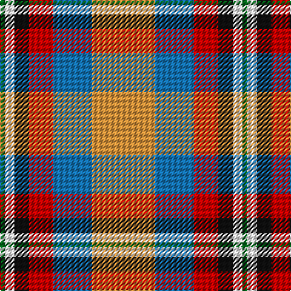

In pattern [GWKRBY](/patterns/gwkrby/).

This was sourced from register-of-tartans.  It is a [6 stripes tartan](/stripes/stripes6/).

Original link https://www.tartanregister.gov.uk/tartanDetails.aspx?ref=175

## Attestations

This cloth appears in 2 source records; the oldest owns this page.

- 01/01/2003 — Ball (register-of-tartans, [record](https://www.tartanregister.gov.uk/tartanDetails.aspx?ref=175))
- 2003 — Ball (Name) (tartans-authority, [record](http://www.tartansauthority.com/tartan-ferret/display/6056/))

## Thread count
G/4 W8 K12 R20 B32 O/52

## Palette
Each colour and its ΔE from the base-6 reference it is a variant of.

| Colour | Shade | Base | ΔE (OKLab) |
|---|---|---|---|
| B | <code style="background-color:#1474B4;">#1474B4</code> `#1474B4` | B <code style="background-color:#2A418A;">#2A418A</code> | 0.15 |
| DB | <code style="background-color:#2C2C80;">#2C2C80</code> `#2C2C80` | B <code style="background-color:#2A418A;">#2A418A</code> | 0.06 |
| G | <code style="background-color:#006818;">#006818</code> `#006818` | G <code style="background-color:#006100;">#006100</code> | 0.02 |
| K | <code style="background-color:#101010;">#101010</code> `#101010` | K <code style="background-color:#000000;">#000000</code> | 0.17 |
| LR | <code style="background-color:#E87878;">#E87878</code> `#E87878` | R <code style="background-color:#CC0000;">#CC0000</code> | 0.19 |
| O | <code style="background-color:#DC943C;">#DC943C</code> `#DC943C` | Y <code style="background-color:#F2BF00;">#F2BF00</code> | 0.12 |
| R | <code style="background-color:#C80000;">#C80000</code> `#C80000` | R <code style="background-color:#CC0000;">#CC0000</code> | 0.01 |
| W | <code style="background-color:#FCFCFC;">#FCFCFC</code> `#FCFCFC` | W <code style="background-color:#F7F7F7;">#F7F7F7</code> | 0.01 |
| Y | <code style="background-color:#E8C000;">#E8C000</code> `#E8C000` | Y <code style="background-color:#F2BF00;">#F2BF00</code> | 0.02 |

# Sample pattern

## Nearest tartans

The nearest existing variants by ΔTartan distance.

1. [Christie (London) (Personal)](/setts/s6/w5r25b18g4k2y5~b5c8ca8-g289c18-k101010-rc80000-we0e0e0-ye8c000~x2/) — ΔT 0.83
1. [Ball Hunting](/setts/s6/y13g8k5w3wa2r1~g009468-k101010-rc80000-w98c8e8-waf8f8f8-ydc943c~x4/) — ΔT 0.95
1. [Canadian Shield (Personal)](/setts/s7/r5g8b13ra21ga34w55g3~b441800-g285800-ga74846c-r880000-ra98481c-wf0e4cc/) — ΔT 1.00
1. [Porcupine City of](/setts/s7/r10b3ba1w8ba1y2g5~b5c5c5c-ba1c0070-g006818-rb03000-wc0c0c0-yd09800~x4/) — ΔT 1.04
1. [De Maynard (Personal)](/setts/s8/b2r9g8r4y1r4ba10w2~b440044-ba2c2c80-g006818-re86000-wfcfcfc-ye8c000~x4/) — ΔT 1.05
1. [Nicolson of Taransay (Personal)](/setts/s7/w6g10r22b16ga2ga4ga5~b2c2c80-g006818-ga289c18-rc80000-we0e0e0~x2/) — ΔT 1.07
1. [MacLean, dress](/setts/s6/r1w12g6r8b3y1~b5480b0-g008000-rc00000-we0e0e0-yf0c000~x4/) — ΔT 1.14
1. [MacLachlan Dress Clan Tartan Tartan Number: 828. Earliest known date: 1990 Based on the MacLachlan pattern in Old And Rare See products available Copyright © Blair Urquhart, Comrie, 2015](/setts/s7/r34w3g4ga23w24k3g4~g006428-ga006818-k101010-rd05054-we0e0e0~x2/) — ΔT 1.15
1. [Oor Wullie (Corporate)](/setts/s7/y3r3ya2r20k16w24wa2~k101010-rc80000-wc0c0c0-wae0e0e0-yfccc00-yae8c000~x2/) — ΔT 1.16
1. [Barbour -Modern](/setts/s7/w4y2w21k11wa2b21r2~b5c5c5c-k101010-rc80000-wc0c0c0-wafcfcfc-yfccc00~x2/) — ΔT 1.18

## Neighbour map

Every grey dot is one of 15726 variants placed by the first two principal components of the ΔTartan feature space (44% of its variance). Red is this tartan; blue dots are its nearest — click one to open its page.

<svg viewBox="0 0 640 380" role="img" style="max-width:100%;height:auto;border:1px solid #e0e0e0;border-radius:4px;display:block" xmlns="http://www.w3.org/2000/svg"><image href="/nn/cloud.v1.png" width="640" height="380"/><a href="/setts/s6/w5r25b18g4k2y5~b5c8ca8-g289c18-k101010-rc80000-we0e0e0-ye8c000~x2/"><circle cx="188.8" cy="148.8" r="4" fill="#3465a4"><title>Christie (London) (Personal)</title></circle></a><a href="/setts/s6/y13g8k5w3wa2r1~g009468-k101010-rc80000-w98c8e8-waf8f8f8-ydc943c~x4/"><circle cx="139.5" cy="153.3" r="4" fill="#3465a4"><title>Ball Hunting</title></circle></a><a href="/setts/s7/r5g8b13ra21ga34w55g3~b441800-g285800-ga74846c-r880000-ra98481c-wf0e4cc/"><circle cx="151.7" cy="121.4" r="4" fill="#3465a4"><title>Canadian Shield (Personal)</title></circle></a><a href="/setts/s7/r10b3ba1w8ba1y2g5~b5c5c5c-ba1c0070-g006818-rb03000-wc0c0c0-yd09800~x4/"><circle cx="114.8" cy="161.3" r="4" fill="#3465a4"><title>Porcupine City of</title></circle></a><a href="/setts/s8/b2r9g8r4y1r4ba10w2~b440044-ba2c2c80-g006818-re86000-wfcfcfc-ye8c000~x4/"><circle cx="139.8" cy="163.2" r="4" fill="#3465a4"><title>De Maynard (Personal)</title></circle></a><a href="/setts/s7/w6g10r22b16ga2ga4ga5~b2c2c80-g006818-ga289c18-rc80000-we0e0e0~x2/"><circle cx="103.5" cy="160.2" r="4" fill="#3465a4"><title>Nicolson of Taransay (Personal)</title></circle></a><a href="/setts/s6/r1w12g6r8b3y1~b5480b0-g008000-rc00000-we0e0e0-yf0c000~x4/"><circle cx="157.5" cy="166.8" r="4" fill="#3465a4"><title>MacLean, dress</title></circle></a><a href="/setts/s7/r34w3g4ga23w24k3g4~g006428-ga006818-k101010-rd05054-we0e0e0~x2/"><circle cx="152.8" cy="156.2" r="4" fill="#3465a4"><title>MacLachlan Dress Clan Tartan Tartan Number: 828. Earliest known date: 1990 Based on the MacLachlan pattern in Old And Rare See products available Copyright © Blair Urquhart, Comrie, 2015</title></circle></a><a href="/setts/s7/y3r3ya2r20k16w24wa2~k101010-rc80000-wc0c0c0-wae0e0e0-yfccc00-yae8c000~x2/"><circle cx="128.0" cy="130.6" r="4" fill="#3465a4"><title>Oor Wullie (Corporate)</title></circle></a><a href="/setts/s7/w4y2w21k11wa2b21r2~b5c5c5c-k101010-rc80000-wc0c0c0-wafcfcfc-yfccc00~x2/"><circle cx="146.3" cy="144.3" r="4" fill="#3465a4"><title>Barbour -Modern</title></circle></a><circle cx="149.5" cy="152.3" r="5" fill="#c00000"/></svg>

ID: /setts/s6/y13b8r5k3w2g1~b1474b4-g006818-k101010-rc80000-wfcfcfc-ydc943c~x4/
