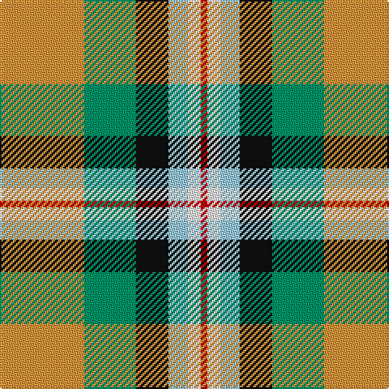

In pattern [RWWKGY](/patterns/rwwkgy/).

This was sourced from register-of-tartans.  It is a [6 stripes tartan](/stripes/stripes6/).

Original link https://www.tartanregister.gov.uk/tartanDetails.aspx?ref=176

## Attestations

This cloth appears in 2 source records; the oldest owns this page.

- 01/01/2004 — Ball Hunting (register-of-tartans, [record](https://www.tartanregister.gov.uk/tartanDetails.aspx?ref=176))
- pre 2004 — Ball Htg (Name) (tartans-authority, [record](http://www.tartansauthority.com/tartan-ferret/display/6355/))

## Thread count
O/52 B32 K20 LB12 W8 R/4

## Palette
Each colour and its ΔE from the base-6 reference it is a variant of.

| Colour | Shade | Base | ΔE (OKLab) |
|---|---|---|---|
| B | <code style="background-color:#009468;">#009468</code> `#009468` | G <code style="background-color:#006100;">#006100</code> | 0.17 |
| K | <code style="background-color:#101010;">#101010</code> `#101010` | K <code style="background-color:#000000;">#000000</code> | 0.17 |
| LB | <code style="background-color:#98C8E8;">#98C8E8</code> `#98C8E8` | W <code style="background-color:#F7F7F7;">#F7F7F7</code> | 0.18 |
| LP | <code style="background-color:#A8ACE8;">#A8ACE8</code> `#A8ACE8` | W <code style="background-color:#F7F7F7;">#F7F7F7</code> | 0.23 |
| O | <code style="background-color:#DC943C;">#DC943C</code> `#DC943C` | Y <code style="background-color:#F2BF00;">#F2BF00</code> | 0.12 |
| R | <code style="background-color:#C80000;">#C80000</code> `#C80000` | R <code style="background-color:#CC0000;">#CC0000</code> | 0.01 |
| W | <code style="background-color:#F8F8F8;">#F8F8F8</code> `#F8F8F8` | W <code style="background-color:#F7F7F7;">#F7F7F7</code> | 0.00 |
| Y | <code style="background-color:#E8C000;">#E8C000</code> `#E8C000` | Y <code style="background-color:#F2BF00;">#F2BF00</code> | 0.02 |

# Sample pattern

## Nearest tartans

The nearest existing variants by ΔTartan distance.

1. [Canadian Shield (Personal)](/setts/s7/r5g8b13ra21ga34w55g3~b441800-g285800-ga74846c-r880000-ra98481c-wf0e4cc/) — ΔT 0.88
1. [Carmen Lau (Hong Kong) (Personal)](/setts/s7/y8r3b2ba1w6g12ba2x2~b1474b4-ba2c2c80-g006818-r901c38-wfcfcfc-yfccc00/) — ΔT 0.91
1. [Ball](/setts/s6/y13b8r5k3w2g1x4~b1474b4-g006818-k101010-rc80000-wfcfcfc-ydc943c/) — ΔT 0.95
1. [Ontario Northern Canadian District Tartan Tartan Number: 956. Earliest known date: 1967 The six colours represent the nickel bearing rocks (grey), the snow (white), the sky and the lakes (blue), gold, the forests and fields (green), and the Indian Nation (red brown). See products available Copyright © Blair Urquhart, Comrie, 2015](/setts/s7/g17r5b2w12b2y4ga7x2~b2c2c80-g604000-ga006818-r888888-we0e0e0-ye8c000/) — ΔT 1.04
1. [Carmen Lau (Hong Kong) (Personal)](/setts/s7/y8k3b2ba1w6g12ba2x2~b5f749c-ba3d3134-g649848-k000000-wf9f5ef-yf8e38c/) — ΔT 1.07
1. [MacLachlan Dress Clan Tartan Tartan Number: 828. Earliest known date: 1990 Based on the MacLachlan pattern in Old And Rare See products available Copyright © Blair Urquhart, Comrie, 2015](/setts/s7/r34w3g4ga23w24k3g4x2~g006428-ga006818-k101010-rd05054-we0e0e0/) — ΔT 1.23
1. [MacLean, dress](/setts/s6/r1w12g6r8b3y1x4~b5480b0-g008000-rc00000-we0e0e0-yf0c000/) — ΔT 1.23
1. [MacLachlan, dress](/setts/s7/r34w3g4ga23w24k3g4x2~g006030-ga008000-k000000-rd03030-we0e0e0/) — ΔT 1.25
1. [Samye](/setts/s5/y25r10g10b11w2x2~b2c2c80-g006818-rc80000-wf8f8f8-ye8c000/) — ΔT 1.25
1. [MacLaren Dress Clan Tartan Tartan Number: 649. Earliest known date: 1981 This sett was approved by the Chief and accepted by the A.G.M. of the Clan MacLaren Society as Dress MacLaren in 1981. The sett has been designed by changing the blue ground of the usual MacLaren sett to white and then centering a blue stripe on the white ground. This illustration is based on a kilt belonging to the designer, Mr I.G.Campbell MacLaren. See products available Copyright © Blair Urquhart, Comrie, 2015](/setts/s8/b7w30k13g9r6g16k2y7x2~b2c2c80-g006818-k101010-rc80000-we0e0e0-ye8c000/) — ΔT 1.28

## Neighbour map

Every grey dot is one of 15726 variants placed by the first two principal components of the ΔTartan feature space (44% of its variance). Red is this tartan; blue dots are its nearest — click one to open its page.

<svg viewBox="0 0 640 380" role="img" style="max-width:100%;height:auto;border:1px solid #e0e0e0;border-radius:4px;display:block" xmlns="http://www.w3.org/2000/svg"><image href="/nn/cloud.v1.png" width="640" height="380"/><a href="/setts/s7/r5g8b13ra21ga34w55g3~b441800-g285800-ga74846c-r880000-ra98481c-wf0e4cc/"><circle cx="151.7" cy="121.4" r="4" fill="#3465a4"><title>Canadian Shield (Personal)</title></circle></a><a href="/setts/s7/y8r3b2ba1w6g12ba2x2~b1474b4-ba2c2c80-g006818-r901c38-wfcfcfc-yfccc00/"><circle cx="86.9" cy="144.9" r="4" fill="#3465a4"><title>Carmen Lau (Hong Kong) (Personal)</title></circle></a><a href="/setts/s6/y13b8r5k3w2g1x4~b1474b4-g006818-k101010-rc80000-wfcfcfc-ydc943c/"><circle cx="149.5" cy="152.3" r="4" fill="#3465a4"><title>Ball</title></circle></a><a href="/setts/s7/g17r5b2w12b2y4ga7x2~b2c2c80-g604000-ga006818-r888888-we0e0e0-ye8c000/"><circle cx="85.2" cy="165.5" r="4" fill="#3465a4"><title>Ontario Northern Canadian District Tartan Tartan Number: 956. Earliest known date: 1967 The six colours represent the nickel bearing rocks (grey), the snow (white), the sky and the lakes (blue), gold, the forests and fields (green), and the Indian Nation (red brown). See products available Copyright © Blair Urquhart, Comrie, 2015</title></circle></a><a href="/setts/s7/y8k3b2ba1w6g12ba2x2~b5f749c-ba3d3134-g649848-k000000-wf9f5ef-yf8e38c/"><circle cx="80.8" cy="141.7" r="4" fill="#3465a4"><title>Carmen Lau (Hong Kong) (Personal)</title></circle></a><a href="/setts/s7/r34w3g4ga23w24k3g4x2~g006428-ga006818-k101010-rd05054-we0e0e0/"><circle cx="152.8" cy="156.2" r="4" fill="#3465a4"><title>MacLachlan Dress Clan Tartan Tartan Number: 828. Earliest known date: 1990 Based on the MacLachlan pattern in Old And Rare See products available Copyright © Blair Urquhart, Comrie, 2015</title></circle></a><a href="/setts/s6/r1w12g6r8b3y1x4~b5480b0-g008000-rc00000-we0e0e0-yf0c000/"><circle cx="157.5" cy="166.8" r="4" fill="#3465a4"><title>MacLean, dress</title></circle></a><a href="/setts/s7/r34w3g4ga23w24k3g4x2~g006030-ga008000-k000000-rd03030-we0e0e0/"><circle cx="147.1" cy="152.9" r="4" fill="#3465a4"><title>MacLachlan, dress</title></circle></a><a href="/setts/s5/y25r10g10b11w2x2~b2c2c80-g006818-rc80000-wf8f8f8-ye8c000/"><circle cx="158.4" cy="186.8" r="4" fill="#3465a4"><title>Samye</title></circle></a><a href="/setts/s8/b7w30k13g9r6g16k2y7x2~b2c2c80-g006818-k101010-rc80000-we0e0e0-ye8c000/"><circle cx="80.3" cy="135.5" r="4" fill="#3465a4"><title>MacLaren Dress Clan Tartan Tartan Number: 649. Earliest known date: 1981 This sett was approved by the Chief and accepted by the A.G.M. of the Clan MacLaren Society as Dress MacLaren in 1981. The sett has been designed by changing the blue ground of the usual MacLaren sett to white and then centering a blue stripe on the white ground. This illustration is based on a kilt belonging to the designer, Mr I.G.Campbell MacLaren. See products available Copyright © Blair Urquhart, Comrie, 2015</title></circle></a><circle cx="139.5" cy="153.3" r="5" fill="#c00000"/></svg>

ID: /setts/s6/y13g8k5w3wa2r1x4~g009468-k101010-rc80000-w98c8e8-waf8f8f8-ydc943c/
