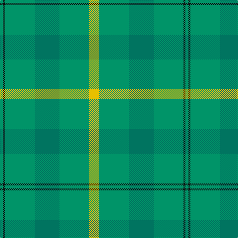

In pattern [GKGGGY](/patterns/gkgggy/).

This was sourced from tartans-authority.  It is a [6 stripes tartan](/stripes/stripes6/).

Original link http://www.tartansauthority.com/tartan-ferret/display/7643/

## Attestations

This cloth appears in 2 source records; the oldest owns this page.

- pre 2008 — Gordon Cumming (Artefact) (tartans-authority, [record](http://www.tartansauthority.com/tartan-ferret/display/7643/))
- undated — Gordon Cumming (register-of-tartans, [record](https://www.tartanregister.gov.uk/tartanDetails.aspx?ref=5657))

## Thread count
B/6 K4 B60 G50 B60 Y/20

## Palette
Each colour and its ΔE from the base-6 reference it is a variant of.

| Colour | Shade | Base | ΔE (OKLab) |
|---|---|---|---|
| B | <code style="background-color:#009468;">#009468</code> `#009468` | G <code style="background-color:#006100;">#006100</code> | 0.17 |
| G | <code style="background-color:#007460;">#007460</code> `#007460` | G <code style="background-color:#006100;">#006100</code> | 0.11 |
| K | <code style="background-color:#101010;">#101010</code> `#101010` | K <code style="background-color:#000000;">#000000</code> | 0.17 |
| Y | <code style="background-color:#E8C000;">#E8C000</code> `#E8C000` | Y <code style="background-color:#F2BF00;">#F2BF00</code> | 0.02 |

# Sample pattern

## Nearest tartans

The nearest existing variants by ΔTartan distance.

1. [Irving of Bonshaw](/setts/s5/g108ga56b8ga8y8-b003c64-g006818-ga048888-ye8c000/) — ΔT 1.45
1. [Castle Bay (Fashion)](/setts/s5/g80w4ga10gb10ga30-g50a47c-ga5c6428-gb048888-we0e0e0/) — ΔT 1.52
1. [Palm Beach Gardens Police](/setts/s6/g64b12g24b56r4ba2-b688898-ba1c0070-g20943c-r880000/) — ΔT 1.67
1. [Irvine of Drum (Clan)](/setts/s5/g98b42k6b6w6-b5c8ca8-g408060-k101010-wfcfcfc/) — ΔT 1.84
1. [O'Brien (Scotch Corner)](/setts/s9/g72ga38g8ga62b4r6b4r6ga24-b1474b4-g5c6428-ga289c18-ra00000/) — ΔT 1.87
1. [Taylor](/setts/s8/g16k4g26y8g24b44g10ya6-b506878-g006818-k101010-yd0908c-yabc8c00/) — ΔT 1.87
1. [Glenlivet](/setts/s8/g18r6g75b6g13ra35g12b6-b304080-g008000-rc00000-ra806050/) — ΔT 1.92
1. [Campbell Simpson (Dalgliesh)](/setts/s6/g44k6g6ga32g12k8-g408060-ga006818-k101010/) — ΔT 1.98
1. [Ledford (Name)](/setts/s3/g144r64y16-g008c44-r888888-yf0c800/) — ΔT 1.98
1. [Kildare](/setts/s8/g16b4g26r8g24ba44g10ga6-b401000-ba5480b0-g407040-ga908000-rc00000/) — ΔT 2.09

## Neighbour map

Every grey dot is one of 15726 variants placed by the first two principal components of the ΔTartan feature space (44% of its variance). Red is this tartan; blue dots are its nearest — click one to open its page.

<svg viewBox="0 0 640 380" role="img" style="max-width:100%;height:auto;border:1px solid #e0e0e0;border-radius:4px;display:block" xmlns="http://www.w3.org/2000/svg"><image href="/nn/cloud.v1.png" width="640" height="380"/><a href="/setts/s5/g108ga56b8ga8y8-b003c64-g006818-ga048888-ye8c000/"><circle cx="421.6" cy="241.0" r="4" fill="#3465a4"><title>Irving of Bonshaw</title></circle></a><a href="/setts/s5/g80w4ga10gb10ga30-g50a47c-ga5c6428-gb048888-we0e0e0/"><circle cx="461.0" cy="228.1" r="4" fill="#3465a4"><title>Castle Bay (Fashion)</title></circle></a><a href="/setts/s6/g64b12g24b56r4ba2-b688898-ba1c0070-g20943c-r880000/"><circle cx="452.9" cy="215.6" r="4" fill="#3465a4"><title>Palm Beach Gardens Police</title></circle></a><a href="/setts/s5/g98b42k6b6w6-b5c8ca8-g408060-k101010-wfcfcfc/"><circle cx="449.4" cy="218.8" r="4" fill="#3465a4"><title>Irvine of Drum (Clan)</title></circle></a><a href="/setts/s9/g72ga38g8ga62b4r6b4r6ga24-b1474b4-g5c6428-ga289c18-ra00000/"><circle cx="407.7" cy="204.1" r="4" fill="#3465a4"><title>O'Brien (Scotch Corner)</title></circle></a><a href="/setts/s8/g16k4g26y8g24b44g10ya6-b506878-g006818-k101010-yd0908c-yabc8c00/"><circle cx="333.2" cy="228.9" r="4" fill="#3465a4"><title>Taylor</title></circle></a><a href="/setts/s8/g18r6g75b6g13ra35g12b6-b304080-g008000-rc00000-ra806050/"><circle cx="470.8" cy="220.7" r="4" fill="#3465a4"><title>Glenlivet</title></circle></a><a href="/setts/s6/g44k6g6ga32g12k8-g408060-ga006818-k101010/"><circle cx="372.1" cy="278.2" r="4" fill="#3465a4"><title>Campbell Simpson (Dalgliesh)</title></circle></a><a href="/setts/s3/g144r64y16-g008c44-r888888-yf0c800/"><circle cx="455.8" cy="317.2" r="4" fill="#3465a4"><title>Ledford (Name)</title></circle></a><a href="/setts/s8/g16b4g26r8g24ba44g10ga6-b401000-ba5480b0-g407040-ga908000-rc00000/"><circle cx="346.9" cy="230.0" r="4" fill="#3465a4"><title>Kildare</title></circle></a><circle cx="416.4" cy="252.8" r="5" fill="#c00000"/></svg>

ID: /setts/s6/y20g60ga50g60k4g6-g009468-ga007460-k101010-ye8c000/
