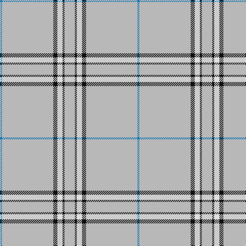

In pattern [BYKWKY](/patterns/bykwky/).

This was sourced from tartans-authority.  It is a [6 stripes tartan](/stripes/stripes6/).

Original link http://www.tartansauthority.com/tartan-ferret/display/7270/

## Thread count
B/4 N100 K8 LN10 K4 N/20

## Palette
Each colour and its ΔE from the base-6 reference it is a variant of.

| Colour | Shade | Base | ΔE (OKLab) |
|---|---|---|---|
| B | <code style="background-color:#1474B4;">#1474B4</code> `#1474B4` | B <code style="background-color:#2A418A;">#2A418A</code> | 0.15 |
| K | <code style="background-color:#101010;">#101010</code> `#101010` | K <code style="background-color:#000000;">#000000</code> | 0.17 |
| LN | <code style="background-color:#E0E0E0;">#E0E0E0</code> `#E0E0E0` | W <code style="background-color:#F7F7F7;">#F7F7F7</code> | 0.07 |
| N | <code style="background-color:#B8B8B8;">#B8B8B8</code> `#B8B8B8` | Y <code style="background-color:#F2BF00;">#F2BF00</code> | 0.17 |

# Sample pattern

## Nearest tartans

The nearest existing variants by ΔTartan distance.

1. [Gairloch (Fashion)](/setts/s8/w48w2g18w2w18w4g4k4-g808080-k101010-we0e0e0/) — ΔT 1.54
1. [St. Giles Check (Corporate)](/setts/s7/b12r4w4r100w4r4ba12-b2c2c80-ba780078-r888888-wfcfcfc/) — ΔT 1.73
1. [MacDonald from Rawtenstall (Personal)](/setts/s8/w14wa4r14wa8w100wa4k4ra4-k101010-r781c38-radc0000-w98d0f0-wae0e0e0/) — ΔT 1.82
1. [Young, Christina](/setts/s6/w162k10b10y9g6b3-b800070-g908000-k000000-we0e0e0-yff8500/) — ΔT 1.93
1. [St Giles Check Tartan Tartan Number: 387. Earliest known date: 1984 St Giles Church is in the Royal Mile, Edinburgh See products available Copyright © Blair Urquhart, Comrie, 2015](/setts/s7/b6r2w2r50w2r2ba6-b2c2c80-ba780078-r888888-we0e0e0/) — ΔT 1.97
1. [Reece (Name)](/setts/s7/w4y88b16y4b4y6r2-b2c2c80-rc80000-we0e0e0-ya08858/) — ΔT 1.98
1. [Young in Australia](/setts/s4/w162g12y16g16-g23321b-we8ddcb-ye0a126/) — ΔT 2.01
1. [Whisky Kilt (Fashion)](/setts/s7/w336r4w4y4w4ya6g52-g007460-ra00000-wf8e8d8-ybc8c00-yaa08858/) — ΔT 2.14
1. [Wyckoff, Ann Grainger Phillips](/setts/s9/b140ba10b6w10b6w10b6r10b16-b50729f-ba0000cd-rff0000-wffffff/) — ΔT 2.16
1. [Asahi (Estimated threadcount)](/setts/s5/w90b4w8b30w14-b1474b4-we0e0e0/) — ΔT 2.19

## Neighbour map

Every grey dot is one of 15726 variants placed by the first two principal components of the ΔTartan feature space (44% of its variance). Red is this tartan; blue dots are its nearest — click one to open its page.

<svg viewBox="0 0 640 380" role="img" style="max-width:100%;height:auto;border:1px solid #e0e0e0;border-radius:4px;display:block" xmlns="http://www.w3.org/2000/svg"><image href="/nn/cloud.v1.png" width="640" height="380"/><a href="/setts/s8/w48w2g18w2w18w4g4k4-g808080-k101010-we0e0e0/"><circle cx="463.3" cy="131.9" r="4" fill="#3465a4"><title>Gairloch (Fashion)</title></circle></a><a href="/setts/s7/b12r4w4r100w4r4ba12-b2c2c80-ba780078-r888888-wfcfcfc/"><circle cx="544.0" cy="135.5" r="4" fill="#3465a4"><title>St. Giles Check (Corporate)</title></circle></a><a href="/setts/s8/w14wa4r14wa8w100wa4k4ra4-k101010-r781c38-radc0000-w98d0f0-wae0e0e0/"><circle cx="468.8" cy="98.6" r="4" fill="#3465a4"><title>MacDonald from Rawtenstall (Personal)</title></circle></a><a href="/setts/s6/w162k10b10y9g6b3-b800070-g908000-k000000-we0e0e0-yff8500/"><circle cx="531.3" cy="66.6" r="4" fill="#3465a4"><title>Young, Christina</title></circle></a><a href="/setts/s7/b6r2w2r50w2r2ba6-b2c2c80-ba780078-r888888-we0e0e0/"><circle cx="556.3" cy="141.0" r="4" fill="#3465a4"><title>St Giles Check Tartan Tartan Number: 387. Earliest known date: 1984 St Giles Church is in the Royal Mile, Edinburgh See products available Copyright © Blair Urquhart, Comrie, 2015</title></circle></a><a href="/setts/s7/w4y88b16y4b4y6r2-b2c2c80-rc80000-we0e0e0-ya08858/"><circle cx="589.0" cy="116.9" r="4" fill="#3465a4"><title>Reece (Name)</title></circle></a><a href="/setts/s4/w162g12y16g16-g23321b-we8ddcb-ye0a126/"><circle cx="499.8" cy="187.4" r="4" fill="#3465a4"><title>Young in Australia</title></circle></a><a href="/setts/s7/w336r4w4y4w4ya6g52-g007460-ra00000-wf8e8d8-ybc8c00-yaa08858/"><circle cx="598.3" cy="66.1" r="4" fill="#3465a4"><title>Whisky Kilt (Fashion)</title></circle></a><a href="/setts/s9/b140ba10b6w10b6w10b6r10b16-b50729f-ba0000cd-rff0000-wffffff/"><circle cx="557.8" cy="124.6" r="4" fill="#3465a4"><title>Wyckoff, Ann Grainger Phillips</title></circle></a><a href="/setts/s5/w90b4w8b30w14-b1474b4-we0e0e0/"><circle cx="535.9" cy="197.2" r="4" fill="#3465a4"><title>Asahi (Estimated threadcount)</title></circle></a><circle cx="552.5" cy="139.6" r="5" fill="#c00000"/></svg>

ID: /setts/s6/y20k4w10k8y100b4-b1474b4-k101010-we0e0e0-yb8b8b8/
