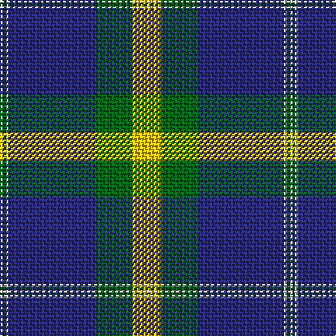

In pattern [WGWBGY](/patterns/wgwbgy/).

This was sourced from tartans-authority.  It is a [6 stripes tartan](/stripes/stripes6/).

Original link http://www.tartansauthority.com/tartan-ferret/display/7641/

## Attestations

This cloth appears in 2 source records; the oldest owns this page.

- pre 2008 — Nynashamn Whisky Society (Corporate) (tartans-authority, [record](http://www.tartansauthority.com/tartan-ferret/display/7641/))
- undated — Nynaeshamn Whisky Society (register-of-tartans, [record](https://www.tartanregister.gov.uk/tartanDetails.aspx?ref=5655))

## Register references

External register numbers recorded for this tartan.

- Scottish Register of Tartans: [5655](https://www.tartanregister.gov.uk/tartanDetails.aspx?ref=5655)
- Scottish Tartans Authority (ITI): 7641

## Thread count
LN/2 DG2 LN2 DB62 G26 Y/21

## Palette
Each colour and its ΔE from the base-6 reference it is a variant of.

| Colour | Shade | Base | ΔE (OKLab) |
|---|---|---|---|
| DB | <code style="background-color:#2C2C80;">#2C2C80</code> `#2C2C80` | B <code style="background-color:#2A418A;">#2A418A</code> | 0.06 |
| DG | <code style="background-color:#003820;">#003820</code> `#003820` | G <code style="background-color:#006100;">#006100</code> | 0.15 |
| G | <code style="background-color:#006818;">#006818</code> `#006818` | G <code style="background-color:#006100;">#006100</code> | 0.02 |
| LN | <code style="background-color:#E0E0E0;">#E0E0E0</code> `#E0E0E0` | W <code style="background-color:#F7F7F7;">#F7F7F7</code> | 0.07 |
| Y | <code style="background-color:#E8C000;">#E8C000</code> `#E8C000` | Y <code style="background-color:#F2BF00;">#F2BF00</code> | 0.02 |

# Sample pattern

## Nearest tartans

The nearest existing variants by ΔTartan distance.

1. [Solberg-Bell (Personal)](/setts/s6/y8k2b20ba4w1k2~b003c64-ba5c8ca8-k101010-wffffff-ye0a126~x4/) — ΔT 0.72
1. [Solberg-Bell](/setts/s6/y8k2b20ba4w1k2~b003c64-ba5c8ca8-k101010-wfcfcfc-yfccc00~x4/) — ΔT 0.81
1. [Sandelin (Personal)](/setts/s8/w10b2w1b35g10y3g10r4~b2c2c80-g006818-rc80000-we0e0e0-ybc8c00~x2/) — ΔT 0.84
1. [Sandelin #2 (Personal)](/setts/s8/w10b2w1b35g10y3g10r4~b141e46-g003c14-rdc0000-we0e0e0-yc89600~x2/) — ΔT 1.10
1. [MacFadzean](/setts/s6/b48w2k20g22r3g4~b304080-g008000-k000000-rc00000-we0e0e0~x2/) — ΔT 1.25
1. [Sinclair-Brown](/setts/s8/b64k11r2k4r2k4g32ga4~b304080-g008000-ga908000-k000000-rc00000~x2/) — ΔT 1.26
1. [MacRaes of America](/setts/s8/w8b4y2b36ba48b2ba4r5~b202060-ba5c8ca8-rc80000-wf0f0d8-ye8c000~x2/) — ΔT 1.26
1. [Longniddry Blue (Dance)](/setts/s8/b42w2wa2w2b5ba12wa32b4~b14283c-ba003c64-wa8ace8-wac0c0c0~x2/) — ΔT 1.26
1. [Intergen (Corporate)](/setts/s6/k4y3k30y33r1y4~k101010-rc8002c-y48a4c0~x2/) — ΔT 1.27
1. [Comrie, Navy Blue (Dance)](/setts/s8/b42ba2w2ba2b5k12w32bb4~b003c64-ba2888c4-bb1c0070-k101010-wf0e0c8~x2/) — ΔT 1.28

## Neighbour map

Every grey dot is one of 15726 variants placed by the first two principal components of the ΔTartan feature space (44% of its variance). Red is this tartan; blue dots are its nearest — click one to open its page.

<svg viewBox="0 0 640 380" role="img" style="max-width:100%;height:auto;border:1px solid #e0e0e0;border-radius:4px;display:block" xmlns="http://www.w3.org/2000/svg"><image href="/nn/cloud.v1.png" width="640" height="380"/><a href="/setts/s6/y8k2b20ba4w1k2~b003c64-ba5c8ca8-k101010-wffffff-ye0a126~x4/"><circle cx="278.2" cy="149.1" r="4" fill="#3465a4"><title>Solberg-Bell (Personal)</title></circle></a><a href="/setts/s6/y8k2b20ba4w1k2~b003c64-ba5c8ca8-k101010-wfcfcfc-yfccc00~x4/"><circle cx="264.0" cy="143.4" r="4" fill="#3465a4"><title>Solberg-Bell</title></circle></a><a href="/setts/s8/w10b2w1b35g10y3g10r4~b2c2c80-g006818-rc80000-we0e0e0-ybc8c00~x2/"><circle cx="270.7" cy="112.6" r="4" fill="#3465a4"><title>Sandelin (Personal)</title></circle></a><a href="/setts/s8/w10b2w1b35g10y3g10r4~b141e46-g003c14-rdc0000-we0e0e0-yc89600~x2/"><circle cx="268.8" cy="114.4" r="4" fill="#3465a4"><title>Sandelin #2 (Personal)</title></circle></a><a href="/setts/s6/b48w2k20g22r3g4~b304080-g008000-k000000-rc00000-we0e0e0~x2/"><circle cx="256.1" cy="154.5" r="4" fill="#3465a4"><title>MacFadzean</title></circle></a><a href="/setts/s8/b64k11r2k4r2k4g32ga4~b304080-g008000-ga908000-k000000-rc00000~x2/"><circle cx="309.6" cy="114.4" r="4" fill="#3465a4"><title>Sinclair-Brown</title></circle></a><a href="/setts/s8/w8b4y2b36ba48b2ba4r5~b202060-ba5c8ca8-rc80000-wf0f0d8-ye8c000~x2/"><circle cx="280.9" cy="120.4" r="4" fill="#3465a4"><title>MacRaes of America</title></circle></a><a href="/setts/s8/b42w2wa2w2b5ba12wa32b4~b14283c-ba003c64-wa8ace8-wac0c0c0~x2/"><circle cx="284.3" cy="141.6" r="4" fill="#3465a4"><title>Longniddry Blue (Dance)</title></circle></a><a href="/setts/s6/k4y3k30y33r1y4~k101010-rc8002c-y48a4c0~x2/"><circle cx="320.1" cy="149.8" r="4" fill="#3465a4"><title>Intergen (Corporate)</title></circle></a><a href="/setts/s8/b42ba2w2ba2b5k12w32bb4~b003c64-ba2888c4-bb1c0070-k101010-wf0e0c8~x2/"><circle cx="227.3" cy="117.5" r="4" fill="#3465a4"><title>Comrie, Navy Blue (Dance)</title></circle></a><circle cx="298.3" cy="129.5" r="5" fill="#c00000"/></svg>

ID: /setts/s6/y21g26b62w2ga2w2~b2c2c80-g006818-ga003820-we0e0e0-ye8c000/
