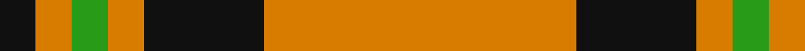
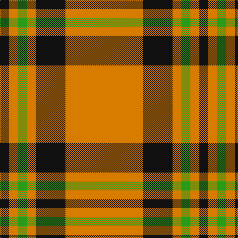

In pattern [KYGYKY](/patterns/kygyky/).

This was sourced from tartans-authority.  It is a [6 stripes tartan](/stripes/stripes6/).

Original link http://www.tartansauthority.com/tartan-ferret/display/7504/

## Attestations

This cloth appears in 2 source records; the oldest owns this page.

- pre 2008 — Volkswagen Orange Trim (Fashion) (tartans-authority, [record](http://www.tartansauthority.com/tartan-ferret/display/7504/))
- undated — Volkswagen Orange Fashion Tartan Tartan Number: 7504. Earliest known date: pre 2008 Small sample of Volkswagen upholstery fabric taken in to The Scottish Shoppe in Calgary, Alberta. Sample didn't show the complete sett but the proportions of what has been reconstructed here are correct. The threadcount has been multiplied by three and the actual sett in the vehicle was probably about 12 inches. The colours would be changed depending upon the body colour of the vehicle. Enquiries are being made with VW (Feb 2008) to try and pin down the patterns. See products available Copyright © Blair Urquhart, Comrie, 2015 (house-of-tartan, [record](http://www.house-of-tartan.scotland.net/house/TartanViewjs.asp?colr=Def&tnam=7504))

## Thread count
K/18 O18 G18 O18 K60 O/156

## Palette
Each colour and its ΔE from the base-6 reference it is a variant of.

| Colour | Shade | Base | ΔE (OKLab) |
|---|---|---|---|
| G | <code style="background-color:#289C18;">#289C18</code> `#289C18` | G <code style="background-color:#006100;">#006100</code> | 0.19 |
| K | <code style="background-color:#101010;">#101010</code> `#101010` | K <code style="background-color:#000000;">#000000</code> | 0.17 |
| O | <code style="background-color:#D87C00;">#D87C00</code> `#D87C00` | Y <code style="background-color:#F2BF00;">#F2BF00</code> | 0.17 |

# Sample pattern

## Nearest tartans

The nearest existing variants by ΔTartan distance.

1. [Volkswagen Orange Trim](/setts/s6/g3y3k10y26k3y3~g289c18-k101010-yd87c00~x2/) — ΔT 0.00
1. [Loch Tummel](/setts/s5/r38w9r3b9w3~b401000-r906030-we0e0e0~x2/) — ΔT 1.27
1. [Baileville (Personal)](/setts/s7/y1k4y1k4y11r1y1~k101010-r901c38-ye8c000~x4/) — ΔT 1.35
1. [Welsh, National](/setts/s7/k4r2ra2r2k2r15y2~k000000-r906030-rac00000-yf0c000~x4/) — ΔT 1.40
1. [Coca Cola (Corporate)](/setts/s5/w15g15w15g80r6~g604000-rc80000-wd4e8f4/) — ΔT 1.40
1. [Baillieville](/setts/s7/y1k4y1k4y11r1y1~k000000-r802040-yf0c000~x4/) — ΔT 1.42
1. [Loch Tummel](/setts/s5/g38w9g3k9w3~g603800-k101010-wfcfcfc~x2/) — ΔT 1.42
1. [Coca Cola](/setts/s5/w7g7w7g40r3~g604000-rc80000-wd4e8f4~x2/) — ΔT 1.45
1. [Makhtoum](/setts/s6/w11r40g13r5g12r5~g008000-rc00000-we0e0e0~x2/) — ΔT 1.52
1. [Monoch Airline](/setts/s6/y4k6y1k1y16k2~k101010-yd09800~x2/) — ΔT 1.52

## Neighbour map

Every grey dot is one of 15726 variants placed by the first two principal components of the ΔTartan feature space (44% of its variance). Red is this tartan; blue dots are its nearest — click one to open its page.

<svg viewBox="0 0 640 380" role="img" style="max-width:100%;height:auto;border:1px solid #e0e0e0;border-radius:4px;display:block" xmlns="http://www.w3.org/2000/svg"><image href="/nn/cloud.v1.png" width="640" height="380"/><a href="/setts/s6/g3y3k10y26k3y3~g289c18-k101010-yd87c00~x2/"><circle cx="386.4" cy="203.7" r="4" fill="#3465a4"><title>Volkswagen Orange Trim</title></circle></a><a href="/setts/s5/r38w9r3b9w3~b401000-r906030-we0e0e0~x2/"><circle cx="407.7" cy="203.9" r="4" fill="#3465a4"><title>Loch Tummel</title></circle></a><a href="/setts/s7/y1k4y1k4y11r1y1~k101010-r901c38-ye8c000~x4/"><circle cx="334.6" cy="182.6" r="4" fill="#3465a4"><title>Baileville (Personal)</title></circle></a><a href="/setts/s7/k4r2ra2r2k2r15y2~k000000-r906030-rac00000-yf0c000~x4/"><circle cx="344.4" cy="188.5" r="4" fill="#3465a4"><title>Welsh, National</title></circle></a><a href="/setts/s5/w15g15w15g80r6~g604000-rc80000-wd4e8f4/"><circle cx="444.7" cy="205.8" r="4" fill="#3465a4"><title>Coca Cola (Corporate)</title></circle></a><a href="/setts/s7/y1k4y1k4y11r1y1~k000000-r802040-yf0c000~x4/"><circle cx="329.7" cy="182.6" r="4" fill="#3465a4"><title>Baillieville</title></circle></a><a href="/setts/s5/g38w9g3k9w3~g603800-k101010-wfcfcfc~x2/"><circle cx="381.5" cy="200.7" r="4" fill="#3465a4"><title>Loch Tummel</title></circle></a><a href="/setts/s5/w7g7w7g40r3~g604000-rc80000-wd4e8f4~x2/"><circle cx="454.9" cy="204.6" r="4" fill="#3465a4"><title>Coca Cola</title></circle></a><a href="/setts/s6/w11r40g13r5g12r5~g008000-rc00000-we0e0e0~x2/"><circle cx="328.8" cy="222.1" r="4" fill="#3465a4"><title>Makhtoum</title></circle></a><a href="/setts/s6/y4k6y1k1y16k2~k101010-yd09800~x2/"><circle cx="446.3" cy="200.3" r="4" fill="#3465a4"><title>Monoch Airline</title></circle></a><circle cx="386.4" cy="203.7" r="5" fill="#c00000"/></svg>

ID: /setts/s6/y26k10y3g3y3k3~g289c18-k101010-yd87c00~x6/
