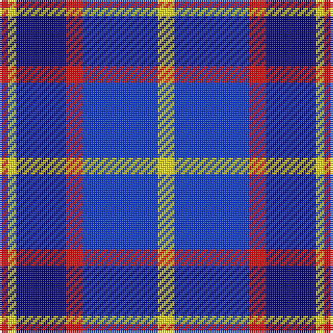

In pattern [RYBRBY](/patterns/rybrby/).

This was sourced from register-of-tartans.  It is a [6 stripes tartan](/stripes/stripes6/).

Original link https://www.tartanregister.gov.uk/tartanDetails.aspx?ref=10307

## Thread count
R/4 Y4 DB24 R8 B36 Y/8

## Palette
Each colour and its ΔE from the base-6 reference it is a variant of.

| Colour | Shade | Base | ΔE (OKLab) |
|---|---|---|---|
| B | <code style="background-color:#003BEB;">#003BEB</code> `#003BEB` | B <code style="background-color:#2A418A;">#2A418A</code> | 0.16 |
| DB | <code style="background-color:#000080;">#000080</code> `#000080` | B <code style="background-color:#2A418A;">#2A418A</code> | 0.14 |
| R | <code style="background-color:#FF0000;">#FF0000</code> `#FF0000` | R <code style="background-color:#CC0000;">#CC0000</code> | 0.11 |
| Y | <code style="background-color:#FFE600;">#FFE600</code> `#FFE600` | Y <code style="background-color:#F2BF00;">#F2BF00</code> | 0.10 |

# Sample pattern

## Nearest tartans

The nearest existing variants by ΔTartan distance.

1. [Strathclyde](/setts/s7/b4ba2b15w10k15ba2k4x2~b8080d0-ba304080-k000030-we0e0e0/) — ΔT 1.08
1. [Strathclyde](/setts/s7/b4ba2b15w10k15ba2k4x2~b0596fa-ba2c4084-k000028-we0e0e0/) — ΔT 1.19
1. [Thompson (Dance)](/setts/s6/b1w6ba1b3k3b1x8~b3474fc-ba00008c-k000000-wc8c8c8/) — ΔT 1.29
1. [Lands of Liberty](/setts/s5/r10w5b30ba20r3x4~b2c4084-ba0596fa-rc80000-wffffff/) — ΔT 1.35
1. [Immanuel Presbyterian Church (Milwaukee)](/setts/s8/k3r2k14w2b6w2b16w3x2~b0000cd-k101010-rff0000-w82cffd/) — ΔT 1.39
1. [Bannockbane Blue #2](/setts/s8/b3ba2b14ba1w10wa16ba2wa3x2~b1c0070-ba2c2c80-wc0c0c0-waa8ace8/) — ΔT 1.39
1. [Strathclyde](/setts/s7/k2b16w2ka16w15k2w2x2~b0060b0-k000000-ka000030-we0e0e0/) — ΔT 1.45
1. [Bryson (1988)](/setts/s5/g16r8b57ba56w8~b2474e8-ba1c0070-g8b6508-re3170d-wa8ace8/) — ΔT 1.53
1. [Halesowen #2](/setts/s8/w9b3y3b24ba24y2ba2y2x2~b1c0070-ba003c64-we0e0e0-ye8c000/) — ΔT 1.54
1. [Lands of Liberty (Fashion)](/setts/s5/r15w10b48ba32r6x2~b202060-ba2888c4-rc80000-wfcfcfc/) — ΔT 1.54

## Neighbour map

Every grey dot is one of 15726 variants placed by the first two principal components of the ΔTartan feature space (44% of its variance). Red is this tartan; blue dots are its nearest — click one to open its page.

<svg viewBox="0 0 640 380" role="img" style="max-width:100%;height:auto;border:1px solid #e0e0e0;border-radius:4px;display:block" xmlns="http://www.w3.org/2000/svg"><image href="/nn/cloud.v1.png" width="640" height="380"/><a href="/setts/s7/b4ba2b15w10k15ba2k4x2~b8080d0-ba304080-k000030-we0e0e0/"><circle cx="133.7" cy="206.7" r="4" fill="#3465a4"><title>Strathclyde</title></circle></a><a href="/setts/s7/b4ba2b15w10k15ba2k4x2~b0596fa-ba2c4084-k000028-we0e0e0/"><circle cx="125.0" cy="209.0" r="4" fill="#3465a4"><title>Strathclyde</title></circle></a><a href="/setts/s6/b1w6ba1b3k3b1x8~b3474fc-ba00008c-k000000-wc8c8c8/"><circle cx="130.9" cy="217.7" r="4" fill="#3465a4"><title>Thompson (Dance)</title></circle></a><a href="/setts/s5/r10w5b30ba20r3x4~b2c4084-ba0596fa-rc80000-wffffff/"><circle cx="207.8" cy="216.5" r="4" fill="#3465a4"><title>Lands of Liberty</title></circle></a><a href="/setts/s8/k3r2k14w2b6w2b16w3x2~b0000cd-k101010-rff0000-w82cffd/"><circle cx="205.1" cy="199.5" r="4" fill="#3465a4"><title>Immanuel Presbyterian Church (Milwaukee)</title></circle></a><a href="/setts/s8/b3ba2b14ba1w10wa16ba2wa3x2~b1c0070-ba2c2c80-wc0c0c0-waa8ace8/"><circle cx="180.5" cy="160.3" r="4" fill="#3465a4"><title>Bannockbane Blue #2</title></circle></a><a href="/setts/s7/k2b16w2ka16w15k2w2x2~b0060b0-k000000-ka000030-we0e0e0/"><circle cx="124.9" cy="190.1" r="4" fill="#3465a4"><title>Strathclyde</title></circle></a><a href="/setts/s5/g16r8b57ba56w8~b2474e8-ba1c0070-g8b6508-re3170d-wa8ace8/"><circle cx="173.5" cy="218.2" r="4" fill="#3465a4"><title>Bryson (1988)</title></circle></a><a href="/setts/s8/w9b3y3b24ba24y2ba2y2x2~b1c0070-ba003c64-we0e0e0-ye8c000/"><circle cx="198.7" cy="167.6" r="4" fill="#3465a4"><title>Halesowen #2</title></circle></a><a href="/setts/s5/r15w10b48ba32r6x2~b202060-ba2888c4-rc80000-wfcfcfc/"><circle cx="183.3" cy="224.9" r="4" fill="#3465a4"><title>Lands of Liberty (Fashion)</title></circle></a><circle cx="174.5" cy="196.7" r="5" fill="#c00000"/></svg>

ID: /setts/s6/y2b9r2ba6y1r1x4~b003beb-ba000080-rff0000-yffe600/
