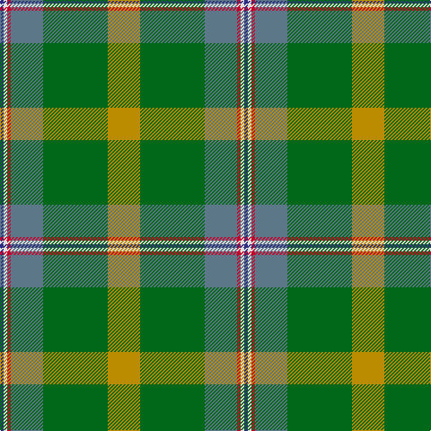

In pattern [BWRBGY](/patterns/bwrbgy/).

This was sourced from tartans-authority.  It is a [6 stripes tartan](/stripes/stripes6/).

Original link http://www.tartansauthority.com/tartan-ferret/display/10286/

## Thread count
DB/4 LN4 R4 B36 G72 DY/36

## Palette
Each colour and its ΔE from the base-6 reference it is a variant of.

| Colour | Shade | Base | ΔE (OKLab) |
|---|---|---|---|
| B | <code style="background-color:#5C7888;">#5C7888</code> `#5C7888` | B <code style="background-color:#2C4084;">#2C4084</code> | 0.18 |
| DB | <code style="background-color:#2C2C80;">#2C2C80</code> `#2C2C80` | B <code style="background-color:#2C4084;">#2C4084</code> | 0.05 |
| DY | <code style="background-color:#BC8C00;">#BC8C00</code> `#BC8C00` | Y <code style="background-color:#E8C000;">#E8C000</code> | 0.16 |
| G | <code style="background-color:#006818;">#006818</code> `#006818` | G <code style="background-color:#006400;">#006400</code> | 0.02 |
| LN | <code style="background-color:#E0E0E0;">#E0E0E0</code> `#E0E0E0` | W <code style="background-color:#F4F4F0;">#F4F4F0</code> | 0.06 |
| R | <code style="background-color:#C8002C;">#C8002C</code> `#C8002C` | R <code style="background-color:#C80000;">#C80000</code> | 0.03 |

# Sample pattern

## Nearest tartans

The nearest existing variants by ΔTartan distance.

1. [Wagland](/setts/s7/r6b12y4b30g24ga78w6-b304080-g004010-ga407040-rc00000-we0e0e0-yf0c000/) — ΔT 1.27
1. [City of Vancouver (Commemorative)](/setts/s6/g8y4g48w24ga48r4-g006818-ga408060-r880000-wc0c0c0-yd09800/) — ΔT 1.30
1. [Waterford](/setts/s6/g84y4ga32b14ba32r10-b304080-ba401000-g008000-ga30a010-rc00000-yf0c000/) — ΔT 1.31
1. [Hannigan of Dirleton](/setts/s8/b8g8ga4w6g54ga60y2r6-b800080-g008000-ga505020-rc00020-we0e0e0-yf0c000/) — ΔT 1.35
1. [Wagland (Name)](/setts/s7/r6b12y4b30g24ga78w6-b2c2c80-g006818-ga285800-rc80000-we0e0e0-ye8c000/) — ΔT 1.39
1. [Vipont (White line)](/setts/s7/r8g28k6ra6g24b72w8-b0c585c-g006818-k101010-rc80000-ra9c68a4-wfcfcfc/) — ΔT 1.40
1. [Red Rum](/setts/s7/k4r60g8w4g28ra26y4-g008000-k000000-r806050-ra802040-we0e0e0-yf0c000/) — ΔT 1.41
1. [Snelgrove Htg (Name)](/setts/s7/k6r24b16y4g72b20ba4-b642000-ba2888c4-g006818-k101010-rc80000-ybc8c00/) — ΔT 1.44
1. [Sinclair](/setts/s7/g20r6g60ga20w4b30r8-b304080-g008000-ga808080-rc00000-we0e0e0/) — ΔT 1.47
1. [Michigan, State of (District)](/setts/s10/g36w2g8w2y8ga2y4ga24r4ga8-g509884-ga006818-r940000-wfcfcfc-yc8904c/) — ΔT 1.50

## Neighbour map

Every grey dot is one of 15726 variants placed by the first two principal components of the ΔTartan feature space (44% of its variance). Red is this tartan; blue dots are its nearest — click one to open its page.

<svg viewBox="0 0 640 380" role="img" style="max-width:100%;height:auto;border:1px solid #e0e0e0;border-radius:4px;display:block" xmlns="http://www.w3.org/2000/svg"><image href="/nn/cloud.v1.png" width="640" height="380"/><a href="/setts/s7/r6b12y4b30g24ga78w6-b304080-g004010-ga407040-rc00000-we0e0e0-yf0c000/"><circle cx="276.8" cy="150.8" r="4" fill="#3465a4"><title>Wagland</title></circle></a><a href="/setts/s6/g8y4g48w24ga48r4-g006818-ga408060-r880000-wc0c0c0-yd09800/"><circle cx="242.7" cy="208.5" r="4" fill="#3465a4"><title>City of Vancouver (Commemorative)</title></circle></a><a href="/setts/s6/g84y4ga32b14ba32r10-b304080-ba401000-g008000-ga30a010-rc00000-yf0c000/"><circle cx="236.4" cy="156.6" r="4" fill="#3465a4"><title>Waterford</title></circle></a><a href="/setts/s8/b8g8ga4w6g54ga60y2r6-b800080-g008000-ga505020-rc00020-we0e0e0-yf0c000/"><circle cx="301.1" cy="123.8" r="4" fill="#3465a4"><title>Hannigan of Dirleton</title></circle></a><a href="/setts/s7/r6b12y4b30g24ga78w6-b2c2c80-g006818-ga285800-rc80000-we0e0e0-ye8c000/"><circle cx="267.0" cy="148.9" r="4" fill="#3465a4"><title>Wagland (Name)</title></circle></a><a href="/setts/s7/r8g28k6ra6g24b72w8-b0c585c-g006818-k101010-rc80000-ra9c68a4-wfcfcfc/"><circle cx="251.0" cy="171.3" r="4" fill="#3465a4"><title>Vipont (White line)</title></circle></a><a href="/setts/s7/k4r60g8w4g28ra26y4-g008000-k000000-r806050-ra802040-we0e0e0-yf0c000/"><circle cx="240.9" cy="151.4" r="4" fill="#3465a4"><title>Red Rum</title></circle></a><a href="/setts/s7/k6r24b16y4g72b20ba4-b642000-ba2888c4-g006818-k101010-rc80000-ybc8c00/"><circle cx="284.0" cy="149.3" r="4" fill="#3465a4"><title>Snelgrove Htg (Name)</title></circle></a><a href="/setts/s7/g20r6g60ga20w4b30r8-b304080-g008000-ga808080-rc00000-we0e0e0/"><circle cx="286.2" cy="185.4" r="4" fill="#3465a4"><title>Sinclair</title></circle></a><a href="/setts/s10/g36w2g8w2y8ga2y4ga24r4ga8-g509884-ga006818-r940000-wfcfcfc-yc8904c/"><circle cx="276.3" cy="150.4" r="4" fill="#3465a4"><title>Michigan, State of (District)</title></circle></a><circle cx="265.0" cy="166.3" r="5" fill="#c00000"/></svg>

ID: /setts/s6/y36g72b36r4w4ba4-b5c7888-ba2c2c80-g006818-rc8002c-we0e0e0-ybc8c00/
