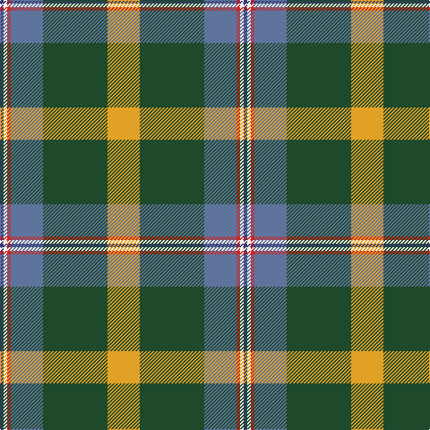

In pattern [BWRBGY](/patterns/bwrbgy/).

This was sourced from register-of-tartans.  It is a [6 stripes tartan](/stripes/stripes6/).

Original link https://www.tartanregister.gov.uk/tartanDetails.aspx?ref=10286

## Thread count
DB/4 W4 R4 B36 DG72 Y/36

## Palette
Each colour and its ΔE from the base-6 reference it is a variant of.

| Colour | Shade | Base | ΔE (OKLab) |
|---|---|---|---|
| B | <code style="background-color:#5F749C;">#5F749C</code> `#5F749C` | B <code style="background-color:#2C4084;">#2C4084</code> | 0.17 |
| DB | <code style="background-color:#373875;">#373875</code> `#373875` | B <code style="background-color:#2C4084;">#2C4084</code> | 0.03 |
| DG | <code style="background-color:#1E492B;">#1E492B</code> `#1E492B` | G <code style="background-color:#006400;">#006400</code> | 0.11 |
| R | <code style="background-color:#CA2625;">#CA2625</code> `#CA2625` | R <code style="background-color:#C80000;">#C80000</code> | 0.03 |
| W | <code style="background-color:#F9F5EF;">#F9F5EF</code> `#F9F5EF` | W <code style="background-color:#F4F4F0;">#F4F4F0</code> | 0.01 |
| Y | <code style="background-color:#E0A126;">#E0A126</code> `#E0A126` | Y <code style="background-color:#E8C000;">#E8C000</code> | 0.08 |

# Sample pattern

## Nearest tartans

The nearest existing variants by ΔTartan distance.

1. [Stirling University (Corporate)](/setts/s8/g88r12w4g8r12b64k12y8-b5c8ca8-g006818-k101010-rc80000-wfcfcfc-ye8c000/) — ΔT 1.02
1. [Stirling, University of Corporate Univ Tartan Tartan Number: 2297. Earliest known date: 1994 This is the accepted University design. See products available Copyright © Blair Urquhart, Comrie, 2015](/setts/s8/g88r12k4g8r12b64ka12y8-b5c8ca8-g006818-k000000-ka101010-rc80000-ye8c000/) — ΔT 1.03
1. [Shawlands International (Commem.)](/setts/s6/k6g88b54y12r20w6-b1c0070-g006818-k101010-rc80000-we0e0e0-yfccc00/) — ΔT 1.15
1. [State Seal of New Mexico (Fashion)](/setts/s8/w10r98w6g48ra10y8ga60w8-g003820-ga604000-r888888-ra880000-we8ccb8-ybc8c00/) — ΔT 1.15
1. [Red Rum](/setts/s7/k4r60g8w4g28ra26y4-g008000-k000000-r806050-ra802040-we0e0e0-yf0c000/) — ΔT 1.17
1. [State Seal of West Virginia (Fash)](/setts/s8/r98y6b26g16k46b20r28ra8-b1474b4-g604000-k101010-r888888-rac80000-ybc8c00/) — ΔT 1.23
1. [Hamilton of Brandon (Fashion)](/setts/s6/y64k28w4g28k4ya12-g006818-k101010-we0e0e0-ya08858-yae8c000/) — ΔT 1.23
1. [Caskie](/setts/s7/w6k2b50r14g24k2y6-b2888c4-g006818-k101010-rc80000-we0e0e0-ye8c000/) — ΔT 1.25
1. [Royal British Legion, The](/setts/s7/r12b4g40k6ba16ga4b8-b8080d0-ba304080-g008000-ga30a010-k000000-rc00000/) — ΔT 1.25
1. [Glencross, Tynron (Name)](/setts/s6/r6g26b26y4ga68w6-b2c2c80-g5c6428-ga003820-rc80000-we0e0e0-ye8c000/) — ΔT 1.27

## Neighbour map

Every grey dot is one of 15726 variants placed by the first two principal components of the ΔTartan feature space (44% of its variance). Red is this tartan; blue dots are its nearest — click one to open its page.

<svg viewBox="0 0 640 380" role="img" style="max-width:100%;height:auto;border:1px solid #e0e0e0;border-radius:4px;display:block" xmlns="http://www.w3.org/2000/svg"><image href="/nn/cloud.v1.png" width="640" height="380"/><a href="/setts/s8/g88r12w4g8r12b64k12y8-b5c8ca8-g006818-k101010-rc80000-wfcfcfc-ye8c000/"><circle cx="245.7" cy="120.7" r="4" fill="#3465a4"><title>Stirling University (Corporate)</title></circle></a><a href="/setts/s8/g88r12k4g8r12b64ka12y8-b5c8ca8-g006818-k000000-ka101010-rc80000-ye8c000/"><circle cx="245.6" cy="121.4" r="4" fill="#3465a4"><title>Stirling, University of Corporate Univ Tartan Tartan Number: 2297. Earliest known date: 1994 This is the accepted University design. See products available Copyright © Blair Urquhart, Comrie, 2015</title></circle></a><a href="/setts/s6/k6g88b54y12r20w6-b1c0070-g006818-k101010-rc80000-we0e0e0-yfccc00/"><circle cx="207.1" cy="149.2" r="4" fill="#3465a4"><title>Shawlands International (Commem.)</title></circle></a><a href="/setts/s8/w10r98w6g48ra10y8ga60w8-g003820-ga604000-r888888-ra880000-we8ccb8-ybc8c00/"><circle cx="192.8" cy="132.8" r="4" fill="#3465a4"><title>State Seal of New Mexico (Fashion)</title></circle></a><a href="/setts/s7/k4r60g8w4g28ra26y4-g008000-k000000-r806050-ra802040-we0e0e0-yf0c000/"><circle cx="240.9" cy="151.4" r="4" fill="#3465a4"><title>Red Rum</title></circle></a><a href="/setts/s8/r98y6b26g16k46b20r28ra8-b1474b4-g604000-k101010-r888888-rac80000-ybc8c00/"><circle cx="239.9" cy="144.9" r="4" fill="#3465a4"><title>State Seal of West Virginia (Fash)</title></circle></a><a href="/setts/s6/y64k28w4g28k4ya12-g006818-k101010-we0e0e0-ya08858-yae8c000/"><circle cx="213.3" cy="162.6" r="4" fill="#3465a4"><title>Hamilton of Brandon (Fashion)</title></circle></a><a href="/setts/s7/w6k2b50r14g24k2y6-b2888c4-g006818-k101010-rc80000-we0e0e0-ye8c000/"><circle cx="237.2" cy="116.8" r="4" fill="#3465a4"><title>Caskie</title></circle></a><a href="/setts/s7/r12b4g40k6ba16ga4b8-b8080d0-ba304080-g008000-ga30a010-k000000-rc00000/"><circle cx="164.5" cy="162.2" r="4" fill="#3465a4"><title>Royal British Legion, The</title></circle></a><a href="/setts/s6/r6g26b26y4ga68w6-b2c2c80-g5c6428-ga003820-rc80000-we0e0e0-ye8c000/"><circle cx="255.2" cy="160.6" r="4" fill="#3465a4"><title>Glencross, Tynron (Name)</title></circle></a><circle cx="227.9" cy="145.6" r="5" fill="#c00000"/></svg>

ID: /setts/s6/y36g72b36r4w4ba4-b5f749c-ba373875-g1e492b-rca2625-wf9f5ef-ye0a126/
