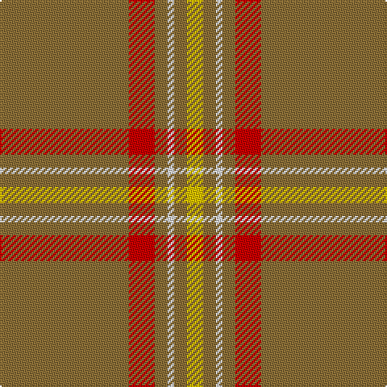

**Bands:** [YGWGRG](/stripes/ygwgrg/) · **Stripes:** [LY Y W Y R Y](/stripes/stripes6/) LY Y W Y R Y

This was sourced from register-of-tartans.  It is a [6 band tartan](/bands/bands6/).

Original link https://www.tartanregister.gov.uk/tartanDetails.aspx?ref=3492

## Attestations

This cloth appears in 2 source records; the oldest owns this page.

- 01/01/2003 — Reid (1939) (register-of-tartans, [record](https://www.tartanregister.gov.uk/tartanDetails.aspx?ref=3492))
- pre 2003 — Reid (1939) (Artefact) (tartans-authority, [record](http://www.tartansauthority.com/tartan-ferret/display/5874/))

## Register references

External register numbers recorded for this tartan.

- Scottish Register of Tartans: [3492](https://www.tartanregister.gov.uk/tartanDetails.aspx?ref=3492)
- Scottish Tartans Authority (ITI): 5874

## Thread count
LT/80 R16 LT8 LN4 LT8 Y/10

## Palette
Each colour and its ΔE from the base-6 reference it is a variant of.

| Colour | Shade | Base | ΔE (OKLab) |
|---|---|---|---|
| LN | <code style="background-color:#E0E0E0;">#E0E0E0</code> `#E0E0E0` | W <code style="background-color:#F7F7F7;">#F7F7F7</code> | 0.07 |
| LT | <code style="background-color:#8C7038;">#8C7038</code> `#8C7038` | G <code style="background-color:#006100;">#006100</code> | 0.18 |
| R | <code style="background-color:#C80000;">#C80000</code> `#C80000` | R <code style="background-color:#CC0000;">#CC0000</code> | 0.01 |
| Y | <code style="background-color:#E8C000;">#E8C000</code> `#E8C000` | Y <code style="background-color:#F2BF00;">#F2BF00</code> | 0.02 |

# Sample pattern

## Nearest tartans

The nearest existing variants by ΔTartan distance.

1. [Ballantyne (Personal)](/setts/s5/y60g13y9r8ly4~x2/) — ΔT 1.76
1. [Portosalvo (Corporate)](/setts/s11/o5g1o32r1o8r9o2g2g3r3g1~x2/) — ΔT 1.79
1. [Auchairne Grey](/setts/s6/r13o3r4o56n4o4~x2/) — ΔT 1.84
1. [Perry, Arisaid](/setts/s5/y65r27w2y4ly5~x2/) — ΔT 1.85
1. [Canadian Irish Regiment](/setts/s4/lo100dy26g3r2~x2/) — ΔT 1.85
1. [Ballantyne Personal Tartan Tartan Number: 7563. Earliest known date: 2007 Andrew Ballantyne said, l finally decided to purchase a tartan of my own design. The first kilt was made for my father and he was very pleased with it. The fabric was designed online at House of Tartan and woven by Edgars, Perth. See products available Copyright © Blair Urquhart, Comrie, 2015](/setts/s5/o60dg13o9o8ly4~x2/) — ΔT 1.88
1. [Reece, Mathew](/setts/s7/w2o44dt8o2dt2o3r1~x2/) — ΔT 1.90
1. [Spencer](/setts/s11/y40n3y8r2y2w2y10n6do2n2w2~x2/) — ΔT 1.92
1. [Auchairne grey](/setts/s6/r13y3r4y56n4y4~x2/) — ΔT 1.94
1. [Leiato of American Samoa (Personal)](/setts/s7/o45k5o28k5r5w2do6~x2/) — ΔT 1.95

## Neighbour map

Every grey dot is one of 14299 variants placed by the first two principal components of the ΔTartan feature space (44% of its variance). Red is this tartan; blue dots are its nearest — click one to open its page.

<svg viewBox="0 0 640 380" role="img" style="max-width:100%;height:auto;border:1px solid #e0e0e0;border-radius:4px;display:block" xmlns="http://www.w3.org/2000/svg"><image href="/nn/cloud.v1.png" width="640" height="380"/><a href="/setts/s5/y60g13y9r8ly4~x2/"><circle cx="527.5" cy="225.8" r="4" fill="#3465a4"><title>Ballantyne (Personal)</title></circle></a><a href="/setts/s11/o5g1o32r1o8r9o2g2g3r3g1~x2/"><circle cx="539.1" cy="141.6" r="4" fill="#3465a4"><title>Portosalvo (Corporate)</title></circle></a><a href="/setts/s6/r13o3r4o56n4o4~x2/"><circle cx="603.4" cy="213.1" r="4" fill="#3465a4"><title>Auchairne Grey</title></circle></a><a href="/setts/s5/y65r27w2y4ly5~x2/"><circle cx="508.1" cy="174.4" r="4" fill="#3465a4"><title>Perry, Arisaid</title></circle></a><a href="/setts/s4/lo100dy26g3r2~x2/"><circle cx="603.2" cy="170.3" r="4" fill="#3465a4"><title>Canadian Irish Regiment</title></circle></a><a href="/setts/s5/o60dg13o9o8ly4~x2/"><circle cx="506.7" cy="212.5" r="4" fill="#3465a4"><title>Ballantyne Personal Tartan Tartan Number: 7563. Earliest known date: 2007 Andrew Ballantyne said, l finally decided to purchase a tartan of my own design. The first kilt was made for my father and he was very pleased with it. The fabric was designed online at House of Tartan and woven by Edgars, Perth. See products available Copyright © Blair Urquhart, Comrie, 2015</title></circle></a><a href="/setts/s7/w2o44dt8o2dt2o3r1~x2/"><circle cx="626.0" cy="136.1" r="4" fill="#3465a4"><title>Reece, Mathew</title></circle></a><a href="/setts/s11/y40n3y8r2y2w2y10n6do2n2w2~x2/"><circle cx="538.7" cy="140.8" r="4" fill="#3465a4"><title>Spencer</title></circle></a><a href="/setts/s6/r13y3r4y56n4y4~x2/"><circle cx="609.4" cy="217.6" r="4" fill="#3465a4"><title>Auchairne grey</title></circle></a><a href="/setts/s7/o45k5o28k5r5w2do6~x2/"><circle cx="525.4" cy="163.4" r="4" fill="#3465a4"><title>Leiato of American Samoa (Personal)</title></circle></a><circle cx="565.8" cy="187.6" r="5" fill="#c00000"/></svg>

ID: /setts/s6/y40r8y4w2y4ly5~x2/
