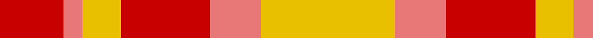

In pattern [RRYRRY](/patterns/rryrry/).

This was sourced from tartans-authority.  It is a [6 stripes tartan](/stripes/stripes6/).

Original link http://www.tartansauthority.com/tartan-ferret/display/2046/

## Thread count
R/20 LR6 Y12 R28 LR16 Y/42

## Palette
Each colour and its ΔE from the base-6 reference it is a variant of.

| Colour | Shade | Base | ΔE (OKLab) |
|---|---|---|---|
| LR | <code style="background-color:#E87878;">#E87878</code> `#E87878` | R <code style="background-color:#CC0000;">#CC0000</code> | 0.19 |
| R | <code style="background-color:#C80000;">#C80000</code> `#C80000` | R <code style="background-color:#CC0000;">#CC0000</code> | 0.01 |
| Y | <code style="background-color:#E8C000;">#E8C000</code> `#E8C000` | Y <code style="background-color:#F2BF00;">#F2BF00</code> | 0.02 |

# Sample pattern

## Nearest tartans

The nearest existing variants by ΔTartan distance.

1. [Kozlosky, Kilt](/setts/s6/y42r15ra28y12r6ra20-rd03030-rac00000-yf0c000/) — ΔT 0.42
1. [Harmony, 9](/setts/s5/r8y40ra60r40y8-r806050-rac00000-yf0c000/) — ΔT 1.09
1. [Kozlosky (Personal)](/setts/s10/r20ra6y12r28ra16y42ra16r28y12ra6-rc80000-rae87878-ye8c000/) — ΔT 1.15
1. [Harmony 9](/setts/s5/g8y40r60g40y8-g503c14-rdc0000-ye8c000/) — ΔT 1.50
1. [Buchele Check (Fashion?)](/setts/s6/r16y4r12ya4y32ya8-r901c38-ydcc08c-yad0c830/) — ΔT 1.82
1. [Shire of Hornwood (Corporate)](/setts/s5/r36y6r36y60k8-k101010-rc80000-yfccc00/) — ΔT 1.85
1. [Prince of Orange](/setts/s4/b12y56r40b6-b5480b0-r806050-yff8500/) — ΔT 1.97
1. [Manx, Mannin Plaid](/setts/s4/w4r20ra20y4-rc00000-ra806050-we0e0e0-yf0c000/) — ΔT 2.01
1. [Shire of Hornwood (USA)](/setts/s5/r36y6r36y60k8-k101010-rff0000-yffe600/) — ΔT 2.03
1. [Manhattan Ethnic](/setts/s7/y72b30y18r62ya10b8r32-b441800-re87878-ya08858-yabc8c00/) — ΔT 2.04

## Neighbour map

Every grey dot is one of 15726 variants placed by the first two principal components of the ΔTartan feature space (44% of its variance). Red is this tartan; blue dots are its nearest — click one to open its page.

<svg viewBox="0 0 640 380" role="img" style="max-width:100%;height:auto;border:1px solid #e0e0e0;border-radius:4px;display:block" xmlns="http://www.w3.org/2000/svg"><image href="/nn/cloud.v1.png" width="640" height="380"/><a href="/setts/s6/y42r15ra28y12r6ra20-rd03030-rac00000-yf0c000/"><circle cx="251.4" cy="244.3" r="4" fill="#3465a4"><title>Kozlosky, Kilt</title></circle></a><a href="/setts/s5/r8y40ra60r40y8-r806050-rac00000-yf0c000/"><circle cx="235.4" cy="247.0" r="4" fill="#3465a4"><title>Harmony, 9</title></circle></a><a href="/setts/s10/r20ra6y12r28ra16y42ra16r28y12ra6-rc80000-rae87878-ye8c000/"><circle cx="233.6" cy="226.7" r="4" fill="#3465a4"><title>Kozlosky (Personal)</title></circle></a><a href="/setts/s5/g8y40r60g40y8-g503c14-rdc0000-ye8c000/"><circle cx="213.6" cy="238.0" r="4" fill="#3465a4"><title>Harmony 9</title></circle></a><a href="/setts/s6/r16y4r12ya4y32ya8-r901c38-ydcc08c-yad0c830/"><circle cx="261.8" cy="218.5" r="4" fill="#3465a4"><title>Buchele Check (Fashion?)</title></circle></a><a href="/setts/s5/r36y6r36y60k8-k101010-rc80000-yfccc00/"><circle cx="293.9" cy="216.7" r="4" fill="#3465a4"><title>Shire of Hornwood (Corporate)</title></circle></a><a href="/setts/s4/b12y56r40b6-b5480b0-r806050-yff8500/"><circle cx="331.5" cy="258.0" r="4" fill="#3465a4"><title>Prince of Orange</title></circle></a><a href="/setts/s4/w4r20ra20y4-rc00000-ra806050-we0e0e0-yf0c000/"><circle cx="244.0" cy="262.9" r="4" fill="#3465a4"><title>Manx, Mannin Plaid</title></circle></a><a href="/setts/s5/r36y6r36y60k8-k101010-rff0000-yffe600/"><circle cx="288.3" cy="210.0" r="4" fill="#3465a4"><title>Shire of Hornwood (USA)</title></circle></a><a href="/setts/s7/y72b30y18r62ya10b8r32-b441800-re87878-ya08858-yabc8c00/"><circle cx="245.0" cy="218.3" r="4" fill="#3465a4"><title>Manhattan Ethnic</title></circle></a><circle cx="252.9" cy="247.7" r="5" fill="#c00000"/></svg>

ID: /setts/s6/y42r16ra28y12r6ra20-re87878-rac80000-ye8c000/
