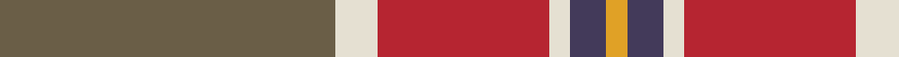

This page is one **sett** — a single exact thread-count. It belongs to the [tartan](/tartans/y47w6r24w3dp5lo3/)
(the same proportion at any scale), whose colour order is pattern [GWRWBY](/stripes/gwrwby/).

Sourced from register-of-tartans.  It is a [6 stripe tartan](/stripes/stripes6/).

Original link https://www.tartanregister.gov.uk/tartanDetails.aspx?ref=10597

## Register references

External register numbers recorded for this tartan.

- Scottish Register of Tartans: [10597](https://www.tartanregister.gov.uk/tartanDetails.aspx?ref=10597)

## Thread count
Na/94 W12 R48 W6 N10 Y/6

## Palette

Palette: <strong>Tartan Register</strong> <small style="color:#888">(1 of 5 colours)</small>
<table><thead><tr><th>Colour</th><th>Threads</th><th>Shade</th><th>Base</th><th>OKLCh</th></tr></thead><tbody><tr><td>Na/</td><td style="text-align:right;font-variant-numeric:tabular-nums">94</td><td><code style="background-color:#6A5E47;">#6A5E47</code> <small style="color:#888">#6A5E47</small></td><td>G <code style="background-color:#006100;">#006100</code></td><td><small style="color:#888">oklch(48.7% 0.038 83.5)</small></td></tr><tr><td>W</td><td style="text-align:right;font-variant-numeric:tabular-nums">12</td><td><code style="background-color:#E5E0D2;">#E5E0D2</code> <small style="color:#888">#E5E0D2</small></td><td>W <code style="background-color:#F7F7F7;">#F7F7F7</code></td><td><small style="color:#888">oklch(90.7% 0.020 90.6)</small></td></tr><tr><td>R</td><td style="text-align:right;font-variant-numeric:tabular-nums">48</td><td><code style="background-color:#B62531;">#B62531</code> <small style="color:#888">#B62531</small></td><td>R <code style="background-color:#CC0000;">#CC0000</code></td><td><small style="color:#888">oklch(50.8% 0.180 22.7)</small></td></tr><tr><td>W</td><td style="text-align:right;font-variant-numeric:tabular-nums">6</td><td><code style="background-color:#E5E0D2;">#E5E0D2</code> <small style="color:#888">#E5E0D2</small></td><td>W <code style="background-color:#F7F7F7;">#F7F7F7</code></td><td><small style="color:#888">oklch(90.7% 0.020 90.6)</small></td></tr><tr><td>N</td><td style="text-align:right;font-variant-numeric:tabular-nums">10</td><td><code style="background-color:#433A5A;">#433A5A</code> <small style="color:#888">#433A5A</small></td><td>B <code style="background-color:#2A418A;">#2A418A</code></td><td><small style="color:#888">oklch(37.2% 0.055 296.6)</small></td></tr><tr><td>Y/</td><td style="text-align:right;font-variant-numeric:tabular-nums">6</td><td><code style="background-color:#E0A126;">#E0A126</code> <small style="color:#888">#E0A126</small></td><td>Y <code style="background-color:#F2BF00;">#F2BF00</code></td><td><small style="color:#888">oklch(75.1% 0.146 78.3)</small></td></tr></tbody></table>

# Sample pattern

## Nearest tartans

The nearest existing variants by ΔTartan distance, with this tartan at the top so the swatches line up against it.

ΔTartan

Tartan

Sett

—

<a href="/ttd/edit/#slug=y47w6r24w3dp5lo3~x2">Duminiak (Trevose, Pennsylvania)</a> <a class="nn-out" href="/setts/s6/y47w6r24w3dp5lo3~x2/" title="open its dictionary page">↗</a>

0.77

<a href="/ttd/edit/#slug=o47w6r24w3dt5lo3~x2">Duminiak (Personal)</a> <a class="nn-out" href="/setts/s6/o47w6r24w3dt5lo3~x2/" title="open its dictionary page">↗</a>

0.81

<a href="/ttd/edit/#slug=r2g16r1r2r12ly1t1~x2">Spragg (Name)</a> <a class="nn-out" href="/setts/s7/r2g16r1r2r12ly1t1~x2/" title="open its dictionary page">↗</a>

0.82

<a href="/ttd/edit/#slug=db4dr2db2w2dr9o27r4~x3">Unidentified 35</a> <a class="nn-out" href="/setts/s7/db4dr2db2w2dr9o27r4~x3/" title="open its dictionary page">↗</a>

0.99

<a href="/ttd/edit/#slug=r2dg16r1r2r12ly1y1~x2">Spragg, Andrew</a> <a class="nn-out" href="/setts/s7/r2dg16r1r2r12ly1y1~x2/" title="open its dictionary page">↗</a>

1.23

<a href="/ttd/edit/#slug=o59t28ly5dg3w4ly5~x2">Dundhuin Gold</a> <a class="nn-out" href="/setts/s6/o59t28ly5dg3w4ly5~x2/" title="open its dictionary page">↗</a>

1.24

<a href="/ttd/edit/#slug=g24b2r25ly2k3~x2">Bronte</a> <a class="nn-out" href="/setts/s5/g24b2r25ly2k3~x2/" title="open its dictionary page">↗</a>

1.27

<a href="/ttd/edit/#slug=lr6o5k2y18r28w2~x2">Dundhuin</a> <a class="nn-out" href="/setts/s6/lr6o5k2y18r28w2~x2/" title="open its dictionary page">↗</a>

1.34

<a href="/ttd/edit/#slug=n2r10n10o3r2lr24w2~x2">Un-named Dutch</a> <a class="nn-out" href="/setts/s7/n2r10n10o3r2lr24w2~x2/" title="open its dictionary page">↗</a>

1.39

<a href="/ttd/edit/#slug=r6b22r6g20ly2r45b2w5~x2">Elbrick Dress (Personal)</a> <a class="nn-out" href="/setts/s8/r6b22r6g20ly2r45b2w5~x2/" title="open its dictionary page">↗</a>

1.40

<a href="/ttd/edit/#slug=n9do2dg12o31lo9~x2">Buncle (Duns)</a> <a class="nn-out" href="/setts/s5/n9do2dg12o31lo9~x2/" title="open its dictionary page">↗</a>

## Neighbour map

Every grey dot is one of 14299 variants placed by the first two principal components of the ΔTartan feature space (44% of its variance). Red is this tartan; blue dots are its nearest — click one to open its page.

<svg viewBox="0 0 640 380" role="img" style="max-width:100%;height:auto;border:1px solid #e0e0e0;border-radius:4px;display:block" xmlns="http://www.w3.org/2000/svg"><image href="/nn/cloud.v1.png" width="640" height="380"/><a href="/setts/s6/o47w6r24w3dt5lo3~x2/"><circle cx="325.6" cy="158.5" r="4" fill="#3465a4"><title>Duminiak (Personal)</title></circle></a><a href="/setts/s7/r2g16r1r2r12ly1t1~x2/"><circle cx="299.2" cy="152.4" r="4" fill="#3465a4"><title>Spragg (Name)</title></circle></a><a href="/setts/s7/db4dr2db2w2dr9o27r4~x3/"><circle cx="324.6" cy="160.6" r="4" fill="#3465a4"><title>Unidentified 35</title></circle></a><a href="/setts/s7/r2dg16r1r2r12ly1y1~x2/"><circle cx="302.5" cy="154.1" r="4" fill="#3465a4"><title>Spragg, Andrew</title></circle></a><a href="/setts/s6/o59t28ly5dg3w4ly5~x2/"><circle cx="374.7" cy="160.3" r="4" fill="#3465a4"><title>Dundhuin Gold</title></circle></a><a href="/setts/s5/g24b2r25ly2k3~x2/"><circle cx="284.0" cy="182.7" r="4" fill="#3465a4"><title>Bronte</title></circle></a><a href="/setts/s6/lr6o5k2y18r28w2~x2/"><circle cx="258.0" cy="163.0" r="4" fill="#3465a4"><title>Dundhuin</title></circle></a><a href="/setts/s7/n2r10n10o3r2lr24w2~x2/"><circle cx="251.4" cy="170.0" r="4" fill="#3465a4"><title>Un-named Dutch</title></circle></a><a href="/setts/s8/r6b22r6g20ly2r45b2w5~x2/"><circle cx="308.8" cy="128.3" r="4" fill="#3465a4"><title>Elbrick Dress (Personal)</title></circle></a><a href="/setts/s5/n9do2dg12o31lo9~x2/"><circle cx="282.4" cy="197.8" r="4" fill="#3465a4"><title>Buncle (Duns)</title></circle></a><circle cx="335.4" cy="166.8" r="5" fill="#c00000"/></svg>

ID: /setts/s6/y47w6r24w3dp5lo3~x2/
