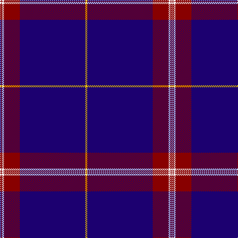

In pattern [WRWRBY](/patterns/wrwrby/).

This was sourced from register-of-tartans.  It is a [6 stripes tartan](/stripes/stripes6/).

Original link https://www.tartanregister.gov.uk/tartanDetails.aspx?ref=750

## Attestations

This cloth appears in 2 source records; the oldest owns this page.

- 01/09/2005 — Coogan (Personal) (register-of-tartans, [record](https://www.tartanregister.gov.uk/tartanDetails.aspx?ref=750))
- 2005 September — Coogan (Personal) (tartans-authority, [record](http://www.tartansauthority.com/tartan-ferret/display/6782/))

## Thread count
W/2 DR2 W4 DR32 DB132 Y/4

## Palette
Each colour and its ΔE from the base-6 reference it is a variant of.

| Colour | Shade | Base | ΔE (OKLab) |
|---|---|---|---|
| DB | <code style="background-color:#1C0070;">#1C0070</code> `#1C0070` | B <code style="background-color:#2A418A;">#2A418A</code> | 0.14 |
| DR | <code style="background-color:#880000;">#880000</code> `#880000` | R <code style="background-color:#CC0000;">#CC0000</code> | 0.15 |
| W | <code style="background-color:#F8F8F8;">#F8F8F8</code> `#F8F8F8` | W <code style="background-color:#F7F7F7;">#F7F7F7</code> | 0.00 |
| Y | <code style="background-color:#E8C000;">#E8C000</code> `#E8C000` | Y <code style="background-color:#F2BF00;">#F2BF00</code> | 0.02 |

# Sample pattern

## Nearest tartans

The nearest existing variants by ΔTartan distance.

1. [Cougan Irish Personal Tartan Tartan Number: 6782. Earliest known date: 2005 September Designed by Douglas Gregor of Tartanweb as a personal tartan for Margot Coogan of County Laois, Ireland. The colours reflect those in the Cougan coat of arms - deep red representing the red cross in the shield and the white lines representing the three silver oak leaves. See products available Copyright © Blair Urquhart, Comrie, 2015](/setts/s10/b132r32w4r2w2r2w4r32b132y4-b1c0070-r880000-wf8f8f8-ye8c000/) — ΔT 1.15
1. [Inverness Htg (Royal)](/setts/s8/b122r12w4r16y4b6y4b30-b1c0070-r880000-wfcfcfc-yd09800/) — ΔT 1.24
1. [United States (Corporate)](/setts/s9/b7ba5w6ba5r7ba2b2ba70w2-b1474b4-ba202060-rc80000-wfcfcfc/) — ΔT 1.31
1. [Balmer (Personal)](/setts/s6/w4b98r10y4r10y4-b2c2c80-rc80000-we0e0e0-ye8c000/) — ΔT 1.45
1. [RAAF](/setts/s9/b132w4b20w4b20w4b24r6ba48-b1c0070-ba5c8ca8-rc80000-we0e0e0/) — ΔT 1.47
1. [Nunavut Territory (District)](/setts/s7/b120w2y8k8w2wa16w4-b1c1c50-k101010-we0e0e0-wac49cd8-ye8c000/) — ΔT 1.48
1. [Hong Kong St Andrew's Society](/setts/s6/b150k8r50b12k12w4-b000048-k000000-rc80000-wf8f8f8/) — ΔT 1.59
1. [Tyneside Blue, North Tyneside Pipe Band](/setts/s7/b124k44w6k4w4k6r2-b304080-k000030-rc00000-we0e0e0/) — ΔT 1.60
1. [Auchtermuchty Tartan Army (Corp)](/setts/s6/b160r14w2r14y40b30-b2c2c80-rc80000-we0e0e0-ye8c000/) — ΔT 1.61
1. [United States](/setts/s9/b7k5y6k5r7k2b2k70y2-b304080-k000030-rc00000-yb0b0b0/) — ΔT 1.62

## Neighbour map

Every grey dot is one of 15726 variants placed by the first two principal components of the ΔTartan feature space (44% of its variance). Red is this tartan; blue dots are its nearest — click one to open its page.

<svg viewBox="0 0 640 380" role="img" style="max-width:100%;height:auto;border:1px solid #e0e0e0;border-radius:4px;display:block" xmlns="http://www.w3.org/2000/svg"><image href="/nn/cloud.v1.png" width="640" height="380"/><a href="/setts/s10/b132r32w4r2w2r2w4r32b132y4-b1c0070-r880000-wf8f8f8-ye8c000/"><circle cx="543.2" cy="111.6" r="4" fill="#3465a4"><title>Cougan Irish Personal Tartan Tartan Number: 6782. Earliest known date: 2005 September Designed by Douglas Gregor of Tartanweb as a personal tartan for Margot Coogan of County Laois, Ireland. The colours reflect those in the Cougan coat of arms - deep red representing the red cross in the shield and the white lines representing the three silver oak leaves. See products available Copyright © Blair Urquhart, Comrie, 2015</title></circle></a><a href="/setts/s8/b122r12w4r16y4b6y4b30-b1c0070-r880000-wfcfcfc-yd09800/"><circle cx="558.4" cy="137.1" r="4" fill="#3465a4"><title>Inverness Htg (Royal)</title></circle></a><a href="/setts/s9/b7ba5w6ba5r7ba2b2ba70w2-b1474b4-ba202060-rc80000-wfcfcfc/"><circle cx="522.3" cy="106.2" r="4" fill="#3465a4"><title>United States (Corporate)</title></circle></a><a href="/setts/s6/w4b98r10y4r10y4-b2c2c80-rc80000-we0e0e0-ye8c000/"><circle cx="506.8" cy="139.6" r="4" fill="#3465a4"><title>Balmer (Personal)</title></circle></a><a href="/setts/s9/b132w4b20w4b20w4b24r6ba48-b1c0070-ba5c8ca8-rc80000-we0e0e0/"><circle cx="491.3" cy="131.2" r="4" fill="#3465a4"><title>RAAF</title></circle></a><a href="/setts/s7/b120w2y8k8w2wa16w4-b1c1c50-k101010-we0e0e0-wac49cd8-ye8c000/"><circle cx="493.9" cy="84.8" r="4" fill="#3465a4"><title>Nunavut Territory (District)</title></circle></a><a href="/setts/s6/b150k8r50b12k12w4-b000048-k000000-rc80000-wf8f8f8/"><circle cx="455.3" cy="140.5" r="4" fill="#3465a4"><title>Hong Kong St Andrew's Society</title></circle></a><a href="/setts/s7/b124k44w6k4w4k6r2-b304080-k000030-rc00000-we0e0e0/"><circle cx="472.2" cy="122.3" r="4" fill="#3465a4"><title>Tyneside Blue, North Tyneside Pipe Band</title></circle></a><a href="/setts/s6/b160r14w2r14y40b30-b2c2c80-rc80000-we0e0e0-ye8c000/"><circle cx="485.0" cy="124.9" r="4" fill="#3465a4"><title>Auchtermuchty Tartan Army (Corp)</title></circle></a><a href="/setts/s9/b7k5y6k5r7k2b2k70y2-b304080-k000030-rc00000-yb0b0b0/"><circle cx="531.1" cy="117.7" r="4" fill="#3465a4"><title>United States</title></circle></a><circle cx="539.5" cy="120.8" r="5" fill="#c00000"/></svg>

ID: /setts/s6/y4b132r32w4r2w2-b1c0070-r880000-wf8f8f8-ye8c000/
