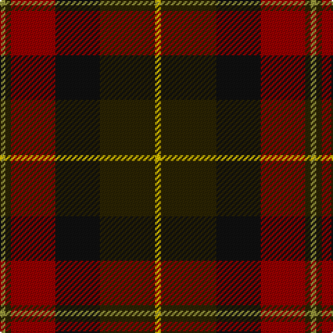

In pattern [YBKRBY](/patterns/ybkrby/).

This was sourced from register-of-tartans.  It is a [6 stripes tartan](/stripes/stripes6/).

Original link https://www.tartanregister.gov.uk/tartanDetails.aspx?ref=5312

## Thread count
LT/4 K4 DR32 Ka32 K40 Y/4

## Palette
Each colour and its ΔE from the base-6 reference it is a variant of.

| Colour | Shade | Base | ΔE (OKLab) |
|---|---|---|---|
| DR | <code style="background-color:#960000;">#960000</code> `#960000` | R <code style="background-color:#C80000;">#C80000</code> | 0.11 |
| K | <code style="background-color:#2A2303;">#2A2303</code> `#2A2303` | B <code style="background-color:#2C4084;">#2C4084</code> | 0.21 |
| Ka | <code style="background-color:#101010;">#101010</code> `#101010` | K <code style="background-color:#000000;">#000000</code> | 0.17 |
| LT | <code style="background-color:#96963C;">#96963C</code> `#96963C` | Y <code style="background-color:#E8C000;">#E8C000</code> | 0.18 |
| Y | <code style="background-color:#E8C000;">#E8C000</code> `#E8C000` | Y <code style="background-color:#E8C000;">#E8C000</code> | 0.00 |

# Sample pattern

ID: /setts/s6/y4b4r32k32b40ya4-b2a2303-k101010-r960000-y96963c-yae8c000/
