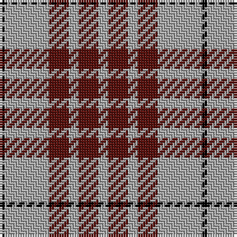

In pattern [KYBYBY](/patterns/kybyby/).

This was sourced from weddslist.  It is a [6 stripes tartan](/stripes/stripes6/).

Original link http://www.weddslist.com/cgi-bin/tartans/pg.pl?source=tinsel

## Thread count
K/2 N18 DR8 N4 DR8 N/4

## Palette
Each colour and its ΔE from the base-6 reference it is a variant of.

| Colour | Shade | Base | ΔE (OKLab) |
|---|---|---|---|
| DR | <code style="background-color:#59110D;">#59110D</code> `#59110D` | B <code style="background-color:#2A418A;">#2A418A</code> | 0.22 |
| K | <code style="background-color:#000000;">#000000</code> `#000000` | K <code style="background-color:#000000;">#000000</code> | 0.00 |
| N | <code style="background-color:#AAAAAA;">#AAAAAA</code> `#AAAAAA` | Y <code style="background-color:#F2BF00;">#F2BF00</code> | 0.19 |

# Sample pattern

## Nearest tartans

The nearest existing variants by ΔTartan distance.

1. [Buchanan VS](/setts/s6/y2b4y2b4y9k1-b59110d-k000000-yaaaaaa/) — ΔT 0.00
1. [Blackberry (Fashion)](/setts/s7/r16y12k22y12k22y60r6-k101010-ra80000-yc8bc9c/) — ΔT 0.98
1. [Richmond de Ellel (Personal)](/setts/s7/k10y50k20r6k20y50w10-k101010-rc80000-wfcfcfc-ya08858/) — ΔT 1.24
1. [Latin](/setts/s6/b6y18b6y18b40r6-b2c2c80-rc8002c-ybc8c00/) — ΔT 1.25
1. [Lister (Misty Mountain)](/setts/s7/g16y58g16ya6g16y16ya6-g5d321f-yccbaaf-yae0a126/) — ΔT 1.33
1. [McPartlin (Personal)](/setts/s5/k54w58k10w28r4-k101010-rc80000-wf8e8d8/) — ΔT 1.38
1. [Unidentified, Sample](/setts/s6/b22r8y18b8y4b22-b304080-rc00000-yf0c000/) — ΔT 1.39
1. [Flynn](/setts/s6/r116k44r16k34ra10k28-k101010-r888888-rac8002c/) — ΔT 1.43
1. [Unidentified Sample](/setts/s6/b22r8y18b8y4b22-b2c4084-rdc0000-ye8c000/) — ΔT 1.44
1. [Shembe Zulu Church](/setts/s5/k10w50r12k90w8-k101010-rc80000-wfcfcfc/) — ΔT 1.47

## Neighbour map

Every grey dot is one of 15726 variants placed by the first two principal components of the ΔTartan feature space (44% of its variance). Red is this tartan; blue dots are its nearest — click one to open its page.

<svg viewBox="0 0 640 380" role="img" style="max-width:100%;height:auto;border:1px solid #e0e0e0;border-radius:4px;display:block" xmlns="http://www.w3.org/2000/svg"><image href="/nn/cloud.v1.png" width="640" height="380"/><a href="/setts/s6/y2b4y2b4y9k1-b59110d-k000000-yaaaaaa/"><circle cx="318.3" cy="224.4" r="4" fill="#3465a4"><title>Buchanan VS</title></circle></a><a href="/setts/s7/r16y12k22y12k22y60r6-k101010-ra80000-yc8bc9c/"><circle cx="277.8" cy="201.2" r="4" fill="#3465a4"><title>Blackberry (Fashion)</title></circle></a><a href="/setts/s7/k10y50k20r6k20y50w10-k101010-rc80000-wfcfcfc-ya08858/"><circle cx="288.6" cy="206.2" r="4" fill="#3465a4"><title>Richmond de Ellel (Personal)</title></circle></a><a href="/setts/s6/b6y18b6y18b40r6-b2c2c80-rc8002c-ybc8c00/"><circle cx="305.6" cy="240.3" r="4" fill="#3465a4"><title>Latin</title></circle></a><a href="/setts/s7/g16y58g16ya6g16y16ya6-g5d321f-yccbaaf-yae0a126/"><circle cx="312.8" cy="202.0" r="4" fill="#3465a4"><title>Lister (Misty Mountain)</title></circle></a><a href="/setts/s5/k54w58k10w28r4-k101010-rc80000-wf8e8d8/"><circle cx="300.4" cy="204.9" r="4" fill="#3465a4"><title>McPartlin (Personal)</title></circle></a><a href="/setts/s6/b22r8y18b8y4b22-b304080-rc00000-yf0c000/"><circle cx="296.2" cy="267.2" r="4" fill="#3465a4"><title>Unidentified, Sample</title></circle></a><a href="/setts/s6/r116k44r16k34ra10k28-k101010-r888888-rac8002c/"><circle cx="320.5" cy="215.2" r="4" fill="#3465a4"><title>Flynn</title></circle></a><a href="/setts/s6/b22r8y18b8y4b22-b2c4084-rdc0000-ye8c000/"><circle cx="294.8" cy="267.2" r="4" fill="#3465a4"><title>Unidentified Sample</title></circle></a><a href="/setts/s5/k10w50r12k90w8-k101010-rc80000-wfcfcfc/"><circle cx="316.6" cy="201.4" r="4" fill="#3465a4"><title>Shembe Zulu Church</title></circle></a><circle cx="318.3" cy="224.4" r="5" fill="#c00000"/></svg>

ID: /setts/s6/y4b8y4b8y18k2-b59110d-k000000-yaaaaaa/
