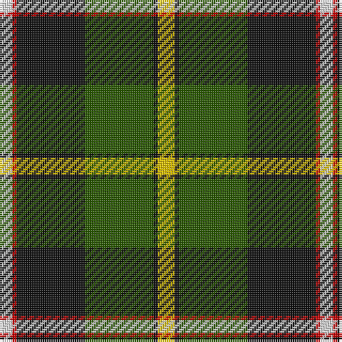

In pattern [WRKGKY](/patterns/wrkgky/).

This was sourced from register-of-tartans.  It is a [6 stripes tartan](/stripes/stripes6/).

Original link https://www.tartanregister.gov.uk/tartanDetails.aspx?ref=2593

## Attestations

This cloth appears in 2 source records; the oldest owns this page.

- 01/01/1999 — MacLamroc (register-of-tartans, [record](https://www.tartanregister.gov.uk/tartanDetails.aspx?ref=2593))
- January 1999 — MacLamrock (Clan) (tartans-authority, [record](http://www.tartansauthority.com/tartan-ferret/display/2591/))

## Thread count
LN/6 R2 K32 G32 K2 Y/8

## Palette
Each colour and its ΔE from the base-6 reference it is a variant of.

| Colour | Shade | Base | ΔE (OKLab) |
|---|---|---|---|
| G | <code style="background-color:#285800;">#285800</code> `#285800` | G <code style="background-color:#006100;">#006100</code> | 0.03 |
| K | <code style="background-color:#101010;">#101010</code> `#101010` | K <code style="background-color:#000000;">#000000</code> | 0.17 |
| LN | <code style="background-color:#E0E0E0;">#E0E0E0</code> `#E0E0E0` | W <code style="background-color:#F7F7F7;">#F7F7F7</code> | 0.07 |
| R | <code style="background-color:#C80000;">#C80000</code> `#C80000` | R <code style="background-color:#CC0000;">#CC0000</code> | 0.01 |
| Y | <code style="background-color:#E8C000;">#E8C000</code> `#E8C000` | Y <code style="background-color:#F2BF00;">#F2BF00</code> | 0.02 |

# Sample pattern

## Nearest tartans

The nearest existing variants by ΔTartan distance.

1. [Unidentified 20th Centuary](/setts/s7/r2k1g15k7ga15k1y2~g007800-ga784c18-k000000-r8c0000-yc88c00~x2/) — ΔT 1.02
1. [Afternoon Tea / Afternoon Tea](/setts/s6/w15k8r25k72g98y15~g408060-k1c1714-r781638-we0e0e0-yc89800/) — ΔT 1.08
1. [Hackett (Personal)](/setts/s7/k20w4r4g20w5g2ga2~g006818-ga289c18-k101010-rc80000-wfcfcfc~x2/) — ΔT 1.09
1. [Chiti, Cristiano (Personal)](/setts/s6/g20ga11w6r2b3w1~b780078-g004c00-ga002814-r880000-wc0c0c0~x2/) — ΔT 1.09
1. [Dalveen (Fashion)](/setts/s8/g3ga2g21ga1w11k21ga2k3~g744c00-ga006818-k101010-we0e0e0~x2/) — ΔT 1.12
1. [Colquhoun](/setts/s7/b4k2b16w1k8g24r4~b304080-g008000-k000000-rc00000-we0e0e0~x2/) — ΔT 1.14
1. [MacFadzean, MacPhedran](/setts/s7/g3b12w1k12g13r2g2~b304080-g008000-k000000-rc00000-we0e0e0~x2/) — ΔT 1.14
1. [MacPhadran](/setts/s7/g3b12y1k12g13r2g2~b304080-g008000-k000000-rc00000-yb0b0b0~x2/) — ΔT 1.14
1. [MacNeil 3](/setts/s8/g45w2r3k15r3b15r3b15~b304080-g008000-k000000-rc00000-we0e0e0~x2/) — ΔT 1.14
1. [Bryan Wedding (Personal)](/setts/s6/g30y5b10k10w2k2~b5c8ca8-g604000-k101010-wfcfcfc-yfccc00~x2/) — ΔT 1.21

## Neighbour map

Every grey dot is one of 15726 variants placed by the first two principal components of the ΔTartan feature space (44% of its variance). Red is this tartan; blue dots are its nearest — click one to open its page.

<svg viewBox="0 0 640 380" role="img" style="max-width:100%;height:auto;border:1px solid #e0e0e0;border-radius:4px;display:block" xmlns="http://www.w3.org/2000/svg"><image href="/nn/cloud.v1.png" width="640" height="380"/><a href="/setts/s7/r2k1g15k7ga15k1y2~g007800-ga784c18-k000000-r8c0000-yc88c00~x2/"><circle cx="180.2" cy="161.6" r="4" fill="#3465a4"><title>Unidentified 20th Centuary</title></circle></a><a href="/setts/s6/w15k8r25k72g98y15~g408060-k1c1714-r781638-we0e0e0-yc89800/"><circle cx="198.8" cy="180.2" r="4" fill="#3465a4"><title>Afternoon Tea / Afternoon Tea</title></circle></a><a href="/setts/s7/k20w4r4g20w5g2ga2~g006818-ga289c18-k101010-rc80000-wfcfcfc~x2/"><circle cx="150.1" cy="167.4" r="4" fill="#3465a4"><title>Hackett (Personal)</title></circle></a><a href="/setts/s6/g20ga11w6r2b3w1~b780078-g004c00-ga002814-r880000-wc0c0c0~x2/"><circle cx="242.2" cy="167.7" r="4" fill="#3465a4"><title>Chiti, Cristiano (Personal)</title></circle></a><a href="/setts/s8/g3ga2g21ga1w11k21ga2k3~g744c00-ga006818-k101010-we0e0e0~x2/"><circle cx="195.6" cy="131.7" r="4" fill="#3465a4"><title>Dalveen (Fashion)</title></circle></a><a href="/setts/s7/b4k2b16w1k8g24r4~b304080-g008000-k000000-rc00000-we0e0e0~x2/"><circle cx="209.3" cy="147.7" r="4" fill="#3465a4"><title>Colquhoun</title></circle></a><a href="/setts/s7/g3b12w1k12g13r2g2~b304080-g008000-k000000-rc00000-we0e0e0~x2/"><circle cx="163.0" cy="178.7" r="4" fill="#3465a4"><title>MacFadzean, MacPhedran</title></circle></a><a href="/setts/s7/g3b12y1k12g13r2g2~b304080-g008000-k000000-rc00000-yb0b0b0~x2/"><circle cx="165.1" cy="179.7" r="4" fill="#3465a4"><title>MacPhadran</title></circle></a><a href="/setts/s8/g45w2r3k15r3b15r3b15~b304080-g008000-k000000-rc00000-we0e0e0~x2/"><circle cx="227.0" cy="134.4" r="4" fill="#3465a4"><title>MacNeil 3</title></circle></a><a href="/setts/s6/g30y5b10k10w2k2~b5c8ca8-g604000-k101010-wfcfcfc-yfccc00~x2/"><circle cx="250.7" cy="162.7" r="4" fill="#3465a4"><title>Bryan Wedding (Personal)</title></circle></a><circle cx="209.8" cy="163.6" r="5" fill="#c00000"/></svg>

ID: /setts/s6/y4k1g16k16r1w3~g285800-k101010-rc80000-we0e0e0-ye8c000~x2/
