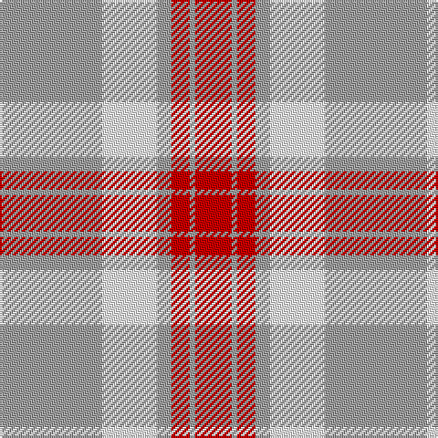

In pattern [RYRYWY](/patterns/ryrywy/).

This was sourced from register-of-tartans.  It is a [6 stripes tartan](/stripes/stripes6/).

Original link https://www.tartanregister.gov.uk/tartanDetails.aspx?ref=11204

## Thread count
N/56 W30 N8 R10 N3 R/20

## Palette
Each colour and its ΔE from the base-6 reference it is a variant of.

| Colour | Shade | Base | ΔE (OKLab) |
|---|---|---|---|
| N | <code style="background-color:#A0A0A0;">#A0A0A0</code> `#A0A0A0` | Y <code style="background-color:#E8C000;">#E8C000</code> | 0.20 |
| R | <code style="background-color:#C80000;">#C80000</code> `#C80000` | R <code style="background-color:#C80000;">#C80000</code> | 0.00 |
| W | <code style="background-color:#FFFFFF;">#FFFFFF</code> `#FFFFFF` | W <code style="background-color:#F4F4F0;">#F4F4F0</code> | 0.03 |

# Sample pattern

## Nearest tartans

The nearest existing variants by ΔTartan distance.

1. [Walsh, Michael Edward (Personal)](/setts/s6/r56w30r8ra10r3ra20-r888888-rac80000-wfcfcfc/) — ΔT 0.39
1. [O'Connor Dress](/setts/s5/g20r20w44r4g4-g604000-re87878-w98c8e8/) — ΔT 1.27
1. [Ailsa, Pink (Dance)](/setts/s6/r16w6r56w64k6w8-k101010-re87878-wf0e0c8/) — ΔT 1.42
1. [Malaysian Unknown (Artefact)](/setts/s5/w90r4g18w4r60-g006818-r880000-we8ccb8/) — ΔT 1.51
1. [Lister (Misty Mountain)](/setts/s7/b16y58b16ya6b16y16ya6-b5d321f-yccbaaf-yae0a126/) — ΔT 1.53
1. [O'Neill Pipe Band 1999/ Oliver dress](/setts/s9/w8g4w8r24w40g24w8r4w8-g289c18-rc80028-we0e0e0/) — ΔT 1.64
1. [Buchanan #5](/setts/s6/k4w56r26w4r26w4-k101010-r960028-we0e0e0/) — ΔT 1.69
1. [Buchele Check (Fashion?)](/setts/s6/r16y4r12ya4y32ya8-r901c38-ydcc08c-yad0c830/) — ΔT 1.78
1. [MacPherson, dress red](/setts/s7/w8r4w50ra42w6ra16y6-r800000-rac00000-we0e0e0-yf0c000/) — ΔT 1.79
1. [MacPherson Dress Burgandy Clan Tartan Tartan Number: 1832. Earliest known date: pre 2003 Examined by D.C.S. 1947 See products available Copyright © Blair Urquhart, Comrie, 2015](/setts/s7/w8k4w50r42w6r16y6-k101010-rc80000-we0e0e0-ye8c000/) — ΔT 1.80

## Neighbour map

Every grey dot is one of 15726 variants placed by the first two principal components of the ΔTartan feature space (44% of its variance). Red is this tartan; blue dots are its nearest — click one to open its page.

<svg viewBox="0 0 640 380" role="img" style="max-width:100%;height:auto;border:1px solid #e0e0e0;border-radius:4px;display:block" xmlns="http://www.w3.org/2000/svg"><image href="/nn/cloud.v1.png" width="640" height="380"/><a href="/setts/s6/r56w30r8ra10r3ra20-r888888-rac80000-wfcfcfc/"><circle cx="319.0" cy="184.2" r="4" fill="#3465a4"><title>Walsh, Michael Edward (Personal)</title></circle></a><a href="/setts/s5/g20r20w44r4g4-g604000-re87878-w98c8e8/"><circle cx="272.9" cy="218.3" r="4" fill="#3465a4"><title>O'Connor Dress</title></circle></a><a href="/setts/s6/r16w6r56w64k6w8-k101010-re87878-wf0e0c8/"><circle cx="342.2" cy="199.1" r="4" fill="#3465a4"><title>Ailsa, Pink (Dance)</title></circle></a><a href="/setts/s5/w90r4g18w4r60-g006818-r880000-we8ccb8/"><circle cx="336.3" cy="167.3" r="4" fill="#3465a4"><title>Malaysian Unknown (Artefact)</title></circle></a><a href="/setts/s7/b16y58b16ya6b16y16ya6-b5d321f-yccbaaf-yae0a126/"><circle cx="312.8" cy="202.0" r="4" fill="#3465a4"><title>Lister (Misty Mountain)</title></circle></a><a href="/setts/s9/w8g4w8r24w40g24w8r4w8-g289c18-rc80028-we0e0e0/"><circle cx="287.6" cy="186.4" r="4" fill="#3465a4"><title>O'Neill Pipe Band 1999/ Oliver dress</title></circle></a><a href="/setts/s6/k4w56r26w4r26w4-k101010-r960028-we0e0e0/"><circle cx="323.9" cy="174.9" r="4" fill="#3465a4"><title>Buchanan #5</title></circle></a><a href="/setts/s6/r16y4r12ya4y32ya8-r901c38-ydcc08c-yad0c830/"><circle cx="261.8" cy="218.5" r="4" fill="#3465a4"><title>Buchele Check (Fashion?)</title></circle></a><a href="/setts/s7/w8r4w50ra42w6ra16y6-r800000-rac00000-we0e0e0-yf0c000/"><circle cx="281.9" cy="157.0" r="4" fill="#3465a4"><title>MacPherson, dress red</title></circle></a><a href="/setts/s7/w8k4w50r42w6r16y6-k101010-rc80000-we0e0e0-ye8c000/"><circle cx="278.6" cy="156.0" r="4" fill="#3465a4"><title>MacPherson Dress Burgandy Clan Tartan Tartan Number: 1832. Earliest known date: pre 2003 Examined by D.C.S. 1947 See products available Copyright © Blair Urquhart, Comrie, 2015</title></circle></a><circle cx="321.2" cy="183.3" r="5" fill="#c00000"/></svg>

ID: /setts/s6/y56w30y8r10y3r20-rc80000-wffffff-ya0a0a0/
