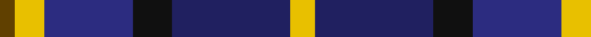
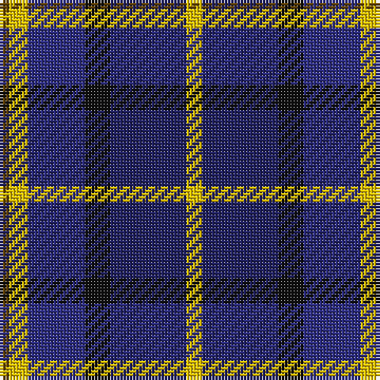

In pattern [GYBKBY](/patterns/gybkby/).

This was sourced from register-of-tartans.  It is a [6 stripes tartan](/stripes/stripes6/).

Original link https://www.tartanregister.gov.uk/tartanDetails.aspx?ref=466

## Attestations

This cloth appears in 2 source records; the oldest owns this page.

- 01/02/1999 — Cala Homes (Corporate) (register-of-tartans, [record](https://www.tartanregister.gov.uk/tartanDetails.aspx?ref=466))
- Feb. 1999 — Cala Homes (Corporate) (tartans-authority, [record](http://www.tartansauthority.com/tartan-ferret/display/2527/))

## Thread count
T/3 Y6 DB18 K8 DBa24 Y/5

## Palette
Each colour and its ΔE from the base-6 reference it is a variant of.

| Colour | Shade | Base | ΔE (OKLab) |
|---|---|---|---|
| DB | <code style="background-color:#2C2C80;">#2C2C80</code> `#2C2C80` | B <code style="background-color:#2C4084;">#2C4084</code> | 0.05 |
| DBa | <code style="background-color:#202060;">#202060</code> `#202060` | B <code style="background-color:#2C4084;">#2C4084</code> | 0.11 |
| K | <code style="background-color:#101010;">#101010</code> `#101010` | K <code style="background-color:#000000;">#000000</code> | 0.17 |
| T | <code style="background-color:#604000;">#604000</code> `#604000` | G <code style="background-color:#006400;">#006400</code> | 0.14 |
| Y | <code style="background-color:#E8C000;">#E8C000</code> `#E8C000` | Y <code style="background-color:#E8C000;">#E8C000</code> | 0.00 |

# Sample pattern

## Nearest tartans

The nearest existing variants by ΔTartan distance.

1. [Lopez-Gasparotto](/setts/s7/r8ra40k40b8k8b48y8-b2c2c80-k101010-rc80000-ra888888-ye8c000/) — ΔT 0.75
1. [American Express](/setts/s6/b8ba36r4b36g36w8-b000050-ba8080d0-g003000-r802040-we0e0e0/) — ΔT 0.84
1. [Wellington No 229](/setts/s5/k8b6ba22g28w4-b3c82af-ba5a008c-g005020-k101010-we0e0e0/) — ΔT 0.85
1. [CALA Homes](/setts/s6/y5b24k8ba18y6r3-b000050-ba304080-k000000-r806050-yf0c000/) — ΔT 0.85
1. [Gold Brothers](/setts/s6/b12g54b6k38ba54w6-b2c2c80-ba780078-g006818-k101010-wf8f8f8/) — ΔT 0.86
1. [MacPhail Hunting #2](/setts/s6/r8b48k24g28k8w6-b2c2c80-g006818-k101010-rc80000-wc0c0c0/) — ΔT 0.87
1. [Stovell (2015)](/setts/s6/b90r36g48k12w12k12-b202060-g005020-k101010-rb03000-wf8f4d0/) — ΔT 0.95
1. [The Open Championship](/setts/s6/w4b30g4ba40r18w4-b304080-ba000050-g808080-rc00000-we0e0e0/) — ΔT 0.95
1. [Swankie (Personal)](/setts/s7/k8b42g20ga8k40r12b6-b1474b4-g604000-ga8c7038-k101010-rc80000/) — ΔT 0.96
1. [East Lothian](/setts/s7/b12ba34bb8ba4k22g6y8-b5c8ca8-ba2c2c80-bb780078-g006818-k101010-ye8c000/) — ΔT 0.99

## Neighbour map

Every grey dot is one of 15726 variants placed by the first two principal components of the ΔTartan feature space (44% of its variance). Red is this tartan; blue dots are its nearest — click one to open its page.

<svg viewBox="0 0 640 380" role="img" style="max-width:100%;height:auto;border:1px solid #e0e0e0;border-radius:4px;display:block" xmlns="http://www.w3.org/2000/svg"><image href="/nn/cloud.v1.png" width="640" height="380"/><a href="/setts/s7/r8ra40k40b8k8b48y8-b2c2c80-k101010-rc80000-ra888888-ye8c000/"><circle cx="128.5" cy="208.0" r="4" fill="#3465a4"><title>Lopez-Gasparotto</title></circle></a><a href="/setts/s6/b8ba36r4b36g36w8-b000050-ba8080d0-g003000-r802040-we0e0e0/"><circle cx="122.5" cy="206.0" r="4" fill="#3465a4"><title>American Express</title></circle></a><a href="/setts/s5/k8b6ba22g28w4-b3c82af-ba5a008c-g005020-k101010-we0e0e0/"><circle cx="169.9" cy="228.7" r="4" fill="#3465a4"><title>Wellington No 229</title></circle></a><a href="/setts/s6/y5b24k8ba18y6r3-b000050-ba304080-k000000-r806050-yf0c000/"><circle cx="119.1" cy="203.8" r="4" fill="#3465a4"><title>CALA Homes</title></circle></a><a href="/setts/s6/b12g54b6k38ba54w6-b2c2c80-ba780078-g006818-k101010-wf8f8f8/"><circle cx="137.2" cy="204.6" r="4" fill="#3465a4"><title>Gold Brothers</title></circle></a><a href="/setts/s6/r8b48k24g28k8w6-b2c2c80-g006818-k101010-rc80000-wc0c0c0/"><circle cx="168.7" cy="217.5" r="4" fill="#3465a4"><title>MacPhail Hunting #2</title></circle></a><a href="/setts/s6/b90r36g48k12w12k12-b202060-g005020-k101010-rb03000-wf8f4d0/"><circle cx="178.9" cy="208.3" r="4" fill="#3465a4"><title>Stovell (2015)</title></circle></a><a href="/setts/s6/w4b30g4ba40r18w4-b304080-ba000050-g808080-rc00000-we0e0e0/"><circle cx="173.2" cy="186.8" r="4" fill="#3465a4"><title>The Open Championship</title></circle></a><a href="/setts/s7/k8b42g20ga8k40r12b6-b1474b4-g604000-ga8c7038-k101010-rc80000/"><circle cx="143.7" cy="210.9" r="4" fill="#3465a4"><title>Swankie (Personal)</title></circle></a><a href="/setts/s7/b12ba34bb8ba4k22g6y8-b5c8ca8-ba2c2c80-bb780078-g006818-k101010-ye8c000/"><circle cx="131.2" cy="183.7" r="4" fill="#3465a4"><title>East Lothian</title></circle></a><circle cx="139.0" cy="209.7" r="5" fill="#c00000"/></svg>

ID: /setts/s6/y5b24k8ba18y6g3-b202060-ba2c2c80-g604000-k101010-ye8c000/
