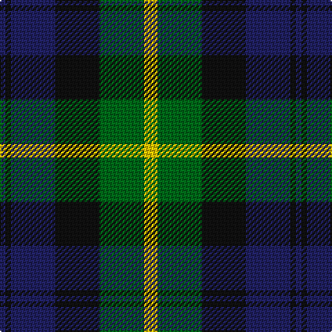

In pattern [BKBKGY](/patterns/bkbkgy/).

This was sourced from tartans-authority.  It is a [6 stripes tartan](/stripes/stripes6/).

Original link http://www.tartansauthority.com/tartan-ferret/display/8389/

## Thread count
DB/4 K4 DB32 K32 G32 Y/10

## Palette
Each colour and its ΔE from the base-6 reference it is a variant of.

| Colour | Shade | Base | ΔE (OKLab) |
|---|---|---|---|
| DB | <code style="background-color:#202060;">#202060</code> `#202060` | B <code style="background-color:#2A418A;">#2A418A</code> | 0.11 |
| G | <code style="background-color:#006818;">#006818</code> `#006818` | G <code style="background-color:#006100;">#006100</code> | 0.02 |
| K | <code style="background-color:#101010;">#101010</code> `#101010` | K <code style="background-color:#000000;">#000000</code> | 0.17 |
| Y | <code style="background-color:#E8C000;">#E8C000</code> `#E8C000` | Y <code style="background-color:#F2BF00;">#F2BF00</code> | 0.02 |

# Sample pattern

## Nearest tartans

The nearest existing variants by ΔTartan distance.

1. [Morrison Society](/setts/s6/k3g14k14g2b14r3~b1474b4-g006818-k101010-rc80000~x2/) — ΔT 0.62
1. [Unidentified No 26](/setts/s6/w4b4g22k20b20w3~b2c4084-g005020-k101010-we0e0e0/) — ΔT 0.62
1. [Campbell of Argyll (Smiths)](/setts/s6/b2k2b12k11g16w2~b2c2c80-g006818-k101010-we0e0e0~x2/) — ΔT 0.66
1. [Glenturret Corporate Tartan Tartan Number: 1097. Earliest known date: 1988 Glenturret Distillery is open to the public. Visitors can view the whisky making process and taste the final product. Glenturret tartan goods are for sale in the distillery shop. See products available Copyright © Blair Urquhart, Comrie, 2015](/setts/s6/k3g14k14g2b15y2~b202060-g006818-k101010-ye8c000~x2/) — ΔT 0.73
1. [Gunn - 1810 (Clan)](/setts/s6/r4g12k12g2b12g3~b1c0070-g006818-k101010-rc80000~x2/) — ΔT 0.89
1. [Morrison Clan Tartan Tartan Number: 1083. Earliest known date: 1908 The Clan Morrison have strong links with the MacKays and this is evident in the similarity of the tartans. Morrison has an added red stripe. Lord Lyon recorded a new sett in 1968 based on a fragment of Morrison tartan dated 1747. See products available Copyright © Blair Urquhart, Comrie, 2015](/setts/s6/k3g14k14g2b14r3~b2c2c80-g006818-k101010-rc80000~x2/) — ΔT 0.90
1. [Gordon of Esslemont](/setts/s7/y6g3y3g22k23b23k4~b5a008c-g005020-k101010-ye8c000~x2/) — ΔT 0.92
1. [Blair](/setts/s7/b3r1b10k8g10r1g3~b304080-g008000-k000000-rc00000~x4/) — ΔT 0.93
1. [Fletcher of Dunans](/setts/s7/b10k3b10k14r2g14r5~b1870a4-g006818-k101010-rc80000~x2/) — ΔT 0.95
1. [Oceanic (Corporate?)](/setts/s7/y8k4r39k37b36k6b7~b003c64-k101010-r888888-ye8c000/) — ΔT 0.95

## Neighbour map

Every grey dot is one of 15726 variants placed by the first two principal components of the ΔTartan feature space (44% of its variance). Red is this tartan; blue dots are its nearest — click one to open its page.

<svg viewBox="0 0 640 380" role="img" style="max-width:100%;height:auto;border:1px solid #e0e0e0;border-radius:4px;display:block" xmlns="http://www.w3.org/2000/svg"><image href="/nn/cloud.v1.png" width="640" height="380"/><a href="/setts/s6/k3g14k14g2b14r3~b1474b4-g006818-k101010-rc80000~x2/"><circle cx="159.5" cy="244.1" r="4" fill="#3465a4"><title>Morrison Society</title></circle></a><a href="/setts/s6/w4b4g22k20b20w3~b2c4084-g005020-k101010-we0e0e0/"><circle cx="146.4" cy="236.8" r="4" fill="#3465a4"><title>Unidentified No 26</title></circle></a><a href="/setts/s6/b2k2b12k11g16w2~b2c2c80-g006818-k101010-we0e0e0~x2/"><circle cx="181.0" cy="233.9" r="4" fill="#3465a4"><title>Campbell of Argyll (Smiths)</title></circle></a><a href="/setts/s6/k3g14k14g2b15y2~b202060-g006818-k101010-ye8c000~x2/"><circle cx="183.1" cy="245.6" r="4" fill="#3465a4"><title>Glenturret Corporate Tartan Tartan Number: 1097. Earliest known date: 1988 Glenturret Distillery is open to the public. Visitors can view the whisky making process and taste the final product. Glenturret tartan goods are for sale in the distillery shop. See products available Copyright © Blair Urquhart, Comrie, 2015</title></circle></a><a href="/setts/s6/r4g12k12g2b12g3~b1c0070-g006818-k101010-rc80000~x2/"><circle cx="164.3" cy="260.3" r="4" fill="#3465a4"><title>Gunn - 1810 (Clan)</title></circle></a><a href="/setts/s6/k3g14k14g2b14r3~b2c2c80-g006818-k101010-rc80000~x2/"><circle cx="180.0" cy="251.8" r="4" fill="#3465a4"><title>Morrison Clan Tartan Tartan Number: 1083. Earliest known date: 1908 The Clan Morrison have strong links with the MacKays and this is evident in the similarity of the tartans. Morrison has an added red stripe. Lord Lyon recorded a new sett in 1968 based on a fragment of Morrison tartan dated 1747. See products available Copyright © Blair Urquhart, Comrie, 2015</title></circle></a><a href="/setts/s7/y6g3y3g22k23b23k4~b5a008c-g005020-k101010-ye8c000~x2/"><circle cx="145.4" cy="215.8" r="4" fill="#3465a4"><title>Gordon of Esslemont</title></circle></a><a href="/setts/s7/b3r1b10k8g10r1g3~b304080-g008000-k000000-rc00000~x4/"><circle cx="163.6" cy="212.9" r="4" fill="#3465a4"><title>Blair</title></circle></a><a href="/setts/s7/b10k3b10k14r2g14r5~b1870a4-g006818-k101010-rc80000~x2/"><circle cx="138.6" cy="247.3" r="4" fill="#3465a4"><title>Fletcher of Dunans</title></circle></a><a href="/setts/s7/y8k4r39k37b36k6b7~b003c64-k101010-r888888-ye8c000/"><circle cx="169.8" cy="207.7" r="4" fill="#3465a4"><title>Oceanic (Corporate?)</title></circle></a><circle cx="147.9" cy="236.1" r="5" fill="#c00000"/></svg>

ID: /setts/s6/y5g16k16b16k2b2~b202060-g006818-k101010-ye8c000~x2/
