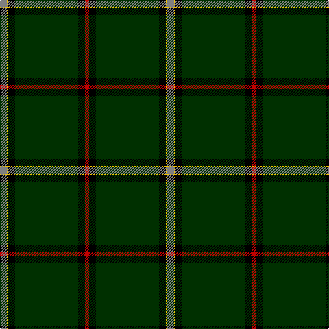

In pattern [GYKGKR](/stripes/gykgkr/).

This was sourced from weddslist.  It is a [6 stripe tartan](/stripes/stripes6/).

Original link http://www.weddslist.com/cgi-bin/tartans/pg.pl?source=sts

## Thread count
N/10 Y2 K10 DG92 K10 R/6

## Palette
Each colour and the base-6 reference it is a variant of.

| Colour | Shade | Base |
|---|---|---|
| DG | <code style="background-color:#003000;">#003000</code> `oklch(26.8% 0.091 142.5)` <small>#003000</small> | G <code style="background-color:#006100;">#006100</code> |
| K | <code style="background-color:#000000;">#000000</code> `oklch(0.0% 0.000 0.0)` <small>#000000</small> | K <code style="background-color:#000000;">#000000</code> |
| N | <code style="background-color:#808080;">#808080</code> `oklch(60.0% 0.000 89.9)` <small>#808080</small> | G <code style="background-color:#006100;">#006100</code> |
| R | <code style="background-color:#C00000;">#C00000</code> `oklch(50.7% 0.208 29.2)` <small>#C00000</small> | R <code style="background-color:#CC0000;">#CC0000</code> |
| Y | <code style="background-color:#F0C000;">#F0C000</code> `oklch(82.7% 0.169 90.5)` <small>#F0C000</small> | Y <code style="background-color:#F2BF00;">#F2BF00</code> |

# Sample pattern

## Nearest tartans

The nearest existing variants by ΔTartan distance.

1. [Tough (Personal)](/setts/s6/n4ly1k4dg32k4r2~x2/) — ΔT 0.92
1. [MacGregor, Black (Personal)](/setts/s6/k72g23k7g8r1w3~x2/) — ΔT 1.09
1. [Perry Hunting (Green) (Personal)](/setts/s5/k75g26lr2g4lo5~x2/) — ΔT 1.22
1. [MTV](/setts/s7/r5k3r9dg56t4dg2w3/) — ΔT 1.23
1. [Moeller, Karsten (Personal)](/setts/s7/k10r5k5dg55db2lo1w1~x2/) — ΔT 1.33
1. [MTV](/setts/s7/dr5k3dr9dg56t4dg2w3/) — ΔT 1.37
1. [Center (Name)](/setts/s8/k50b2k13w1k13b5g15r2~x2/) — ΔT 1.49
1. [Greeven, Wolfgang H (Personal)](/setts/s8/dg62r5w1r4g5lo4dt4w2~x2/) — ΔT 1.58
1. [Aviemore Highland (Corporate)](/setts/s7/dg40k3w1k5r1k2r10~x2/) — ΔT 1.65
1. [Moran Family Ubique](/setts/s10/dg68k2dg2k2dg2lo8r8k8lo2db7~x2/) — ΔT 1.67

## Neighbour map

Every grey dot is one of 14299 variants placed by the first two principal components of the ΔTartan feature space (44% of its variance). Red is this tartan; blue dots are its nearest — click one to open its page.

<svg viewBox="0 0 640 380" role="img" style="max-width:100%;height:auto;border:1px solid #e0e0e0;border-radius:4px;display:block" xmlns="http://www.w3.org/2000/svg"><image href="/nn/cloud.v1.png" width="640" height="380"/><a href="/setts/s6/n4ly1k4dg32k4r2~x2/"><circle cx="442.3" cy="143.0" r="4" fill="#3465a4"><title>Tough (Personal)</title></circle></a><a href="/setts/s6/k72g23k7g8r1w3~x2/"><circle cx="500.4" cy="149.3" r="4" fill="#3465a4"><title>MacGregor, Black (Personal)</title></circle></a><a href="/setts/s5/k75g26lr2g4lo5~x2/"><circle cx="466.4" cy="166.7" r="4" fill="#3465a4"><title>Perry Hunting (Green) (Personal)</title></circle></a><a href="/setts/s7/r5k3r9dg56t4dg2w3/"><circle cx="470.9" cy="131.9" r="4" fill="#3465a4"><title>MTV</title></circle></a><a href="/setts/s7/k10r5k5dg55db2lo1w1~x2/"><circle cx="482.4" cy="107.8" r="4" fill="#3465a4"><title>Moeller, Karsten (Personal)</title></circle></a><a href="/setts/s7/dr5k3dr9dg56t4dg2w3/"><circle cx="479.0" cy="138.5" r="4" fill="#3465a4"><title>MTV</title></circle></a><a href="/setts/s8/k50b2k13w1k13b5g15r2~x2/"><circle cx="515.1" cy="133.1" r="4" fill="#3465a4"><title>Center (Name)</title></circle></a><a href="/setts/s8/dg62r5w1r4g5lo4dt4w2~x2/"><circle cx="463.3" cy="73.1" r="4" fill="#3465a4"><title>Greeven, Wolfgang H (Personal)</title></circle></a><a href="/setts/s7/dg40k3w1k5r1k2r10~x2/"><circle cx="421.2" cy="110.2" r="4" fill="#3465a4"><title>Aviemore Highland (Corporate)</title></circle></a><a href="/setts/s10/dg68k2dg2k2dg2lo8r8k8lo2db7~x2/"><circle cx="442.4" cy="104.0" r="4" fill="#3465a4"><title>Moran Family Ubique</title></circle></a><circle cx="482.8" cy="129.0" r="5" fill="#c00000"/></svg>

ID: /setts/s6/y5ly1k5dg46k5r3~x2/
