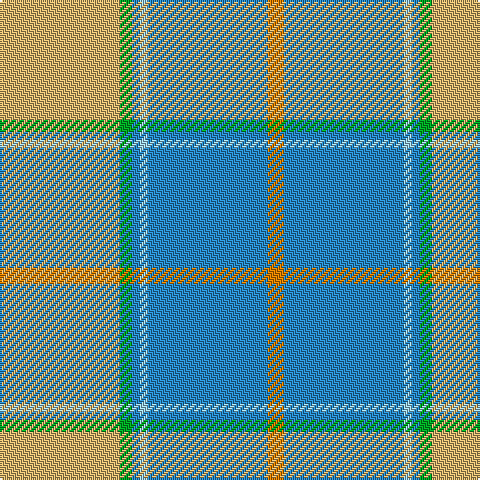

In pattern [YBWBGY](/patterns/ybwbgy/).

This was sourced from tartans-authority.  It is a [6 stripes tartan](/stripes/stripes6/).

Original link http://www.tartansauthority.com/tartan-ferret/display/7732/

## Thread count
LG/60 G6 B4 LB4 B60 O/8

## Palette
Each colour and its ΔE from the base-6 reference it is a variant of.

| Colour | Shade | Base | ΔE (OKLab) |
|---|---|---|---|
| B | <code style="background-color:#2888C4;">#2888C4</code> `#2888C4` | B <code style="background-color:#2C4084;">#2C4084</code> | 0.21 |
| G | <code style="background-color:#00A424;">#00A424</code> `#00A424` | G <code style="background-color:#006400;">#006400</code> | 0.20 |
| LB | <code style="background-color:#98C8E8;">#98C8E8</code> `#98C8E8` | W <code style="background-color:#F4F4F0;">#F4F4F0</code> | 0.17 |
| LG | <code style="background-color:#D0B06C;">#D0B06C</code> `#D0B06C` | Y <code style="background-color:#E8C000;">#E8C000</code> | 0.09 |
| O | <code style="background-color:#D87C00;">#D87C00</code> `#D87C00` | Y <code style="background-color:#E8C000;">#E8C000</code> | 0.17 |

# Sample pattern

ID: /setts/s6/y60g6b4w4b60ya8-b2888c4-g00a424-w98c8e8-yd0b06c-yad87c00/
